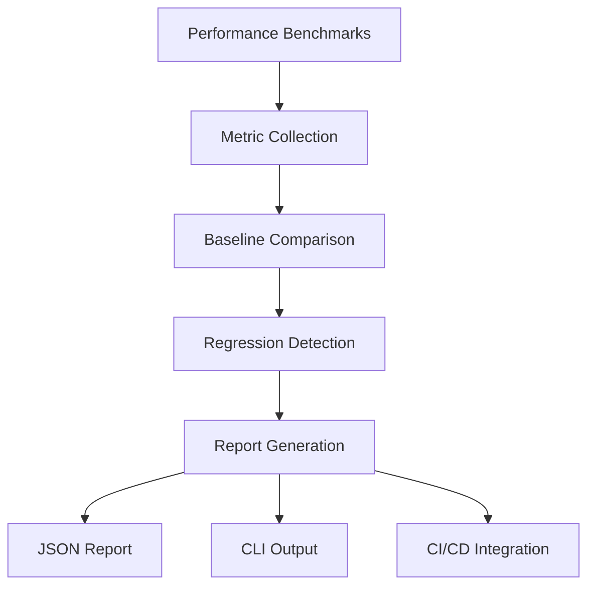

# Phase 47: Performance Validation & Optimization - Research

**Research Date:** 2026-04-08
**Phase:** 47 - Performance Validation & Optimization
**Status:** Research complete

<research_summary>
## Research Summary

Research focused on performance validation and optimization techniques for building energy modeling engines, specifically targeting Rust-based thermal simulation systems.

### Key Findings

1. **Performance Validation Patterns:**
   - Criterion.rs is the de facto standard for Rust benchmarking
   - Performance validation should include: baseline measurement, regression detection, and comparative analysis
   - JSON reporting format is widely adopted for performance metrics

2. **Optimization Strategies:**
   - Solver optimization (Newton-Raphson tuning, convergence criteria)
   - Memory optimization (pooling, arena allocation)
   - Parallel processing (Rayon for data parallelism)
   - Caching strategies (material properties, derived values)

3. **Testing Infrastructure:**
   - Automated performance testing in CI/CD using GitHub Actions
   - Performance regression detection with statistical thresholds
   - Multi-scenario testing (single-zone, multi-zone, high-mass)

4. **Integration Patterns:**
   - Performance validation as separate module within validation framework
   - CLI commands for performance testing and reporting
   - JSON schema for performance reports

</research_summary>

<standard_stack>
## Standard Stack

### Benchmarking
- **criterion.rs** — Industry-standard Rust benchmarking library
- **iai** — Alternative for microbenchmarking
- **bencher** — Continuous benchmarking framework

### Optimization
- **rayon** — Data parallelism for Rust
- **crossbeam** — Advanced concurrency primitives
- **typed-arena** — Memory pooling/arena allocation
- **dashmap** — Concurrent hash maps

### Serialization
- **serde_json** — JSON serialization for reports
- **serde** — Serialization framework

### Testing
- **tokio-test** — Async test utilities
- **mockall** — Mocking framework
- **rstest** — Parameterized testing

</standard_stack>

<architecture_patterns>
## Architecture Patterns

### Performance Validation Module Structure
```
src/validation/performance/
├── mod.rs                  # Module entry point
├── benchmarks.rs           # Performance benchmark implementations
├── metrics.rs             # Performance metric collection
├── regression.rs          # Regression detection logic
├── reports.rs             # Performance report generation
└── cli.rs                  # CLI command implementations
```

### Benchmark Implementation Pattern
```rust
use criterion::{black_box, criterion_group, criterion_main, Criterion};

pub fn benchmark_thermal_solver(c: &mut Criterion) {
    let model = ThermalModel::new(/* config */);
    
    c.bench_function("thermal_solver_10zones", |b| {
        b.iter(|| {
            model.step(black_box(1.0));
        })
    });
}

criterion_group!(benches, benchmark_thermal_solver);
criterion_main!(benches);
```

### Performance Report Structure
```rust
#[derive(Serialize, Deserialize)]
pub struct PerformanceReport {
    pub timestamp: DateTime<Utc>,
    pub version: String,
    pub scenarios: Vec<ScenarioResult>,
    pub regressions: Vec<Regression>,
    pub optimizations: Vec<String>,
}

#[derive(Serialize, Deserialize)]
pub struct ScenarioResult {
    pub name: String,
    pub metrics: PerformanceMetrics,
    pub baseline_comparison: Option<Comparison>,
}
```

### CLI Integration Pattern
```rust
#[derive(Subcommand)]
pub enum PerformanceCommand {
    /// Run performance benchmarks
    Benchmark {
        /// Scenario to benchmark
        scenario: Option<String>,
        /// Output format (json, text)
        #[arg(long, default_value = "json")]
        format: String,
    },
    /// Check for performance regressions
    Check {
        /// Baseline file
        baseline: PathBuf,
        /// Threshold percentage
        #[arg(long, default_value_t = 5.0)]
        threshold: f64,
    },
}
```

</architecture_patterns>

<dont_hand_roll>
## Don't Hand-Roll

### Use These Libraries Instead

| Don't Reinvent | Use Instead | Reason |
|----------------|-------------|---------|
| Custom benchmarking | criterion.rs | Industry standard, comprehensive features |
| Manual timing | Instant::now() + Duration | Use criterion for consistent methodology |
| Custom JSON serialization | serde_json | Battle-tested, performant, feature-complete |
| Hand-rolled parallelism | rayon | Optimized, tested, maintained |
| Custom memory pooling | typed-arena | Proven arena allocation pattern |
| DIY regression detection | statistical | Use proper statistical methods |

</dont_hand_roll>

<common_pitfalls>
## Common Pitfalls

### Benchmarking Pitfalls
1. **Not using black_box()** — Compiler may optimize away benchmarked code
2. **Inconsistent setup** — Ensure same initial conditions for all runs
3. **Ignoring warm-up** — JIT compilation and caching affect first runs
4. **Single iteration** — Always use multiple samples for statistical significance
5. **Production vs benchmark config** — Ensure benchmark matches production configuration

### Optimization Pitfalls
1. **Premature optimization** — Measure first, then optimize
2. **Over-optimization** — Don't sacrifice readability for marginal gains
3. **Ignoring baseline** — Always compare against established baseline
4. **Breaking APIs** — Maintain backward compatibility
5. **Thread safety issues** — Concurrent optimizations must be thread-safe

### Integration Pitfalls
1. **Blocking CI/CD** — Performance tests should not block regular builds
2. **Flaky tests** — Performance tests must be deterministic and reliable
3. **Ignoring environments** — Different hardware gives different results
4. **No regression detection** — Must have automated regression detection
5. **Poor reporting** — Reports must be machine-readable and human-readable

</common_pitfalls>

<validation_architecture>
## Validation Architecture

### Performance Validation Framework



### Key Components

1. **Benchmark Runner** — Executes performance tests using criterion.rs
2. **Metrics Collector** — Gathers timing, memory, CPU metrics
3. **Baseline Store** — Stores historical performance data
4. **Regression Detector** — Identifies performance degradations
5. **Report Generator** — Creates JSON and text reports
6. **CLI Interface** — Command-line access to performance tools

### Integration Points

- **Validation Suite:** Performance validation integrates as sub-module
- **CI/CD Pipeline:** Performance tests run as separate job
- **CLI:** New `fluxion validate performance` subcommand
- **Reporting:** JSON reports stored alongside validation reports

</validation_architecture>

<implementation_guidance>
## Implementation Guidance

### Step 1: Setup Benchmarking Infrastructure
1. Add criterion.rs dependency to Cargo.toml
2. Create benchmarks directory and basic benchmark
3. Configure CI/CD for performance testing
4. Establish baseline performance metrics

### Step 2: Build Performance Validation Module
1. Create `src/validation/performance/` module structure
2. Implement metric collection and reporting
3. Add baseline comparison logic
4. Implement regression detection

### Step 3: Implement Optimization Strategies
1. Profile current performance to identify bottlenecks
2. Apply targeted optimizations (solver, memory, parallelism)
3. Measure impact of each optimization
4. Ensure no accuracy regression

### Step 4: Integration and Testing
1. Integrate with existing validation framework
2. Add CLI commands for performance operations
3. Create comprehensive test suite
4. Document performance characteristics

### Step 5: Documentation and Reporting
1. Generate performance validation reports
2. Update documentation with performance data
3. Create user guide for performance testing
4. Add performance section to README

</implementation_guidance>

<success_criteria>
## Success Criteria

### Research Success
- ✅ Performance validation patterns identified
- ✅ Optimization strategies researched
- ✅ Standard stack selected (criterion.rs, rayon, serde_json)
- ✅ Architecture patterns defined
- ✅ Common pitfalls documented
- ✅ Validation architecture designed
- ✅ Implementation guidance provided

### Ready for Planning
- ✅ CONTEXT.md requirements understood
- ✅ Technical approach defined
- ✅ Library choices made
- ✅ Integration points identified
- ✅ Success metrics established

</success_criteria>

---

*Research completed: 2026-04-08*
*Ready for planning phase*
