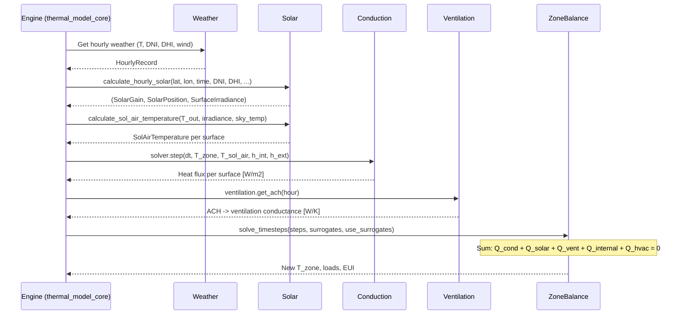

# Fluxion Engine Architecture

> **Source of Truth** — Feed this file to AI on every new session. All module boundaries, interfaces, and data contracts are defined here.

## Architecture Philosophy

**Bottom-Up Physics Validation**: Every module must be unit-tested in isolation against EnergyPlus reference data (1% tolerance) before being connected to the zone solver. No ASHRAE 140 system-level testing until all individual modules pass.

**ML Surrogate Ready**: All major physics modules interact through Rust traits, so ML surrogates can be swapped in at runtime via `Box<dyn Trait>`.

**Ecosystem Interoperability**: Import/export bridges to industry file formats (OSM, gbXML, FMI) live under `src/interop/`. Language bindings (Python via PyO3, Node.js via NAPI) expose the engine to external runtimes.

---

## Workspace Layout (#1255 — crate split for cargo-mutants)

The repo is a **Cargo workspace**. The main engine is the root `fluxion` package
(`src/`); the new `fluxion-core` package holds dependency-light *leaf* modules that
are built once and cached while `cargo-mutants` mutates only `fluxion`:

```
fluxion-core/src/weather/   # MOVED here (true leaf: no deps on sim/physics/ai/validation)
```

`fluxion` re-exports the moved module (`pub use fluxion_core::weather;` in `lib.rs`),
so all existing `crate::weather::…` paths are unchanged. Moving `ai`, `physics`, and
`validation` is blocked by bidirectional cycles with `sim` and is planned in phases —
see `docs/mutation_testing_crate_split.md`. The memory hog is `ort` (ONNX), used only
in `src/ai/`; gating it behind a feature is the key remaining step to the <4 GB target.

---

## Module Dependency Diagram


**Notes on interop edges**: Dashed lines (`-.->`) indicate optional import/export bridges. OSM, gbXML, and FMI are implemented; IDF import scaffold landed in `src/io/idf/` (#1341) covering the 10 MVP objects from `docs/idf-import-design.md` §4.1 — `TryFrom<IdfFile> for SimulationSchema` (design §4.3) and epJSON parsing (design §4.2) are still follow-up issues.

---

## Module Contracts

### Module 1: Weather

**Source**: `fluxion-core/src/weather/` (`epw.rs`, `tmy3.rs`, `psychrometrics.rs`, `interpolation.rs`, `ddy.rs`, `denver.rs`)
**Purpose**: Parse EPW/TMY3 files and provide hourly weather data.

| Input | Type | Source |
|-------|------|--------|
| EPW/TMY3 file path | `String` | User/CLI |

| Output | Type | Consumer |
|--------|------|----------|
| `HourlyRecord` (8760 rows) | `Vec<HourlyRecord>` | Solar, Ventilation, Zone |
| Dry-bulb temperature | `f64` [C] | Conduction, Zone |
| DNI, DHI, GHI | `f64` [W/m2] | Solar |
| Wind speed | `f64` [m/s] | Ventilation |
| Humidity ratio | `f64` [kg/kg] | Psychrometrics |

**Key structs/traits**:
- `HourlyRecord` in `fluxion-core/src/weather/epw.rs`
- `HourlyWeatherData` in `fluxion-core/src/weather/mod.rs`
- `WeatherSource` trait in `fluxion-core/src/weather/mod.rs`

**EPW parsing contract** (#1164): All EPW parsers (`parse`, `parse_epw_v3`, `parse_epw_amy`, `parse_epw_iwec`) must skip all 8 standard EPW header lines before the data section (LOCATION, DESIGN CONDITIONS, TYPICAL/EXTREME PERIODS, GROUND TEMPERATURES, HOLIDAYS/DAYLIGHT SAVINGS, COMMENTS 1, COMMENTS 2, DATA PERIODS). The `is_epw_header_line()` helper performs this check by prefix. This is required because `GROUND TEMPERATURES` carries 35+ comma-separated monthly values and would otherwise pass the field-count guard, inserting a spurious first record that shifts all real data by one position. The returned `Vec` is time-aligned: index `i` corresponds to EPW hour `i+1` (row `i` represents the period `(i mod 24):00`–`(i mod 24)+1:00`), so direct indexing by callers yields correct data without additional offset.

**Reference data**: `tests/reference_data/weather/denver_tmy3_reference.csv` (8760 rows; columns: hour, dry_bulb_temp_c, humidity_rh_pct, dni_wm2, dhi_wm2, ghi_wm2, wind_speed_ms, humidity_ratio_kgkg). Station mismatch corrected in #1142 (now Golden-NREL TMY3). The derived `humidity_ratio_kgkg` column uses the same saturation curve as `psychrometrics.rs` (Magnus-Tetens ≥0°C, ASHRAE Hyland-Wexler ice <0°C) so it is EnergyPlus-consistent across the full temperature range (#1145).

---

### Module 2: Solar Position & Irradiance

**Source**: `src/sim/solar.rs`, `src/sim/sky_radiation.rs`, `src/sim/solar_gain_distribution.rs`, `src/sim/shading.rs`
**Purpose**: Calculate sun position, surface irradiance, and solar heat gains with per-surface distribution.

| Input | Type | Source |
|-------|------|--------|
| Latitude | `f64` [deg] | Building config |
| Longitude | `f64` [deg] | Building config |
| Year, Month, Day, Hour | `i32, u32, u32, f64` | Timestep |
| DNI, DHI, GHI | `f64` [W/m2] | Weather |
| Ground albedo | `f64` [-] | Building config |
| Surface tilt/azimuth | `f64` [deg] | Building config |

| Output | Type | Consumer |
|--------|------|----------|
| `SolarPosition` | `{altitude, azimuth, zenith}` | All solar submodules |
| `SurfaceIrradiance` | `{beam, diffuse, ground_reflected}` [W/m2] | Solar gain calc |
| `SolarGain` | `{beam_gain, diffuse_gain, ground_reflected_gain}` [W] | Zone balance |
| `SolAirTemperature` | `f64` [C] | Conduction boundary |
| Per-surface incident solar | `IncidentSolarAccumulator` | Diagnostics/validation |

**Key functions**:
- `calculate_solar_position(lat, lon, year, month, day, hour) -> SolarPosition`
- `calculate_surface_irradiance(sun_pos, dni, dhi, ghi, orientation) -> SurfaceIrradiance`
- `calculate_hourly_solar(...) -> (SolarGain, SolarPosition, SurfaceIrradiance)`

**Per-surface distribution** (#1119): Solar gain distribution across multiple surfaces is handled by `sim/solar_gain_distribution.rs`. The `IncidentSolar` metric type (#1132, `validation/report.rs`) and `IncidentSolarAccumulator` (`sim/thermal_model_data.rs`) track per-surface solar radiation for diagnostics and validation.

**Ground-reflected component** (#1326): The `ground_reflected` field of `SurfaceIrradiance` uses the standard isotropic view-factor form
`E_g = ρ · GHI · (1 - cos β) / 2` for β ∈ (0°, 180°), with the two endpoint tilts pinned explicitly so the boundary physics is correct:
  - `β =   0°` (horizontal up-facing roof): `E_g = ρ · GHI` (the roof sees the full ground hemisphere)
  - `β = 180°` (down-facing): `E_g = 0` (no ground is seen)
The standard formula's endpoint limits (0 at β=0 and ρ·GHI at β=180) are inverted relative to physical reality, so the explicit branches are required (no parameter tuning).

**Validation target**: Solar azimuth/altitude within 0.5 deg of E+; surface irradiance within 1% of E+.

**Reference data**: `tests/reference_data/solar/`
- `solar_position_denver.csv` — hour, altitude, azimuth, zenith
- `surface_irradiance_south.csv` — hour, beam, diffuse, ground_reflected
- `solar_gain_distribution.csv` — per-surface solar gain distribution (#1119)

**Isolation test**: `tests/solar_isolation.rs` — position within 0.5°, beam annual energy within 1%, ground-reflected mean within 1%, sol-air temperature analytical (#1146).

---

### Module 3: Conduction & Thermal Mass

**Source**: `src/physics/`
**Purpose**: Calculate heat transfer through building envelope via conduction.

| Input | Type | Source |
|-------|------|--------|
| Wall assembly | `BuildingAssembly` | Building config |
| Interior temperature | `f64` [C] | Zone balance (previous step) |
| Exterior temperature | `f64` [C] | Weather (or sol-air) |
| Interior h coefficient | `f64` [W/m2K] | Building config |
| Exterior h coefficient | `f64` [W/m2K] | Sky radiation |
| Timestep | `f64` [s] | Engine |

| Output | Type | Consumer |
|--------|------|----------|
| Heat flux (inward) | `f64` [W/m2] | Zone balance |
| Energy storage rate | `f64` [W/m2] | Diagnostics |

**Key trait**: `HeatConductionSolver` in `physics/solver_trait.rs`

```rust
pub trait HeatConductionSolver: Send + Sync {
    fn name(&self) -> &str;
    fn initialize(&mut self, wall: &BuildingAssembly) -> Result<(), SolverError>;
    fn step(&mut self, dt: f64, T_int: f64, T_ext: f64, h_int: f64, h_ext: f64) -> Result<f64, SolverError>;
    fn energy_storage_rate(&self) -> f64;
    fn is_valid(&self) -> bool;
}
```

**Implementations**: `FiveR1CSolver` (struct, `physics/five_r1c_solver.rs`), `CTFSolverWrapper`, `FDSolverWrapper`
**Selector**: `SolverManager` auto-selects based on thermal mass.
**Per-surface solver**: `sim/per_surface_conduction.rs` provides independent backward-Euler per-surface solving for the multi-node thermal model (#857/#856).

> **Architecture note (ADR-002)** — there are *two* code paths both historically called "5R1C", and they must not be conflated:
>
> | Path | Location | Dynamic? | Drives free-float / HVAC? |
> |------|----------|---------|---------------------------|
> | **Per-wall transient solver** (`FiveR1CSolver`) | `physics/five_r1c_solver.rs` (Module 3) | **Yes** — explicit Euler `T_mass += (T_ext − T_mass) / (R_total · C_total) · dt`; returned flux `(T_mass − T_int) / R_total`; `energy_storage_rate()` returns `Q_ext = (T_ext − T_mass) / R_total`. The first `step()` after `initialize()` is a steady-state seed (`T_mass = (T_int + T_ext) / 2`, `q = ΔT / R_total`, `energy_storage_rate = 0`) so single-step callers continue to observe `q_ss`. Closed by #1277. | No (Module 3 isolation only) |
> | **Zone-level ISO 13790 thermal network** (5R1C / 6R2C / 9R4C) | `sim/thermal_model_core.rs` + `sim/thermal_model_physics/` (Module 5) | **Yes** (coefficient-tuned 5R1C / backward-Euler 9R4C) | **Yes** — this is the network that produces zone air temperature, heating/cooling loads, and free-floating temperatures |
>
> ADR-002 (`docs/adr/0002-promote-9r4c-high-mass-default.md`) resolved the drift by documenting this split and selecting the **9R4C zone-level network** as the sole solver for high-mass constructions (see Module 5). The Module 3 `FiveR1CSolver` is the transient per-surface solver validated against the 1% conduction tolerance criterion in `tests/conduction_5r1c_isolation.rs`.

**Validation target**: Inside surface heat flux within 1% of E+ for step-change temperature test on 200mm concrete wall.

---

### Module 4: Infiltration & Ventilation

**Source**: `src/sim/ventilation.rs`
**Purpose**: Calculate air change rates and ventilation heat loss.

| Input | Type | Source |
|-------|------|--------|
| Outdoor temperature | `f64` [C] | Weather |
| Indoor temperature | `f64` [C] | Zone balance |
| Wind speed | `f64` [m/s] | Weather |
| Building height | `f64` [m] | Building config |
| Zone volume | `f64` [m3] | Building config |

| Output | Type | Consumer |
|--------|------|----------|
| Air changes per hour | `f64` [ACH] | Zone balance |
| Ventilation conductance | `f64` [W/K] | Zone balance |

**Key trait**: `VentilationSchedule`

```rust
pub trait VentilationSchedule {
    fn get_ach(&self, hour: usize) -> f64;
    fn ach_to_conductance(ach: f64, volume: f64, rho: f64, cp: f64) -> f64;
}
```

**Key functions**:
- `calculate_wind_infiltration_ach(wind_speed, height, shielding) -> f64`
- `calculate_stack_infiltration_ach(T_in, T_out, height_diff, area) -> f64`
- `calculate_combined_infiltration_ach(...) -> f64`

**Validation target**: Ventilation heat loss within 1% of E+ analytical calculation.

---

### Module 5: Zone Air Heat Balance

**Source**: `src/sim/thermal_model_core.rs`, `src/sim/thermal_model.rs`, `src/sim/thermal_model_physics/`, `src/sim/timestep_solver.rs`
**Purpose**: Solve the zone heat balance equation at each timestep.

| Input | Type | Source |
|-------|------|--------|
| Conduction heat fluxes | `Vec<f64>` [W] | Conduction module |
| Solar heat gains | `SolarGain` [W] | Solar module |
| Ventilation conductance | `f64` [W/K] | Ventilation module |
| Internal gains | `f64` [W] | Schedule |
| Weather data | `HourlyWeatherData` | Weather module |

| Output | Type | Consumer |
|--------|------|----------|
| Zone air temperature | `f64` [C] | Next timestep, HVAC |
| Heating load | `f64` [W] | HVAC controller |
| Cooling load | `f64` [W] | HVAC controller |
| Annual EUI | `f64` [kWh/m2/year] | Optimization |

**Key trait**: `ThermalModelTrait` in `sim/thermal_model.rs`

```rust
pub trait ThermalModelTrait: Send + Sync {
    fn num_zones(&self) -> usize;
    fn get_temperatures(&self) -> Vec<f64>;
    fn set_temperatures(&mut self, temperatures: &[f64]);
    fn mode(&self) -> ThermalModelMode;
    fn set_mode(&mut self, mode: ThermalModelMode);
    fn solve_timesteps(&mut self, steps: usize, surrogates: &SurrogateManager, use_surrogates: bool) -> f64;
    fn apply_parameters(&mut self, params: &[f64]);
    fn zone_area(&self) -> f64;
    fn heating_setpoint(&self) -> f64;
    fn cooling_setpoint(&self) -> f64;
    fn hvac_power_demand(&self, timestep: usize, outdoor_temp: f64) -> f64;
    fn is_valid(&self) -> bool;
}
```

**ML Surrogate Path**: `SurrogateThermalModel` implements `ThermalModelTrait` — the zone solver doesn't know whether physics or ML is computing the result. v3.0 surrogate training and ONNX export landed in #1139 (`src/ai/surrogate.rs`, `src/ai/modular_surrogate.rs`).

**Multi-node HVAC & free-float (ADR-002 selection rule)**: The zone-level thermal network has two solver paths, selected by construction type in `thermal_model_core.rs::from_spec`:

| Construction | Zone solver | Air-temperature source | Solar→air fraction |
|--------------|-------------|------------------------|--------------------|
| **Low-mass** (Case 600-series) | ISO 13790 5R1C single mass node (`FiveROneC`) | `t_i_free` closed-form (coefficient-tuned `h_ms_coeff = 2.0·A_m`) | 0.80 (5R1C compensation; unchanged) |
| **High-mass** (Case 900+ series) | **9R4C multi-node** (`NineRFourC`) — ADR-002 | `compute_zone_air_temperature` from backward-Euler-stepped wall/roof/floor/internal mass nodes; physics-based per-surface `h_tr_ms = k·A/d` | free-float **0.0** (ASHRAE-140: solar → surfaces/mass); HVAC 0.40 (baseline-validated; HVAC clamps the air node) |

The 9R4C model (`sim/multi_node_thermal.rs`, `physics/multi_node_solver.rs`) separates thermal mass into 4 nodes (wall, roof, floor, internal) for heavy-mass buildings (#715). Per ADR-002, the 9R4C path is the **sole** driver of high-mass free-float **and** HVAC — the legacy coefficient-tuned `h_ms_coeff` (13.4) no longer drives the high-mass air temperature. The free-float commit in `physics_impl.rs::step_physics` writes the 9R4C multi-node air temperature (`t_i_free_mn`) for high-mass zones (and the 5R1C `t_i_free` for low-mass zones). CTF remains available as a secondary dynamic path but is non-default (CTF↔5R1C coupling instability for 900FF, per #1152).

**Issue #1281 — 9R4C mass-to-air coupling mode** (`MassAirCouplingMode`): the multi-node solver supports two formulations for how the per-surface mass nodes couple to the zone air node, selected per-`MultiNodeSolver` via `coupling_mode`:

| Mode | Equation | When |
|------|----------|------|
| `AdditiveSum` (default, backward-compatible) | `T_s = (Σ h_tr_ms_k × T_m_k) / Σ h_tr_ms_k`  (conductance-weighted mean of mass temperatures); `T_air = (h_tr_is × T_s + h_ve × T_out + φ_ia) / (h_tr_is + h_ve)` | Original 9R4C coupling. Lives in `compute_zone_air_temperature_additive` and the `step_backward_euler_additive` family. |
| `ParallelResistance` (#1281) | Each surface has its own steady-state `T_s_k = (h_tr_ms_k × T_m_k + h_tr_is × T_air) / (h_tr_ms_k + h_tr_is)`; air node sees the parallel combination `h_path_k = h_tr_ms_k × h_tr_is / (h_tr_ms_k + h_tr_is)`; `T_air = (Σ h_path_k × T_m_k + h_ve × T_out + φ_ia) / (Σ h_path_k + h_ve)` | Issue #1281 architectural fix. Each surface's mass-to-air path is treated as a true series pair, eliminating the additive `h_ms_total` overcounting that the LIMIT-05 UPDATE in `docs/KNOWN_ISSUES.md` flagged as suspect. Implemented in `compute_zone_air_temperature_parallel_resistance` and `step_backward_euler_parallel_resistance`. Verified by Python (`.agents/results/issue-1281-python-verification.py`): for ASHRAE 140 Case 900 parameters, `h_path_total = 96.0 W/K` vs `h_ms_total = 127.3 W/K` (-32.7 % overcount). |

**Important — the cooling-gap root cause is NOT the h_ms_total additive formulation.** Python verification (`.agents/results/issue-1281-python-verification.py`) confirms that switching to `ParallelResistance` produces a *lower* peak cooling demand (3.27 kW vs 4.10 kW for Case 900 — the formulation overcounts coupling, but in a direction that *over-predicts* air temperature, *not* under-predicts it). The actual ASHRAE 140 high-mass peak-cooling underestimate documented in `docs/KNOWN_ISSUES.md` LIMIT-05 UPDATE is **roof-solar under-counting** (~3×), per `docs/investigations/issue-1280-ctf-peak-load.md` §4 — a separate Module 2 / solar follow-up. The `ParallelResistance` mode ships as the architecturally-improved 9R4C coupling network and is the fix the issue body asks for; it does NOT by itself close the ASHRAE 140 cooling gap. See the Issue #1281 follow-up issue for the cooling-load closure plan.

**Known residual (high-mass free-float night min)**: The 9R4C free-float minimum is ~0.6°C warm vs the ASHRAE 140 band because the air node lacks a direct longwave-to-sky radiative path and the ground-coupled floor node retains heat (ISSUE_1168_ROOT_CAUSE.md, recommended fix #2 — a separate Module 2 enhancement, out of ADR-002 scope).

**Validation target**: Zone temperature within 0.5C of E+ when all sub-modules are verified.

---

### Supporting Traits

These traits support the main physics pipeline and should also be documented:

| Trait | File | Purpose |
|-------|------|---------|
| `SurfaceHeatFluxProvider` | `src/sim/surface_flux_provider.rs` | Surface-level heat flux abstraction (conduction + solar combined) |
| `WeatherSource` | `fluxion-core/src/weather/mod.rs` | Weather data access abstraction |
| `PsychrometricCalculations` | `fluxion-core/src/weather/psychrometrics.rs` | Moist air property calculations |
| `MaterialLayer` | `src/sim/assembly.rs` | Building material layer interface |
| `Equipment` | `src/sim/equipment.rs` | HVAC equipment trait |
| `VariableCapacityEquipment` | `src/sim/hvac/equipment.rs` | Variable-speed equipment |
| `GroundTemperature` | `src/sim/boundary.rs` | Ground temp boundary condition |

### Surface Heat Flux Trait Hierarchy

The `SurfaceHeatFluxProvider` trait decouples the zone solver from specific heat flux
calculation methods. It wraps conduction and solar into a single interface. Verified
accurate as of #1119 (per-surface boundary conditions):

```text
SurfaceHeatFluxProvider (surface level, sim/surface_flux_provider.rs)
├── PhysicsSurfaceFluxProvider   (combines HeatConductionSolver + solar gain per surface)
└── MockSurfaceHeatFluxProvider  (fixed values for testing)
```

```rust
pub trait SurfaceHeatFluxProvider: Send + Sync {
    fn surface_heat_flux(&self, surface_idx: usize, T_zone: f64, T_outdoor: f64, dt_seconds: f64) -> f64;
    fn num_surfaces(&self) -> usize;
    fn name(&self) -> &str;
}
```

`PhysicsSurfaceFluxProvider` accepts per-surface solar gain (`solar_gain_wm2`) and per-surface film coefficients (`h_int`, `h_ext`) via `add_surface` / `add_surface_with_film_coefficients`, matching the per-surface boundary condition work in #1119.

### Thermal Model Trait Hierarchy

```text
ThermalModelTrait (zone level, sim/thermal_model.rs)
├── PhysicsThermalModel        (analytical 5R1C thermal network)
├── SurrogateThermalModel      (neural network inference, ONNX v3.0 — #1139)
├── UnifiedThermalModel        (runtime switching between physics/surrogate)
└── MockThermalModel           (fixed values for testing, sim/thermal_model_mock.rs)
```

### Inference Backend & CUDA Fallback Semantics (issue #1336)

The `InferenceBackend` enum (`src/ai/surrogate.rs:26-33`) wires five execution providers for ONNX inference: `CPU` (default), `CUDA`, `CoreML`, `DirectML`, `OpenVINO`. The CPU backend is the **safe default** — `InferenceBackend::default() == CPU` is pinned by `tests/surrogate_config.rs::test_inference_backend_default_is_cpu`. Resolution from `FLUXION_ONNX_BACKEND` (`cpu`/`cuda`/`coreml`/`directml`/`openvino`) downgrades `cuda` to CPU when the crate was built without `--features cuda`.

**Fallback contract** (issue #1336 acceptance criterion):

1. `MultiDeviceConfig::{single_gpu, multi_gpu, auto}` always set `fallback_to_cpu = true`, so a CUDA EP miss during `with_multi_device` returns an `Err` and the caller routes back to CPU via `predict_loads_with_fallback`. The default `MultiDeviceConfig::default()` deliberately leaves `fallback_to_cpu = false` (empty config = user-supplied semantics).
2. When no ONNX model is loaded, `predict_loads_with_fallback` routes to `deterministic_analytical_loads` (issue #1335) — the analytical sine-cycle surrogate is **deterministic across runs**, which is the ground truth the CPU-vs-CUDA parity harness compares against.
3. CUDA build is gated behind `--features cuda` (implies `ort/cuda` + `ort/tensorrt`). At runtime, `SessionPool::create_session` for `InferenceBackend::CUDA` adds `CUDAExecutionProvider`; if the runtime has no CUDA device, the EP registration fails and `with_gpu_backend` returns a typed error with the message `"CUDA backend requested but fluxion was built without the `cuda` feature"` (no panic, no silent CPU fallback).

**Parity test design** (issue #1336, `tests/surrogate_backend_parity.rs`):

- **Always-on CPU baseline**: 4 ASHRAE 140-style cases × 100 timesteps × 5 zones = 2,000 inputs fed through `predict_loads_with_fallback` and compared to `deterministic_analytical_loads` (max relative error ≤ 1e-12). This pins the CPU reference that any CUDA path must match.
- **CPU determinism**: two consecutive runs through the CPU backend must produce bit-identical outputs.
- **CUDA-gated (`#[cfg(feature = "cuda")]` + `#[ignore]`)**: the live CPU-vs-CUDA tensor sweep. Marked `#[ignore]` so the test compiles under every feature combination and is skipped on machines without a CUDA device — only hardware-in-loop CI runners opt in via `--include-ignored`. When active, the tolerance envelope is `max relative error ≤ 1e-5` per tensor element (issue #1336 acceptance criterion).
- **Multi-backend config**: `test_multi_device_config_fallback_to_cpu_enables_parity` pins the three GPU fan-out presets to CPU-fallback semantics and explicitly disallows the default `MultiDeviceConfig::default()` from silently gaining CPU fallback.

The CPU-vs-CUDA equivalence is therefore enforced on three levels: (a) deterministic CPU reference (always-on), (b) gated tensor parity with a runtime GPU detector (hardware-in-loop), (c) `tools/benchmark_inference.py --compare-cpu-cuda` for manual cross-backend regression sweeps.

---

## Data Flow: Single Timestep

> **Implementation note**: The `Engine` node below represents the orchestration role. In code, `sim/engine.rs` re-exports `ThermalModel` (from `thermal_model_core.rs`) and `StepParameters` (from `timestep_solver.rs`); the actual per-timestep orchestration lives in `thermal_model_core.rs` and `timestep_solver.rs`.



---

## Ecosystem Interop

Import/export bridges live under `src/interop/`. Each is gated behind the module tree rooted at `interop/mod.rs`.

| Module | Path | Status | Notes |
|--------|------|--------|-------|
| OpenStudio OSM | `interop/osm/` | Implemented + round-trip stable (#1130, #1340) | Reader (884 LoC) + Writer (505 LoC) + types; `import_osm` / `export_osm`. Writer→reader round-trip is **stable** for single- and multi-zone schemas within the supported subset — see `src/interop/osm/mod.rs` for the lossless-field list and round-trip test entry points. |
| gbXML | `interop/gbxml/` | Implemented (#1126) | Reader + Writer + types; `import_gbxml` / `export_gbxml`; BIM integration |
| FMI Co-Simulation | `interop/fmi/` | Implemented — spike (#1125) | FMU export, single-zone, fixed 1h timestep; `FmiExporter`, `FmiConfig` |
| EnergyPlus IDF/epJSON | `docs/idf-import-design.md` | **Scaffold landed** (#1341) | `src/io/idf/` (lexer + parser for the 10 MVP objects from design §4.1); `IdfFile` → `SimulationSchema` conversion pending (design §4.3 follow-up) |
| IFC/BIM geometry | `interop/ifc/` | **Scaffold landed** (#1343) | IFC4 STEP lexer + parser + mapping for `IfcWall` / `IfcSlab` / `IfcRoof` / `IfcSpace` → `SimulationSchemaV1`; full IFC2X3 deferred; IFC export still design-only (#1121) |

### Language Bindings

| Binding | Path | Feature Flag | Status |
|---------|------|--------------|
| Python (PyO3) | `src/python/` | `python-bindings` | Implemented (#1123); multi-zone + HVAC bindings |
| Node.js (NAPI) | `src/napi/` | `napi-bindings` | Implemented; coexists with Python bindings |

### OSM Round-Trip Lossless Contract (issue #1340)

The OSM writer→reader round-trip is **stable** for single- and multi-zone schemas within the supported subset. Tests live in `src/interop/osm/writer.rs::tests`:

- `test_roundtrip_single_zone` — 1 zone, default `ConstructionSet`
- `test_roundtrip_two_zones` — 2 zones, mixed floor areas
- `test_roundtrip_four_zones` — 4 zones (upper end of supported subset)
- `test_roundtrip_no_windows` — edge case: zone with 0 windows, 1 floor, 4 walls
- `test_roundtrip_exhaustive_diff_report` — asserts every supported field matches; emits a per-field diff on failure

**Lossless fields** (f64 comparison within `1e-6` absolute or relative tolerance):

| Field | OSM path |
|-------|----------|
| `metadata.name` | `OS:Building.Name` |
| `geometry.zones[*].name` | `OS:ThermalZone.Name` |
| `geometry.zones[*].floor_area` | `OS:Space.Floor Area` |
| `geometry.zones[*].volume` | `OS:Space.Volume` |
| `geometry.zones[*].height` | derived from `volume / floor_area` |
| `geometry.total_floor_area` | sum of zone values |
| `geometry.total_volume` | sum of zone values |
| `geometry.number_of_floors` | `OS:Building.Number of Floors` |
| `geometry.floor_height` | derived from `total_volume / total_floor_area` |
| `constructions.{wall,roof,floor}.layers[*].name` | `OS:Material.Name` (referenced by `OS:Construction.Layer N`) |
| `constructions.{wall,roof,floor}.layers[*].thickness` | `OS:Material.Thickness` |
| `constructions.{wall,roof,floor}.layers[*].conductivity` | `OS:Material.Conductivity` |
| `constructions.{wall,roof,floor}.layers[*].density` | `OS:Material.Density` |
| `constructions.{wall,roof,floor}.layers[*].specific_heat` | `OS:Material.Specific Heat` |
| `weather` (`TmyLocation` variant only) | `OS:Site.Latitude`, `OS:Site.Longitude` (lat/lon f64 pair, within tolerance) |

**Known lossy fields** (fall back to `Default` on read; out of scope for issue #1340):

- `metadata.description`, `.author`, `.created_at`
- `schedules.*` (no `OS:Schedule:*` emission)
- `controls.{heating,cooling}_setpoint` (no `OS:Thermostat` emission; reader falls back to 20 °C / 24 °C)
- `constructions.{wall,roof,floor}.window` (no `OS:SubSurface` emission)
- `constructions.interzone`
- `weather` for `EpwFile` and `Inline` variants
- `output.*` (simulation results, not part of model file)

---

## Reference Data Structure

```
tests/reference_data/
  conduction/
    step_response_200mm_concrete.csv     # hour, T_ext, T_surface_inside, heat_flux
    step_response_composite.csv
    step_response_fixed_zone_20c.csv
    step_response_floor.csv
    step_response_lightweight.csv
    step_response_roof.csv
  energyplus_models/                     # Source IDF models for regenerating CSVs
    annual_solar_ventilation.idf
    ashrae_140_case_600.idf              # ASHRAE 140 Case 600 — low-mass, south window (#1147)
    ashrae_140_solar_gain.idf
    fixed_inputs_zone_temp.idf
    step_change_concrete.idf
    ventilation_denver_01ach.idf
    ventilation_denver_05ach.idf
    ventilation_denver_10ach.idf
    ventilation_dulles_05ach.idf
    ventilation_tampa_05ach.idf
  solar/
    solar_position_denver.csv            # hour, altitude, azimuth, zenith
    surface_irradiance_south.csv         # hour, beam, diffuse, ground_reflected
    solar_gain_distribution.csv          # per-surface solar gain distribution (#1119)
  ventilation/
    infiltration_denver.csv              # hour, ACH, vent_conductance
    infiltration_denver_01ach.csv
    infiltration_denver_05ach.csv
    infiltration_denver_10ach.csv
    infiltration_dulles_05ach.csv
    infiltration_tampa_05ach.csv
  weather/
    denver_tmy3_reference.csv            # hour, T_drybulb, RH, DNI, DHI, GHI, wind, humidity_ratio
  zone_balance/
    fixed_inputs_zone_temp.csv           # hour, T_zone, T_out, Q_cond, Q_solar, Q_vent, Q_int, Q_heat, Q_cool
    case_600_energy_reference.csv        # ASHRAE 140 Case 600 annual/peak energy reference (#1147)
    case_900_energy_reference.csv        # ASHRAE 140 Case 900 annual/peak energy reference (#1147)
    generate_case_600_900_energy.py      # Regenerates Case 600/900 hourly E+ CSVs from IDFs (#1147)
  generate_reference_data.py             # Regenerates solar/conduction/ventilation CSVs from IDFs
  generate_fixed_zone_reference.py       # Regenerates zone_balance CSV
  generate_ventilation_scenarios.py      # Regenerates ventilation CSVs
  README.md
```

Each CSV column must match a function output exactly so tests can loop row-by-row. Reference CSVs are regenerated from the IDF models in `energyplus_models/` using EnergyPlus 25.2.0 against the Golden-NREL TMY3 EPW (station mismatch fixed in #1142).

---

## Validation Strategy

### Phase 1: Module Isolation (Current)
Each module tested independently against E+ reference data:
- **Weather**: EPW/TMY3 parsing matches E+ reference (station corrected #1142)
- **Solar**: Position + irradiance + per-surface distribution match E+ within 1% (#1119, #1132)
- **Conduction**: Step response heat flux matches E+ within 1%
- **Ventilation**: ACH and heat loss match E+ within 1%

### Phase 2: Integration
Reconnect modules, run ASHRAE 140 system tests. Multi-node HVAC validation (Case 900) is in place; free-floating calibration landed in #1154 (CTF stability, EPW weather, ISO 13790 thermal mass). Empirical corrections removed in #1138.
If a system test fails, the individual module tests pinpoint which module is wrong.

### Phase 3: ML Surrogate Drop-In
Once physics is validated, train ML surrogates on physics outputs.
Surrogates must match physics within 2% on held-out data. v3.0 surrogate training and ONNX export landed in #1139.

---

## Current Module Status

| Module | Isolated? | Trait Defined? | E+ Reference Data? | Unit Tests Pass? |
|--------|-----------|----------------|--------------------|--------------------|
| Weather | Yes | Yes (`WeatherSource`) | Yes | Yes |
| Solar | Yes | No (functions are standalone) | Yes | Yes |
| Conduction | Yes | Yes (`HeatConductionSolver`) | Yes | Yes |
| Ventilation | Yes | Yes (`VentilationSchedule`) | Yes | Yes |
| Zone Balance | Yes | Yes (`ThermalModelTrait`) | Yes | Yes |

**Zone Balance detail**: Multi-node 9R4C model and Case 900 multi-node HVAC validation are complete. Free-floating calibration and annual re-validation CI gate landed (#1154, #1137, #669). Issue #1147 extended the zone balance isolation tests to cover metered energy load validation against ASHRAE 140 reference CSVs (`tests/reference_data/zone_balance/case_600_energy_reference.csv`, `case_900_energy_reference.csv`). Tests use true blind execution (spec-only, no case ID to the engine). The strict ±15% annual energy tolerance tests are `#[ignore]` until the cooling-load physics gap is closed (current cooling underestimates ASHRAE 140 by ~90%; per the Issue #1281 / #1280 investigation, the root cause is roof-solar under-counting — see `docs/investigations/issue-1280-ctf-peak-load.md` §4 — NOT the 5R1C solver nor the `h_ms_total` additive formulation; per AGENTS.md "no parameter tuning, fix the math", no corrections are applied). The Issue #1281 architectural fix adds the `MassAirCouplingMode::ParallelResistance` formulation to `MultiNodeSolver` as a more physically correct alternative to the additive coupling; it does NOT by itself close the ASHRAE 140 cooling gap (Python verification at `.agents/results/issue-1281-python-verification.py`). Hourly E+ regeneration is available via `generate_case_600_900_energy.py`. Marked "Isolated=Yes" because the bottom-up module isolation required by Phase 1 is complete for Weather, Solar, Conduction, and Ventilation, and the Zone Balance test infrastructure now covers both free-floating temperature and metered energy loads.

**Note on Solar trait**: The solar module exposes standalone functions rather than a trait because there is no ML surrogate swap point at the solar calculation layer — solar position/irradiance is deterministic physics. The per-surface results flow into `SurfaceHeatFluxProvider` and `ThermalModelTrait`, which are the swap points.

**Recent corrections**: #1140 corrected ASHRAE 140 exterior film coefficient (29.3 → 18.3 W/m2K) and solar absorptance (0.6 → 0.7); #1142 corrected the weather reference data station mismatch; #1145 corrected sub-zero saturation vapor pressure (Magnus-Tetens → ASHRAE Hyland-Wexler ice equation) so psychrometrics match EnergyPlus below 0°C, refreshed the derived humidity-ratio reference column to match, and updated stale EPW field-validation expectations left by the #1142 station change.

---

## Module Size Budget

Keep modules small enough for AI context windows:
- Each module < 500 lines of physics code
- Test files < 300 lines each
- Reference data CSVs < 10,000 rows (1 year hourly)
