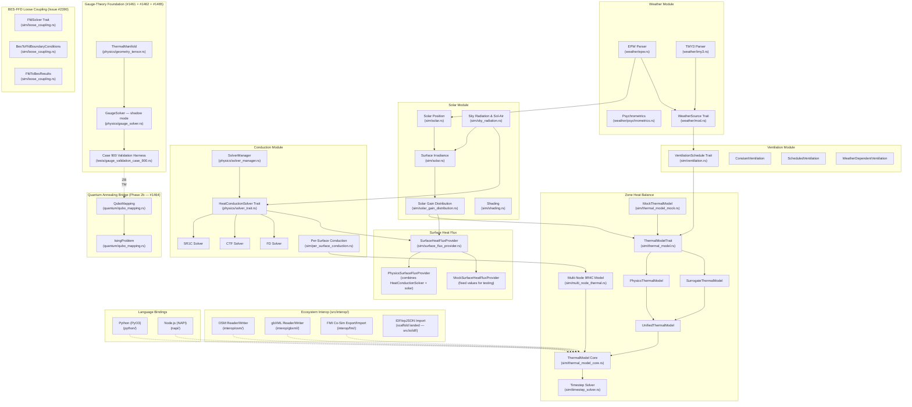
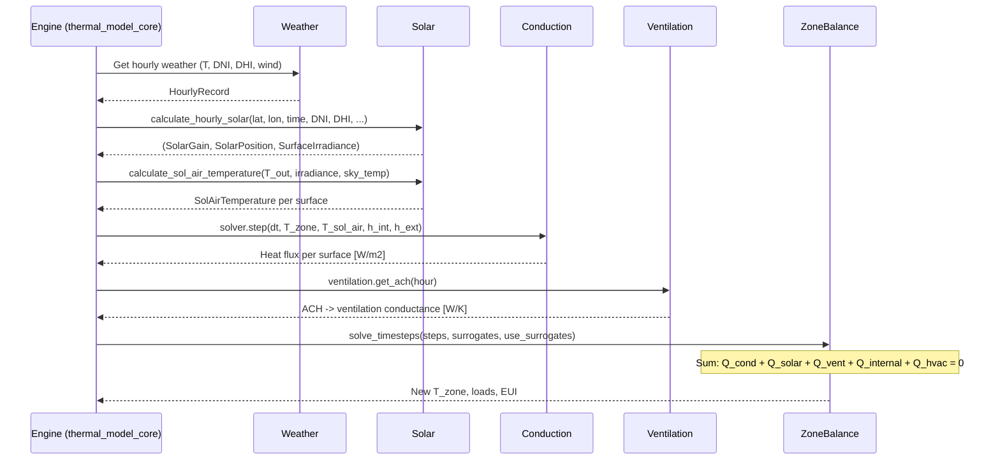

# Fluxion Engine Architecture

> **Source of Truth** — Feed this file to AI on every new session. All module boundaries, interfaces, and data contracts are defined here.

## Architecture Philosophy

**Bottom-Up Physics Validation**: Every module must be unit-tested in isolation against EnergyPlus reference data (1% tolerance) before being connected to the zone solver. No ASHRAE 140 system-level testing until all individual modules pass.

**ML Surrogate Ready**: All major physics modules interact through Rust traits, so ML surrogates can be swapped in at runtime via `Box<dyn Trait>`.

**Ecosystem Interoperability**: Import/export bridges to industry file formats (OSM, gbXML, FMI) live under `src/interop/`. Language bindings (Python via PyO3, Node.js via NAPI) expose the engine to external runtimes.

---

## Workspace Layout (#1255 + #1349 + #1441 — crate split for cargo-mutants)

The repo is a **Cargo workspace**. The main engine is the root `fluxion` package
(`src/`); the `fluxion-core` package holds dependency-light *leaf* modules that
are built once and cached while `cargo-mutants` mutates only `fluxion`:

```
fluxion-core/src/weather/      # MOVED in #1255 (true leaf: no deps on sim/physics/ai/validation)
fluxion-core/src/assembly/     # MOVED in #1349 (BuildingAssembly, AssemblyBuilder, MaterialLayer)
fluxion-core/src/construction/ # MOVED in #2462 (ConstructionLayer, Construction, MassClass,
                               #   Materials, Assemblies, SurfaceType; ASHRAE 140 film/air
                               #   constants inlined)
fluxion-core/src/multi_node/   # MOVED in #1349 (ThermalMassNode, MultiNodeThermalMass)
fluxion-core/src/per_surface_conduction/ # MOVED in #2462 (SurfaceKind, MassNode, SurfaceNode,
                               #   PerSurfaceConductionSolver)
fluxion-core/src/physics_constants/ # MOVED in #2462 (STEFAN_BOLTZMANN, lifted out of
                               #   sim::sky_radiation so physics::multi_node_solver no
                               #   longer has to import from sim)
fluxion-core/src/ashrae_cases/ # MOVED in #1441 (Orientation, WindowArea, ConstructionType,
                               #   ShadingType, ShadingDevice, GlassType, WindowSpec,
                               #   InternalLoads, HvacSchedule, NightVentilation,
                               #   BuildingType, GeometrySpec, ConductanceReferences)
```

`fluxion` re-exports the moved modules (`pub use fluxion_core::{weather, assembly,
multi_node, ashrae_cases};` in `lib.rs`) and keeps thin re-export shims at the old
paths (`src/sim/assembly.rs`, `src/sim/multi_node_thermal.rs`,
`src/validation/ashrae_140_cases.rs` re-exports the leaf types from
`fluxion_core::ashrae_cases`) so all existing `crate::weather::…`,
`crate::assembly::…`, `crate::sim::assembly::…`, `crate::sim::multi_node_thermal::…`,
and `crate::validation::ashrae_140_cases::Orientation` paths are unchanged.
No call-site edits required for downstream consumers.

### Cycle break (Phase 2 of the crate split)

Issue #1349 breaks the `physics <-> sim` cycle by routing `fluxion::physics::*`'s
domain-type imports through `fluxion_core::assembly::*` instead of
`crate::sim::assembly::*`. Affected files:

- `src/physics/wall_properties.rs` — `use fluxion_core::assembly::BuildingAssembly`
- `src/physics/method_selector.rs` — `use fluxion_core::assembly::BuildingAssembly`
- `src/physics/wall_spec.rs` — same
- `src/physics/solver_manager.rs` / `solver_registry.rs` — same
- `src/physics/multi_node_solver.rs` — `use fluxion_core::multi_node::{MultiNodeThermalMass, ...}`
- `src/sim/multi_node_hvac_runner.rs` — `use fluxion_core::multi_node::ThermalMassNode`
- `src/sim/thermal_model_core.rs` / `thermal_model_data/` — `use fluxion_core::assembly::BuildingAssembly`

The ASHRAE 140 material constants that `assembly.rs` previously imported from
`crate::physics::constants::thermal::ashrae_140::materials` (HW_CONCRETE_K,
FOAM_BOARD_K, GYPSUM_K, EXTERIOR_SURFACE_ABSORPTANCE, …) are now inlined at the
call sites — the values are constants and `fluxion_core` cannot depend on
`fluxion`'s `physics::constants` module.

### Cycle break (#1441 — ASHRAE-140 leaf types → `fluxion-core`)

Issue #1441 broke the `sim ↔ validation` cycle documented in the previous
"Remaining cycles" section. The ASHRAE-140 leaf data types (Orientation,
WindowArea, ConstructionType, ShadingType, ShadingDevice, GlassType, WindowSpec,
InternalLoads, HvacSchedule, NightVentilation, BuildingType, GeometrySpec,
ConductanceReferences) were pure-data structs/enums with **no upward
dependencies** on `sim`, `physics`, `ai`, or any other non-leaf module. They
were hoisted into `fluxion_core::ashrae_cases` so `cargo-mutants -p fluxion`
no longer recompiles the 208 KB `validation::ashrae_140_cases` per mutant.

**Cycle markers closed** (5 direct + 3 indirect sim callers):

| File (before) | After |
|---|---|
| `src/sim/solar.rs:13` (was `pub use crate::validation::ashrae_140_cases::Orientation`) | `use fluxion_core::ashrae_cases::Orientation` (re-export deleted) |
| `src/sim/solar.rs:18` (was `WindowArea`) | `use fluxion_core::ashrae_cases::WindowArea` |
| `src/sim/construction.rs:23` | `use fluxion_core::ashrae_cases::Orientation` |
| `src/sim/per_surface_conduction.rs:59` | `use fluxion_core::ashrae_cases::Orientation` |
| `src/sim/invariant_checker.rs:9` | `use fluxion_core::ashrae_cases::Orientation` |
| `src/sim/shading.rs:6,178` | `use fluxion_core::ashrae_cases::WindowArea, Orientation` |
| `src/sim/thermal_model_core.rs:23` | split: `CaseSpec` stays in validation; `Orientation, ShadingType` move to `fluxion_core::ashrae_cases` |
| `src/sim/thermal_model_data/hvac_state.rs:19` | `use fluxion_core::ashrae_cases::NightVentilation` |
| `src/sim/thermal_model_data/solar_state.rs:13` | `use fluxion_core::ashrae_cases::Orientation` |
| `src/sim/thermal_model_iterative.rs:17` | `use fluxion_core::ashrae_cases::{GeometrySpec, Orientation, WindowArea}` |

### Cycle break (#2462 — physics ↔ sim shared domain types → `fluxion-core`)

Issue #2462 closes the remaining `physics ↔ sim` cycle documented in the
previous "Remaining cycles" section. Three shared domain-type clusters were
hoisted out of `fluxion::sim::*` into `fluxion_core::*` leaf modules so that
`fluxion::physics::*` could stop importing from `fluxion::sim::*`:

| Type / constant                                  | New home                              | Why a leaf module? |
|--------------------------------------------------|---------------------------------------|--------------------|
| `ConstructionLayer`, `Construction`, `MassClass`, `Materials`, `Assemblies`, `SurfaceType` | `fluxion_core::construction` | Pure-data structs/enums + the ASHRAE 140 film/air constants (inlined from `physics::constants::thermal::ashrae_140::{v2023, materials}` and `physics::constants::atmospheric`). No upward deps. |
| `SurfaceKind`, `MassNode`, `SurfaceNode`, `PerSurfaceConductionSolver` | `fluxion_core::per_surface_conduction` | Pure-data structs + `Orientation` (already in `fluxion_core::ashrae_cases`). No upward deps. |
| `STEFAN_BOLTZMANN`                               | `fluxion_core::physics_constants` | Leaf physics constant used by both `sim::sky_radiation` and `physics::multi_node_solver`. Hoisted here so physics no longer needs sim. |

**Cycle edges closed** (5 physics→sim + 2 sim→physics, all 7 to 0):

| File (before) | After |
|---|---|
| `src/physics/thermal_mass/construction.rs:11` (was `use crate::sim::construction::ConstructionLayer`) | `use fluxion_core::construction::ConstructionLayer` |
| `src/physics/thermal_mass/diagnostics.rs:11` (was same) | `use fluxion_core::construction::ConstructionLayer` |
| `src/physics/multi_node_solver.rs:40` (was `use crate::sim::per_surface_conduction::{PerSurfaceConductionSolver, SurfaceKind}`) | `use fluxion_core::per_surface_conduction::{PerSurfaceConductionSolver, SurfaceKind}` |
| `src/physics/multi_node_solver.rs:44` (was `use crate::sim::sky_radiation::STEFAN_BOLTZMANN`) | `use fluxion_core::physics_constants::STEFAN_BOLTZMANN` |
| `src/physics/multi_node_solver.rs:2441` (test-only `use crate::sim::sky_radiation::SkyRadiationExchange`) | Test rewritten to compute the linearized radiative coefficient directly from `STEFAN_BOLTZMANN` (the formula `4·ε·F·σ·T_mean³` is identical and already hand-verified in the same test). |
| `src/sim/construction.rs:28` (was `pub use crate::physics::constants::thermal::ashrae_140::{...}`) | Constants inlined at `fluxion_core::construction`. The sim file becomes a thin re-export shim. |
| `src/sim/construction.rs:32` (was `pub use crate::physics::constants::{AIR_DENSITY_SEA_LEVEL, AIR_SPECIFIC_HEAT}`) | Same — constants inlined. |

**Re-export shims** (kept to avoid touching every downstream call site):

```rust
// src/sim/construction.rs
#[doc(inline)]
pub use fluxion_core::construction::{
    exterior_film_coeff, interior_film_coeff, Assemblies, Construction, ConstructionLayer,
    Materials, MassClass, SurfaceType, /* ASHRAE_140 film/air constants */,
};

// src/sim/per_surface_conduction.rs
#[doc(inline)]
pub use fluxion_core::per_surface_conduction::*;

// src/sim/sky_radiation.rs
pub use fluxion_core::physics_constants::STEFAN_BOLTZMANN;
```

`fluxion::sim::construction::WallSurface` stays in the main crate because its
fields reference `crate::sim::shading::{Overhang, ShadeFin}` (shading logic
the leaf crate does not need). It composes `fluxion_core::construction::*`
and `fluxion_core::ashrae_cases::Orientation` for its data fields.

**Regression guard**: `scripts/check_physics_sim_cycle.py` enforces a
zero-edge physics→sim baseline (`BASELINE_PHYSICS_TO_SIM = 0`) and — since
Issue #2766 extended Phase 2 coverage from the 2 originally-guarded files to
ALL of `src/sim/**/*.rs` — a 79-edge sim→physics baseline
(`BASELINE_SIM_TO_PHYSICS = 79`; 84 pre-existing `use crate::physics::`
imports across 26 sim files that the pre-#2766 guard never scanned, minus
1 edge removed by PR #3020 / issue #2896 (doc-only stub deletion), plus
2 new `use crate::physics::exterior_convection::{...}` edges added by
PR #3024 / issue #2891 for ASHRAE 140 §5.2.6 wind-velocity-dependent
exterior convection in the 5R1C path, minus 6 edges removed by PR #3034 /
issue #2878 — the legacy ThermalModelData god-struct (8 physics imports)
was deleted and replaced by a per-domain split in `src/sim/thermal_model_data/`
that consolidates physics imports into a single `pub use crate::physics::{...}`
block in the new `mod.rs` plus a cfg-gated re-export of
`gauge_zone_solver::GaugeZoneSolver`). The CI
listener `Physics-Sim-Cycle-Check` (in `.github/workflows/rust-tests.yml`)
is wired into `release_gates.yaml::ci.required_checks` so a regression
cannot ship past branch protection. The baseline raises only via
legitimate cycle work; snapshot every change in
`scripts/cycle_baseline_history.json`.

These moves unblock `docs/mutation_testing_crate_split.md` §"Phase 2":
`cargo mutants -p fluxion` no longer needs to recompile `sim::construction`
or `sim::per_surface_conduction` per mutant because those modules now live
in cached `fluxion-core`. The 22.3 GB peak RSS reported in #1668 should drop
materially; precise before/after numbers will follow in the Phase 3 issue.

```rust
// src/validation/ashrae_140_cases.rs
pub use fluxion_core::ashrae_cases::{
    BuildingType, ConductanceReferences, ConstructionType, GeometrySpec, GlassType, HvacSchedule,
    InternalLoads, NightVentilation, Orientation, ShadingDevice, ShadingType, WindowArea, WindowSpec,
};
```

The big non-leaf types in the same file (`ASHRAE140Case` — 800+ lines,
`CaseSpec`, `CaseBuilder`, `CommonWall`, `ConstructionSpec`) stay put because
they carry upward deps to `crate::sim::construction`, `crate::sim::hvac`,
`crate::physics::constants::thermal::ashrae_140::*`, etc. — they cannot move
into `fluxion-core`.

**Regression guard**: `scripts/check_ashrae_cases_cycle.py` enforces six
invariants and is wired into CI (run from repo root):

1. `fluxion-core/src/**/*.rs` has no `crate::sim::*` / `crate::physics::*` /
   `crate::ai::*` / `crate::validation::*` / `crate::interop::*` /
   `crate::python::*` / etc. references — keeps `fluxion-core` acyclic w.r.t.
   `fluxion`.
2. `fluxion_core::ashrae_cases` contains all 13 moved leaf types.
3. `src/sim/**` → `crate::validation::*` edge count is at or below the
   documented baseline (currently 72). This counts *every* reference — not
   just the leaf-type `Orientation` import the original #1441 guard forbid,
   but the composite types that actually drive the cycle (`CaseSpec`,
   `CaseBuilder`, `ASHRAE140Case`, `CommonWall`, `ConstructionSpec`) plus
   `validation::diagnostics` / `validation::config`, whether written as a
   `use` import or a fully-qualified path in a signature / match arm.
4. `src/validation/**` → `crate::sim::*` (baseline 58).
 5. `src/validation/**` → `crate::physics::*` (baseline 65).
 6. `src/validation/**` → `crate::weather::*` (baseline 25).

**The `sim ↔ validation` cycle is NOT fully removed.** Issue #1441 only
moved the 13 pure-data leaf types; the composite types (`ASHRAE140Case`,
`CaseSpec`, `CaseBuilder`, `CommonWall`, `ConstructionSpec`) stayed in
`validation::ashrae_140_cases` because they carry upward deps to
`crate::sim::*` / `crate::physics::*`, and `src/validation/**` legitimately
drives the engine, weather sources, and physics tensors. As a result ~220
directional edges remain (72 sim→validation + 58 validation→sim + 65
validation→physics + 25 validation→weather). The guard therefore mirrors
`scripts/check_physics_sim_cycle.py`: it snapshots the current counts as
baselines and **fails only on regression** (a count grows above baseline),
rather than requiring the full cycle removal in one step. Lowering a
baseline is authorised only by the companion cycle-removal work; this
guard rejects growth. See issue #2495.

### Remaining cycles (deferred to follow-up issues)

- ~~`fluxion::sim::construction` still depends on `fluxion::physics::continuous`.~~
  **Resolved by #2462**: the shared `ConstructionLayer` domain type (and
  `Construction`, `MassClass`, `Materials`, `Assemblies`, `SurfaceType`, the
  ASHRAE 140 film/air constants) moved to `fluxion_core::construction`. The
  `sim::construction` re-export shim keeps the historical paths alive. The
  intra-`sim` dependency on `physics::continuous` is still present but
  uni-directional (sim → physics), which is the *intended* direction per the
  Module Dependency Diagram.
- `fluxion::physics::{wall_spec, method_selector, wall_properties}` reference
  `fluxion::physics::{ctf_coefficients, fd_discretization, ctf_solver}` — moving
  these to `fluxion-core` requires moving the whole `physics` tree (Phase 3
  of `docs/mutation_testing_crate_split.md`).

**Regression guard (Issue #2463, closed by #2462; extended by #2766)**:
`scripts/check_physics_sim_cycle.py` mirrors the `check_ashrae_cases_cycle.py`
pattern above and reports the `physics ↔ sim` cycle edge count by file:line.
The script's two phases forbid (a) any `use crate::sim::*` import under
`src/physics/**` and (b) any *new* `use crate::physics::*` import under any
`src/sim/**/*.rs` file that pushes the count above the documented baseline.
Issue #2463 (closed by #2462) originally guarded only the two files that
hosted shared domain types (`src/sim/construction.rs` and
`src/sim/per_surface_conduction.rs`, then at 0+0 edges). Issue #2766 found
that those 2 files were just 2 of 26 sim files importing `crate::physics::`
— 84 pre-existing `use crate::physics::` edges across `thermal_model.rs`,
`engine.rs`, `ventilation.rs`, and 23 others were completely unguarded —
and extended Phase 2 to ALL of `src/sim/**`, snapshotting the 84 edges as
the new baseline. The documented baseline is now **0+84 edges** (0
physics→sim + 84 sim→physics); the script exits non-zero only on regression
(a count grows above its baseline). Wired into CI as the
`Physics-Sim-Cycle-Check` job in `.github/workflows/rust-tests.yml`;
promoted to `release_gates.yaml::ci.required_checks` by #2462 so a future
PR that re-introduces a cycle edge fails branch protection.

### Downward trend guard (Issue #2768)

The two regression guards above enforce a **magnitude contract** — the cycle
edge count must stay at or below the grandfathered baseline. They cannot
detect two pathologies that block goal #3 (the cycle must *trend toward
zero*):

1. **Frozen, not broken** — the count sits at 299 run after run (was 215
   before Issue #2766 extended the physics-sim guard's coverage from 2 to
   26 sim files, surfacing 84 pre-existing edges). The magnitude gate
   passes green every time; nothing forces the count down.
2. **Net-flat edge swap** — a PR removes an edge in one file and adds a
   *different* edge in another. Net count is unchanged, the magnitude
   gate passes, but the cycle's *shape* changed without authorisation.
   The new edge may be higher-criticality than the one it replaced
   (e.g. swapping a `validation::diagnostics` import for a fresh
   `CaseSpec` match arm).

`scripts/check_cycle_downward_trend.py` closes both gaps. It consumes the
scan primitives of the two existing guards (it does **not** re-implement
the detection logic) and layers three directional rules on top of an
append-only ledger at `scripts/cycle_baseline_history.json`:

| Rule | Scope | Fires when |
|------|-------|------------|
| **R1** (no growth)         | per-PR + nightly | `current_total > last_total` |
| **R2** (downward progress) | nightly only     | last `STALE_THRESHOLD_NIGHTS` (=14) snapshots all have the same total |
| **R3** (no net-flat swap)  | per-PR + nightly | `current_total == last_total` but the sorted multiset of `(file, scanned-line)` identity tuples changed (sha256 differs). The identity **excludes `lineno`** (Issue #2810) so a refactor that only inserts code above an unchanged edge does not trip R3; `lineno` stays in the raw offender string for the report |

The per-PR job (`Cycle Downward Trend Guard (Issue #2768)` in
`.github/workflows/rust-tests.yml`) runs R1 + R3 on every PR and main
push. The nightly job (`Cycle Downward Trend Guard (nightly, Issue #2768)`,
`cron: "17 3 * * *"`) additionally runs R2. R2 is **not** enforced on
PRs so an ordinary PR that doesn't touch the cycle still merges; the
nightly cron is what drives the architecture toward zero.

The ledger's `edge_signature` field is the sha256 of the sorted, lineno-stripped
offender identities (`file: text`, per Issue #2810), so any change to the *set*
of edges — even one that nets the total to flat — is caught by R3, while a pure
line-shift refactor (insertion above an unchanged edge) leaves the signature
stable.

**Reset policy.** The ledger is append-only. The only authorised way to
extend it with a *higher* total is an architectural sign-off commit that
also updates the baselines in `scripts/check_ashrae_cases_cycle.py` and
the baseline table above. Silently rewriting the ledger (or editing a
prior snapshot's total) to hide a regression defeats the purpose and is
a blocking review issue. A *lower* total may be appended freely as part
of the cycle-removal workflow (run
`python3 scripts/check_cycle_downward_trend.py --update` after landing a
cycle-removal PR and commit the updated ledger).

The new jobs are wired into CI but **not** added to
`release_gates.yaml::ci.required_checks` yet — they run as non-blocking
checks first to validate the signature-stability of the edge scan across
the PR fleet. Promote to `required_checks` after a green week.

These will be addressed in subsequent phases. The current change lets
`cargo-mutants -p fluxion` skip the bulk of the assembly / construction /
per-surface-conduction / multi-node / ashrae-cases type machinery by mutating
only `fluxion`.

---

## Module Dependency Diagram



**Notes on interop edges**: Dashed lines (`-.->`) indicate optional import/export bridges. OSM, gbXML, and FMI are implemented; IDF import scaffold landed in `src/io/idf/` (#1341) covering the 10 MVP objects from `docs/idf-import-design.md` §4.1 — `TryFrom<IdfFile> for SimulationSchema` (design §4.3) and epJSON parsing (design §4.2) are still follow-up issues.

---

## Module Contracts

### Module 1: Weather

**Source**: `fluxion-core/src/weather/` (`epw.rs`, `tmy3.rs`, `psychrometrics.rs`, `interpolation.rs`, `ddy.rs`, `denver.rs`)
**Purpose**: Parse EPW/TMY3 files and provide hourly weather data.

| Input | Type | Source |
|-------|------|--------|
| EPW/TMY3 file path | `String` | User/CLI |

| Output | Type | Consumer |
|--------|------|----------|
| `HourlyRecord` (8760 rows) | `Vec<HourlyRecord>` | Solar, Ventilation, Zone |
| Dry-bulb temperature | `f64` [C] | Conduction, Zone |
| DNI, DHI, GHI | `f64` [W/m2] | Solar |
| Wind speed | `f64` [m/s] | Ventilation |
| Humidity ratio | `f64` [kg/kg] | Psychrometrics |

**Key structs/traits**:
- `HourlyRecord` in `fluxion-core/src/weather/epw.rs`
- `HourlyWeatherData` in `fluxion-core/src/weather/mod.rs`
- `WeatherSource` trait in `fluxion-core/src/weather/mod.rs`

**EPW parsing contract** (#1164): All EPW parsers (`parse`, `parse_epw_v3`, `parse_epw_amy`, `parse_epw_iwec`) must skip all 8 standard EPW header lines before the data section (LOCATION, DESIGN CONDITIONS, TYPICAL/EXTREME PERIODS, GROUND TEMPERATURES, HOLIDAYS/DAYLIGHT SAVINGS, COMMENTS 1, COMMENTS 2, DATA PERIODS). The `is_epw_header_line()` helper performs this check by prefix. This is required because `GROUND TEMPERATURES` carries 35+ comma-separated monthly values and would otherwise pass the field-count guard, inserting a spurious first record that shifts all real data by one position. The returned `Vec` is time-aligned: index `i` corresponds to EPW hour `i+1` (row `i` represents the period `(i mod 24):00`–`(i mod 24)+1:00`), so direct indexing by callers yields correct data without additional offset.

**Reference data**: `tests/reference_data/weather/denver_tmy3_reference.csv` (8760 rows; columns: hour, dry_bulb_temp_c, humidity_rh_pct, dni_wm2, dhi_wm2, ghi_wm2, wind_speed_ms, humidity_ratio_kgkg). Station mismatch corrected in #1142 (now Golden-NREL TMY3). The derived `humidity_ratio_kgkg` column uses the same saturation curve as `psychrometrics.rs` (Magnus-Tetens ≥0°C, ASHRAE Hyland-Wexler ice <0°C) so it is EnergyPlus-consistent across the full temperature range (#1145).

---

### Module 2: Solar Position & Irradiance

**Source**: `src/sim/solar.rs`, `src/sim/sky_radiation.rs`, `src/sim/solar_gain_distribution.rs`, `src/sim/shading.rs`
**Purpose**: Calculate sun position, surface irradiance, and solar heat gains with per-surface distribution.

| Input | Type | Source |
|-------|------|--------|
| Latitude | `f64` [deg] | Building config |
| Longitude | `f64` [deg] | Building config |
| Year, Month, Day, Hour | `i32, u32, u32, f64` | Timestep |
| DNI, DHI, GHI | `f64` [W/m2] | Weather |
| Ground albedo | `f64` [-] | Building config |
| Surface tilt/azimuth | `f64` [deg] | Building config |

| Output | Type | Consumer |
|--------|------|----------|
| `SolarPosition` | `{altitude, azimuth, zenith}` | All solar submodules |
| `SurfaceIrradiance` | `{beam, diffuse, ground_reflected}` [W/m2] | Solar gain calc |
| `SolarGain` | `{beam_gain, diffuse_gain, ground_reflected_gain}` [W] | Zone balance |
| `SolAirTemperature` | `f64` [C] | Conduction boundary |
| Per-surface incident solar | `IncidentSolarAccumulator` | Diagnostics/validation |

**Key functions**:
- `calculate_solar_position(lat, lon, year, month, day, hour) -> SolarPosition`
- `calculate_surface_irradiance(sun_pos, dni, dhi, ghi, orientation) -> SurfaceIrradiance`
- `calculate_hourly_solar(...) -> (SolarGain, SolarPosition, SurfaceIrradiance)`

**Per-surface distribution** (#1119): Solar gain distribution across multiple surfaces is handled by `sim/solar_gain_distribution.rs`. The `IncidentSolar` metric type (#1132, `validation/report.rs`) and `IncidentSolarAccumulator` (`sim/thermal_model_data/incident_solar_accumulator.rs`) track per-surface solar radiation for diagnostics and validation.

**Ground-reflected component** (#1326): The `ground_reflected` field of `SurfaceIrradiance` uses the standard isotropic view-factor form
`E_g = ρ · GHI · (1 - cos β) / 2` for β ∈ (0°, 180°), with the two endpoint tilts pinned explicitly so the boundary physics is correct:
  - `β =   0°` (horizontal up-facing roof): `E_g = ρ · GHI` (the roof sees the full ground hemisphere)
  - `β = 180°` (down-facing): `E_g = 0` (no ground is seen)
The standard formula's endpoint limits (0 at β=0 and ρ·GHI at β=180) are inverted relative to physical reality, so the explicit branches are required (no parameter tuning).

**Validation target**: Solar azimuth/altitude within 0.5 deg of E+; surface irradiance within 1% of E+.

**Reference data**: `tests/reference_data/solar/`
- `solar_position_denver.csv` — hour, altitude, azimuth, zenith
- `surface_irradiance_south.csv` — hour, beam, diffuse, ground_reflected
- `solar_gain_distribution.csv` — per-surface solar gain distribution (#1119)

**Isolation test**: `tests/solar_isolation.rs` — position within 0.5°, beam annual energy within 1%, ground-reflected mean within 1%, sol-air temperature analytical (#1146).

---

### Module 3: Conduction & Thermal Mass

**Source**: `src/physics/`
**Purpose**: Calculate heat transfer through building envelope via conduction.

| Input | Type | Source |
|-------|------|--------|
| Wall assembly | `BuildingAssembly` | Building config |
| Interior temperature | `f64` [C] | Zone balance (previous step) |
| Exterior temperature | `f64` [C] | Weather (or sol-air) |
| Interior h coefficient | `f64` [W/m2K] | Building config |
| Exterior h coefficient | `f64` [W/m2K] | Sky radiation |
| Timestep | `f64` [s] | Engine |

> **Canonical exterior film coefficient** (`h_exterior` / `EXTERIOR_FILM_COEFF`): The v2023 ASHRAE 140 value is **18.3 W/m²K** (vertical surfaces, ~3.4 m/s wind), defined as `pub const EXTERIOR_FILM_COEFF: f64 = 18.3` in `src/physics/constants/thermal/ashrae_140/v2023.rs`. This replaced the legacy 29.3 W/m²K (6.7 m/s wind) per #1140 / #1419 / #1489. All production paths (`method_selector`, `ctf_solver`, `wall_properties`, `sky_radiation`, `construction`) read from `EXTERIOR_FILM_COEFF` — the literal `1.0 / 29.3` must not appear in any `src/` computation path (enforced by `tests/architecture_drift_check.rs`).

| Output | Type | Consumer |
|--------|------|----------|
| Heat flux (inward) | `f64` [W/m2] | Zone balance |
| Energy storage rate | `f64` [W/m2] | Diagnostics |

**Key trait**: `HeatConductionSolver` in `physics/solver_trait.rs`

```rust
pub trait HeatConductionSolver: Send + Sync {
    fn name(&self) -> &str;
    fn initialize(&mut self, wall: &WallSpec) -> Result<(), SolverError>;
    fn step(&mut self, dt: f64, T_int: f64, T_ext: f64, h_int: f64, h_ext: f64) -> Result<f64, SolverError>;
    fn energy_storage_rate(&self) -> f64;
    fn is_valid(&self) -> bool;
}
```

> _Note: the `step` line above is illustrative (primitive `f64`). The actual signature in `src/physics/solver_trait.rs` uses newtype units — `timestep: Time`, `T_interior: Temperature`, `h_interior: HeatTransferCoefficient` — and returns `Result<HeatFlux, SolverError>`. The `initialize` parameter is `&WallSpec` (not `&BuildingAssembly`)._

> **Trait contract — query vs state-advancing separation** (added in #1392, fix for the pre-existing bug fixed by `steady_state_flux`):
>
> The `HeatConductionSolver` methods have two distinct categories that must not be conflated:
>
> | Category | Methods | Mutates state? | Receiver |
> |----------|---------|---------------|----------|
> | **Query (pure of `(state, BCs)`)** | `name`, `energy_storage_rate`, `is_valid`, `steady_state_flux` (default trait method) | No | `&self` |
> | **State-advancing** | `step` | Yes (advances `T_mass` via implicit Euler; returns the post-step flux) | `&mut self` |
>
> **Rule**: `PhysicsSurfaceFluxProvider::surface_heat_flux` (a query path) must NOT call `solver.step()`. It must call `solver.steady_state_flux(T_int, T_ext)` (closed-form `q_ss = (T_ext − T_int) / R_total` for `FiveR1CSolver`). Mixing them causes two consecutive `surface_heat_flux()` calls with identical args to return different values — a parity violation that breaks the `MockSurfaceFluxProvider` test contract and the ML-surrogate swap-point.
>
> If a caller needs state advancement, call `solver.step()` explicitly *outside* the flux-provider path. The `Energy Conservation` CI gate and the `test_swap_point_*` parity tests in `tests/surface_flux_provider_isolation.rs` enforce this contract.
>
> > **Production wiring for state advancement** (Issue #1409):
> >
> > `PhysicsSurfaceFluxProvider::step_all(dt, T_zone, T_outdoor)` is the production state-advancing companion to `surface_heat_flux`. It walks every per-surface solver registered on the provider, invokes `solver.step()`, and persists each returned flux. Subsequent `surface_heat_flux` calls read the persisted flux (after `step_all` has run at least once) and fall back to `steady_state_flux` (preserving the parity contract) when no `step_all` has been called.
> >
> > `SolverManager::step_all(surfaces, dt, T_int, T_ext)` (`src/physics/solver_manager.rs:340`) is the batch-stepping entry point used by the per-(wall_index, assembly) registry. The provider-level `step_all` and the manager-level `step_all` share the same `HeatConductionSolver::step()` semantics — Issue #1409 makes the provider the wiring surface for production code paths so the existing per-zone `ctf_solvers`/`fd_solvers` field-driven conduction (per `physics_impl.rs::prepare_solvers_and_sol_air`) is joined by an opt-in manager-driven path that does not silently zero high-mass flux.
> >
> > Regression: `tests/conduction_solver_manager_production_wiring.rs`.

**Implementations & `SolverRegistry`**: Four `HeatConductionSolver` implementations are available through the registry / manager system. Since Issue #2494, **all four** are constructible directly via `SolverRegistry::construct` (previously CTF/FD were reachable only through `SolverManager::select`):

| Solver | Construction | Location |
|--------|-------------|----------|
| `FiveR1CSolver` | `SolverRegistry::construct("5r1c", &wall)` — key `registry_keys::FIVE_R1C` | `physics/five_r1c_solver.rs` |
| `CTFSolverWrapper` | `SolverRegistry::construct("ctf", &wall)` — key `registry_keys::CTF` (Issue #2494); same construction as `SolverManager::select`'s CTF method | `physics/ctf_solver_wrapper.rs` |
| `FDSolverWrapper` | `SolverRegistry::construct("fd", &wall)` — key `registry_keys::FD` (Issue #2494); same construction as `SolverManager::select`'s FD method / CTF fallback | `physics/fd_solver_wrapper.rs` |
| `MultiNodeSolver` (9R4C) | `SolverRegistry::construct("multinode_9r4c", &wall)` — key `registry_keys::MULTINODE_9R4C` (PR #1491 / commit 82f76b2, Issue #1429 / ADR-002) | `physics/multi_node_solver.rs` |

`SolverRegistry` (`physics/solver_registry.rs`) owns the constructor dispatch: callers pass a string key + `&WallSpec` (+ `floor_area`, used only by `multinode_9r4c`) and receive a `Box<dyn HeatConductionSolver>`. Built-in keys are enumerated in `registry_keys::BUILTIN_KEYS` and dispatched on a lock-free match path. `SolverManager` wraps the registry and auto-selects between 5R1C / CTF / FD based on thermal mass; `MultiNodeSolver` is selected explicitly for high-mass constructions per ADR-002. The drift-check test (`tests/architecture_drift_check.rs`) verifies ≥ 3 solver constructors are exported.

> **Pluggable registration** (Issue #2494): `SolverRegistry::register_solver(key, factory)` lets third-party code (e.g. an ML-surrogate adapter, a research solver, or a `FluxionCitySurfaceFluxProvider`-style provider) register a `SolverFactory` (`Fn(&WallSpec, f64) -> Result<Box<dyn HeatConductionSolver>, SolverError> + Send + Sync`) under a custom key. `SolverRegistry::construct` dispatches registered keys exactly like built-ins, so the rest of the pipeline (registry insertion, `PhysicsSurfaceFluxProvider::add_surface`, stats aggregation) is reused. Built-in keys (`5r1c` / `ctf` / `fd` / `multinode_9r4c`) cannot be shadowed or overridden; `unregister_solver` / `is_known_key` / `registered_keys` manage the custom set. This is the constructor-level analogue of the `FluxionCitySurfaceFluxProvider` wrapper pattern — rather than wrapping an already-constructed solver, it plugs into construction dispatch.

**Selector**: `SolverManager` auto-selects based on thermal mass.
**Per-surface solver**: `sim/per_surface_conduction.rs` provides independent backward-Euler per-surface solving for the multi-node thermal model (#857/#856).

> **Architecture note (ADR-002)** — there are *two* code paths both historically called "5R1C", and they must not be conflated:
>
> | Path | Location | Dynamic? | Drives free-float / HVAC? |
> |------|----------|---------|---------------------------|
> | **Per-wall transient solver** (`FiveR1CSolver`) | `physics/five_r1c_solver.rs` (Module 3) | **Yes** — explicit Euler `T_mass += (T_ext − T_mass) / (R_total · C_total) · dt`; returned flux `(T_mass − T_int) / R_total`; `energy_storage_rate()` returns `Q_ext = (T_ext − T_mass) / R_total`. The first `step()` after `initialize()` is a steady-state seed (`T_mass = (T_int + T_ext) / 2`, `q = ΔT / R_total`, `energy_storage_rate = 0`) so single-step callers continue to observe `q_ss`. Closed by #1277. | No (Module 3 isolation only) |
> | **Zone-level ISO 13790 thermal network** (5R1C / 6R2C / 9R4C) | `sim/thermal_model_core.rs` + `sim/thermal_model_physics/` (Module 5) | **Yes** (coefficient-tuned 5R1C / backward-Euler 9R4C) | **Yes** — this is the network that produces zone air temperature, heating/cooling loads, and free-floating temperatures |
>
> ADR-002 (`docs/adr/0002-promote-9r4c-high-mass-default.md`) resolved the drift by documenting this split and selecting the **9R4C zone-level network** as the sole solver for high-mass constructions (see Module 5). The Module 3 `FiveR1CSolver` is the transient per-surface solver validated against the 1% conduction tolerance criterion in `tests/conduction_5r1c_isolation.rs`.

**Validation target**: Inside surface heat flux within 1% of E+ for step-change temperature test on 200mm concrete wall.

#### `h_exterior` canonical constant (Issue #1419 / #1504)

All conduction paths in Module 3 use a single source of truth for the exterior film coefficient: `EXTERIOR_FILM_COEFF = 18.3 W/m²K`, defined in `src/physics/constants/thermal/ashrae_140/v2023.rs` and re-exported at `fluxion::physics::constants::EXTERIOR_FILM_COEFF`. The value matches ASHRAE 140 v2023 Section 5.2 for vertical surfaces at the ~3.4 m/s design wind. Any code path that needs the surface resistance must derive it as `1.0 / EXTERIOR_FILM_COEFF` — never as a bare numeric literal. The legacy 6.7 m/s design-wind value (`h_ext = 29.3 W/m²K`) is preserved only at `src/physics/constants/thermal/ashrae_140/materials.rs` as the named constant `ASHRAE140_H_EXT` for backward compatibility with legacy ASHRAE 140 design-wind scenarios; even there, the reciprocal must be derived via `1.0 / ASHRAE140_H_EXT`, never the bare literal `1.0 / 29.3`. The regression guard `tests/regression_exterior_film_unification.rs` pins `EXTERIOR_FILM_COEFF == 18.3` and fails CI if any `.rs` file under `src/` contains the bare arithmetic `1.0 / 29.3` (or whitespace-equivalent forms), with a clear error pointing to the file and line. This guard was added in response to issue #1504 after PR #1420/#1490 re-introduced the legacy literal in an ASHRAE 140 Case 900 test assertion and silently broke CI across 8+ concurrent PRs rebased onto the post-#1419 main.

---

### Module 4: Infiltration & Ventilation

**Source**: `src/sim/ventilation.rs`
**Purpose**: Calculate air change rates and ventilation heat loss.

| Input | Type | Source |
|-------|------|--------|
| Outdoor temperature | `f64` [C] | Weather |
| Indoor temperature | `f64` [C] | Zone balance |
| Wind speed | `f64` [m/s] | Weather |
| Building height | `f64` [m] | Building config |
| Zone volume | `f64` [m3] | Building config |

| Output | Type | Consumer |
|--------|------|----------|
| Air changes per hour | `f64` [ACH] | Zone balance |
| Ventilation conductance | `f64` [W/K] | Zone balance |

**Key trait**: `VentilationSchedule`

```rust
pub trait VentilationSchedule {
    fn get_ach(&self, hour: usize) -> f64;
    fn ach_to_conductance(ach: f64, volume: f64, rho: f64, cp: f64) -> f64;
}
```

**Key functions**:
- `calculate_wind_infiltration_ach(wind_speed, height, shielding) -> f64`
- `calculate_stack_infiltration_ach(T_in, T_out, height_diff, area) -> f64`
- `calculate_combined_infiltration_ach(...) -> f64`

**Validation target**: Ventilation heat loss within 1% of E+ analytical calculation.

---

### Module 5: Zone Air Heat Balance

**Source**: `src/sim/thermal_model_core.rs`, `src/sim/thermal_model.rs`, `src/sim/thermal_model_physics/`, `src/sim/timestep_solver.rs`
**Purpose**: Solve the zone heat balance equation at each timestep.

| Input | Type | Source |
|-------|------|--------|
| Conduction heat fluxes | `Vec<f64>` [W] | Conduction module |
| Solar heat gains | `SolarGain` [W] | Solar module |
| Ventilation conductance | `f64` [W/K] | Ventilation module |
| Internal gains | `f64` [W] | Schedule |
| Weather data | `HourlyWeatherData` | Weather module |

| Output | Type | Consumer |
|--------|------|----------|
| Zone air temperature | `f64` [C] | Next timestep, HVAC |
| Heating load | `f64` [W] | HVAC controller |
| Cooling load | `f64` [W] | HVAC controller |
| Annual EUI | `f64` [kWh/m2/year] | Optimization |

**Key trait**: `ThermalModelTrait` in `sim/thermal_model.rs`

```rust
pub trait ThermalModelTrait: Send + Sync {
    fn num_zones(&self) -> usize;
    fn get_temperatures(&self) -> Vec<f64>;
    fn set_temperatures(&mut self, temperatures: &[f64]);
    fn mode(&self) -> ThermalModelMode;
    fn set_mode(&mut self, mode: ThermalModelMode);
    fn solve_timesteps(&mut self, steps: usize, surrogates: &SurrogateManager, use_surrogates: bool) -> f64;
    fn apply_parameters(&mut self, params: &[f64]);
    fn zone_area(&self) -> f64;
    fn heating_setpoint(&self) -> f64;
    fn cooling_setpoint(&self) -> f64;
    fn hvac_power_demand(&self, timestep: usize, outdoor_temp: f64) -> f64;
    fn is_valid(&self) -> bool;
    fn get_comfort_metrics(&self) -> Vec<ZoneComfortMetrics>;
}
```

**Thermal comfort structs** (ASHRAE 55, Issue #2373):

```rust
pub struct ZoneComfortMetrics {
    pub pmv: f64,                       // Predicted Mean Vote (7-point scale)
    pub ppd: f64,                       // Predicted Percentage Dissatisfied [%]
    pub operative_temp: f64,             // Operative temperature [°C]
    pub relative_humidity: f64,          // Relative humidity [0–1]
    pub running_mean_temp: f64,         // Adaptive comfort running mean [°C]
    pub adaptive_upper_limit: f64,       // Category II upper limit [°C]
    pub adaptive_lower_limit: f64,      // Category II lower limit [°C]
    pub is_adaptive_comfortable: bool,  // True if operative is within band
}
```

**ML Surrogate Path**: `SurrogateThermalModel` implements `ThermalModelTrait` — the zone solver doesn't know whether physics or ML is computing the result. v3.0 surrogate training and ONNX export landed in #1139 (`src/ai/surrogate.rs`, `src/ai/modular_surrogate.rs`).

**PINN Physics Constraints (Issue #1706)**: The `CompositeSurrogate` (weighted ensemble, `src/ai/modular_surrogate.rs:51-170`) is trained with a physics-informed loss term. The PINN constraint enforces the envelope-only energy balance:

```
L_total = L_regression + λ · L_physics
L_physics = ||Q_loads − Q_conduction − Q_solar − Q_internal||²
```

Where (envelope-only MVP, ventilation excluded):
- `Q_conduction = U · A · (T_outdoor − T_zone)` — conductive heat transfer
- `Q_solar = α · solar_rad · A · wwr` — solar gains (α = 0.85 transmissivity)
- `Q_internal = β · occupancy · A` — internal gains (β = 100 W/person)

Thermal properties: `U = 0.5 W/m²K`, `A = 100 m²`.

The `SurrogateDomain::energy_balance_residual` method (`src/ai/surrogate.rs`) computes the per-sample residual `||Q_loads − Q_expected||²` from `SurrogateInputs` + predicted loads for use in the training loop (`tools/train_surrogate.py`). The `--pinn-constraint` flag (default `true`) toggles the physics loss on/off.

**Hybrid mode — `HybridRouting` (PR #1498 / Issue #1431)**: Per-component dispatch between physics and surrogate is governed by the `HybridRouting` struct (`sim/thermal_model.rs`):

```rust
pub struct HybridRouting {
    /// Route conduction (5R1C / 9R4C thermal network solve) to the surrogate.
    pub use_surrogate_conduction: bool,
    /// Route ventilation heat transfer (h_ve) to the surrogate.
    pub use_surrogate_ventilation: bool,
    /// Route internal/external load prediction to the surrogate.
    pub use_surrogate_loads: bool,
    /// Route HVAC power demand to the surrogate.
    pub use_surrogate_hvac: bool,
    /// When `true`, check inputs against training bounds before surrogate
    /// inference and fall back to physics when OOD is detected (Issue #1892).
    pub use_ood_fallback: bool,
}
```

Each flag independently routes one subsystem to the surrogate path (`true`) or the analytical/physics path (`false`). `HybridRouting::all_physics()` sets every flag to `false` (equivalent to `ThermalModelMode::Physics`); the `Default` routes **loads → surrogate, conduction + ventilation + hvac → physics**, with `use_ood_fallback = false` — the highest-value + lowest-risk split from Issue #1431's acceptance criteria (the `hvac` and `ood_fallback` flags were added by #1892/#2457). The `HybridThermalModel` struct holds the routing policy alongside the inner `ThermalModel` and applies per-timestep dispatch with instrumentation (`surrogate_load_calls` / `physics_step_calls` counters for test verification). The routing can be changed at runtime via `set_routing()`. Regression: `tests/surrogate_models/test_hybrid_mode_dispatch.rs`.

**Multi-node HVAC & free-float (ADR-002 selection rule)**: The zone-level thermal network has two solver paths, selected by construction type in `thermal_model_core.rs::from_spec`:

| Construction | Zone solver | Air-temperature source | Solar→air fraction |
|--------------|-------------|------------------------|--------------------|
| **Low-mass** (Case 600-series) | ISO 13790 5R1C single mass node (`FiveROneC`) | `t_i_free` closed-form (coefficient-tuned `h_ms_coeff = 2.0·A_m`) | 0.80 (5R1C compensation; unchanged) |
| **High-mass** (Case 900+ series) | **9R4C multi-node** (`NineRFourC`) — ADR-002 | `compute_zone_air_temperature` from backward-Euler-stepped wall/roof/floor/internal mass nodes; physics-based per-surface `h_tr_ms = k·A/d` | free-float **0.0** (ASHRAE-140: solar → surfaces/mass); HVAC 0.40 (baseline-validated; HVAC clamps the air node) |

The 9R4C model (`sim/multi_node_thermal.rs`, `physics/multi_node_solver.rs`) separates thermal mass into 4 nodes (wall, roof, floor, internal) for heavy-mass buildings (#715). Per ADR-002, the 9R4C path is the **sole** driver of high-mass free-float **and** HVAC — the legacy coefficient-tuned `h_ms_coeff` (13.4) no longer drives the high-mass air temperature. The free-float commit in `physics_impl.rs::step_physics` writes the 9R4C multi-node air temperature (`t_i_free_mn`) for high-mass zones (and the 5R1C `t_i_free` for low-mass zones). CTF remains available as a secondary dynamic path but is non-default (CTF↔5R1C coupling instability for 900FF, per #1152).

**Issue #1281 — 9R4C mass-to-air coupling mode** (`MassAirCouplingMode`): the multi-node solver supports two formulations for how the per-surface mass nodes couple to the zone air node, selected per-`MultiNodeSolver` via `coupling_mode`:

| Mode | Equation | When |
|------|----------|------|
| `AdditiveSum` (default, backward-compatible) | `T_s = (Σ h_tr_ms_k × T_m_k) / Σ h_tr_ms_k`  (conductance-weighted mean of mass temperatures); `T_air = (h_tr_is × T_s + h_ve × T_out + φ_ia) / (h_tr_is + h_ve)` | Original 9R4C coupling. Lives in `compute_zone_air_temperature_additive` and the `step_backward_euler_additive` family. |
| `ParallelResistance` (#1281) | Each surface has its own steady-state `T_s_k = (h_tr_ms_k × T_m_k + h_tr_is × T_air) / (h_tr_ms_k + h_tr_is)`; air node sees the parallel combination `h_path_k = h_tr_ms_k × h_tr_is / (h_tr_ms_k + h_tr_is)`; `T_air = (Σ h_path_k × T_m_k + h_ve × T_out + φ_ia) / (Σ h_path_k + h_ve)` | Issue #1281 architectural fix. Each surface's mass-to-air path is treated as a true series pair, eliminating the additive `h_ms_total` overcounting that the LIMIT-05 UPDATE in `docs/KNOWN_ISSUES.md` flagged as suspect. Implemented in `compute_zone_air_temperature_parallel_resistance` and `step_backward_euler_parallel_resistance`. Verified by Python (`.agents/results/issue-1281-python-verification.py`): for ASHRAE 140 Case 900 parameters, `h_path_total = 96.0 W/K` vs `h_ms_total = 127.3 W/K` (-32.7 % overcount). |

**Important — the cooling-gap root cause is NOT the h_ms_total additive formulation.** Python verification (`.agents/results/issue-1281-python-verification.py`) confirms that switching to `ParallelResistance` produces a *lower* peak cooling demand (3.27 kW vs 4.10 kW for Case 900 — the formulation overcounts coupling, but in a direction that *over-predicts* air temperature, *not* under-predicts it). The actual ASHRAE 140 high-mass peak-cooling underestimate documented in `docs/KNOWN_ISSUES.md` LIMIT-05 UPDATE is **roof-solar under-counting** (~3×), per `docs/investigations/issue-1280-ctf-peak-load.md` §4 — a separate Module 2 / solar follow-up. The `ParallelResistance` mode ships as the architecturally-improved 9R4C coupling network and is the fix the issue body asks for; it does NOT by itself close the ASHRAE 140 cooling gap. See the Issue #1281 follow-up issue for the cooling-load closure plan.

**Known residual (high-mass free-float night min)**: The 9R4C free-float minimum is ~0.6°C warm vs the ASHRAE 140 band because the air node lacks a direct longwave-to-sky radiative path and the ground-coupled floor node retains heat (ISSUE_1168_ROOT_CAUSE.md, recommended fix #2 — a separate Module 2 enhancement, out of ADR-002 scope).

**Validation target**: Zone temperature within 0.5C of E+ when all sub-modules are verified.

**View-factor module — reciprocity contract (issue #1444)**:

`src/sim/view_factors.rs` provides geometric view factors for inter-zone radiative exchange. All view factors obey the reciprocity identity `F_AB * A_A = F_BA * A_B` and the enclosure identity `Σ_j F_ij * A_j = A_i`. Functions are **directional**:

- `hottels_rectangular_view_factor(a_length, a_width, b_length, b_width, separation) -> f64` returns `F_AB` (the fraction of A's emission reaching B). It is **not symmetric** — swapping arguments changes the result for asymmetric geometries. The previous implementation `(common / A_a) * min(common / A_b, 1)` was symmetric in A and B and violated reciprocity (residual 5.33 m² for 8 m × 3 m vs 8 m × 2 m).
- `reciprocal_view_factor(f_ab, area_a, area_b) -> f64` derives `F_BA = F_AB * A_A / A_B`.
- `hottels_rectangular_view_factor_pair(...) -> (f64, f64)` returns `(F_AB, F_BA)` enforcing reciprocity by construction.
- `build_zone_view_factors(n_zones, common_walls) -> DMatrix<f64>` assembles the inter-zone view-factor matrix following the convention `F[i, j]` = view factor **from** zone `j` to zone `i`. Diagonal is zero; per-wall reciprocity is enforced via a `debug_assert!`.
- `CommonWallGeometry` carries each wall's `(zone_a, zone_b, a_length, a_width, b_length, b_width, separation)`; `area_a()` / `area_b()` return the per-side surface areas used in the reciprocity check.

The common-wall limit (separation `< 0.01 m`) is the analytical limit `F_AB = A_overlap / A_A`; for larger separations the same expression is used as a conservative approximation until the full Hottel crossed-string formula lands (future work, tracked outside #1444).

**Loose (Quasi-Dynamic) BES-FFD Coupling (Issue #2390)**: `src/sim/loose_coupling.rs` implements loose coupling between the Building Energy Simulation (BES) engine and the Fast Fluid Dynamics (FFD) solver. The coupling strategy uses a macro timestep (typically 15-60 min for whole-building energy simulation) and a micro timestep (typically seconds for transient airflow events). FFD runs autonomously between exchange points and results are time-averaged over the macro step before data exchange.

**Key trait**: `FfdSolver` in `src/sim/loose_coupling.rs`

```rust
pub trait FfdSolver: Send + Sync {
    fn name(&self) -> &str;
    fn initialize(&mut self, num_zones: usize, zone_volumes: &[f64],
                  surface_areas: &[f64], num_surfaces: usize) -> LooseCouplingResult<()>;
    fn step_micro(&mut self, bc: &BesToFfdBoundaryConditions, dt: f64)
        -> LooseCouplingResult<FfdMicroResults>;
    fn recommended_micro_timestep(&self) -> f64;
    fn is_valid(&self) -> bool;
}
```

FFD micro results (`FfdMicroResults`) contain surface convective heat transfer coefficients (CHTC), zone air temperatures, surface heat fluxes, infiltration flow rates, and zone mixing flow rates. The `FfdAccumulator` struct accumulates these results over multiple micro steps and computes time-averaged values at the end of each macro timestep.

---

### Module N+2: BES-FFD Loose Coupling (`src/sim/loose_coupling.rs`)

**Source**: `src/sim/loose_coupling.rs`
**Purpose**: Loose (quasi-dynamic) coupling between the Building Energy Simulation (BES) engine and the Fast Fluid Dynamics (FFD) solver for co-simulation.

**Key trait**: `FfdSolver`

```rust
pub trait FfdSolver: Send + Sync {
    fn name(&self) -> &str;
    fn initialize(
        &mut self,
        num_zones: usize,
        zone_volumes: &[f64],
        surface_areas: &[f64],
        num_surfaces: usize,
    ) -> LooseCouplingResult<()>;
    fn step_micro(
        &mut self,
        bc: &BesToFfdBoundaryConditions,
        dt: f64,
    ) -> LooseCouplingResult<FfdMicroResults>;
    fn recommended_micro_timestep(&self) -> f64;
    fn is_valid(&self) -> bool;
}
```

**Coupling strategy**: Loose (quasi-dynamic) coupling — no iterations within macro step. BES time-steps (typically 15-60 min) are the macro scale; FFD runs micro-steps (typically seconds) internally and returns time-averaged results at the macro step boundary.

**Key structs**:
- `BesToFfdBoundaryConditions` — boundary conditions passed from BES to FFD at the start of a macro timestep (outdoor temperature, surface temperatures, HVAC supply conditions, wind pressure, internal gains)
- `FfdToBesResults` — results returned from FFD to BES (convective heat transfer coefficients, zone temperatures, surface heat fluxes, infiltration/mixing flow rates)
- `FfdMicroResults` — instantaneous results from a single FFD micro step
- `FfdAccumulator` — accumulates micro-step results over a macro timestep for time-averaging

**Error types**: `LooseCouplingError` enum covers FFD solver errors, invalid timestep configuration, boundary condition errors, and averaging errors.

**References**: Zuo et al. (2016) on BES-CFD coupling strategies; Clarke & Hensen (2017) on co-simulation synchronization.

---

**FFD/CFD Production Adapter (Issue #2460)**: `src/sim/ffd_cfd_adapter.rs` provides `FfdCfdAdapter`, which conforms `fluxion_cfd::FfdCfdSolver` (the real GPU-accelerated FFD solver in the `fluxion-cfd` workspace member) to the BES-side `FfdSolver` trait. The adapter is gated behind the `fluxion-cfd` feature flag (`dep:fluxion-cfd`) so the default build stays small; the CPU solver path is sufficient for the regression test in `tests/ffd_cfd_adapter_integration.rs` (CUDA is not required). The two FFD interfaces are deliberately different — `fluxion_cfd::FfdConfig` is grid-shape focused while `loose_coupling::FfdSolver` is exchange focused — and the adapter keeps the `fluxion-cfd` types opaque to the BES side per Module N+2's coordinator-as-integration-point design.

---

### Module N+1: Grid-Edge Electrical Network (`fluxion-grid`)

**Source**: `fluxion-grid/` (standalone crate, workspace member)
**Purpose**: Grid-edge electrical network components for joint thermal-electrical convergence: battery storage, bus nodes, power flow analysis, and `ThermalElectricalCoupler` for COP-based thermal-to-electrical conversion.

**Crate independence**: `fluxion-grid` has **no default dependency** on the main `fluxion` crate, and **no default dependency on `fluxion-fluid`** (Issue #2561). It ships with its own simplified `ThermalModel` and `ThermalElectricalCoupler` so the crate can be used for pure electrical-network work (batteries, bus nodes, power flow) without pulling in any thermal solver stack. When the optional `fluid` feature is enabled, the coupler gains `HvacState`/`HvacMode` integration via `fluxion_fluid::hvac`.

**Optional `fluxion` integration (Issue #2275)**: When the `fluxion` feature flag is enabled, `fluxion-grid` gains access to `Arc<dyn ThermalModelTrait>` via an optional dependency on the main `fluxion` crate. The `fluxion_bridge::ThermalModelBridge` struct holds both a `ThermalElectricalCoupler` and an `Arc<dyn ThermalModelTrait>`, enabling joint convergence where the grid-side coupler queries the full thermal solver state directly rather than relying on scalar HVAC values.

**Optional `fluid` integration (Issue #2561)**: When the `fluid` feature flag is enabled, `fluxion-grid` re-introduces the optional dependency on `fluxion-fluid` for `HvacState`/`HvacMode` types. This matches the `fluid = ["dep:fluxion-fluid"]` convention used by the main `fluxion` crate, so the two crates stay in sync on the feature name. The default build (no features) no longer pulls in `fluxion-fluid`, which is useful for consumers who only need the standalone electrical-network solver.

| Feature | ThermalElectricalCoupler behavior |
|---------|----------------------------------|
| Default (no feature) | Pure electrical: bus nodes, power flow, batteries. `thermal_to_electrical_simple` and `electrical_to_thermal` are available (scalar COP-based conversion). No `HvacState`/`HvacMode` methods. |
| `fluid` feature | Adds `hvac_state_to_electrical`, `thermal_to_electrical` (batch), and `update_cop_from_hvac_state` via `fluxion_fluid::hvac::{HvacState, HvacMode}` |
| `fluxion-integration` feature | Can additionally hold `Arc<dyn ThermalModelTrait>` via `ThermalModelTraitBridge` |

**Key structs** (always available):
- `ThermalElectricalCoupler` — COP-based coupler between thermal and electrical systems
- `ElectricalLoad` — Electrical load at a building bus
- `ThermalModel` — Simplified thermal model for joint convergence (standalone, not `ThermalModelTrait`)
- `ElectricalNetwork` — Electrical network with bus voltages and power injections
- `JointConvergenceSolver` — Iterative solver for coupled thermal-electrical systems

**Key structs** (requires `fluid` feature):
- `HvacState` / `HvacMode` (re-exported from `fluxion_fluid::hvac`) — scalar HVAC operational state

**Key structs** (requires `fluxion-integration` feature):
- `ThermalModelTraitBridge` — Bridge holding `ThermalElectricalCoupler` + `Arc<dyn ThermalModelTrait>`

**Joint convergence pattern** (with `fluxion` feature):

```rust
use fluxion_grid::{ThermalElectricalCoupler, ElectricalNetwork};
use fluxion_grid::fluxion_bridge::ThermalModelTraitBridge;

let coupler = ThermalElectricalCoupler::new(3.0);
let thermal_model: Arc<dyn ThermalModelTrait> = /* from fluxion */;
let bridge = ThermalModelTraitBridge::new(coupler, thermal_model);

// Query thermal model directly → convert to electrical
let electrical_power = bridge.hvac_power_to_electrical(timestep, outdoor_temp);
```

---

### Module N+2: Urban Radiation Modeling (`fluxion-city`)

**Source**: `fluxion-city/` (standalone crate, workspace member)
**Purpose**: Urban radiation modeling with Nusselt analog view factor computation for building energy modeling. Computes inter-building longwave radiative exchange using geometric view factors and sparse matrix representations for city-scale efficiency.

**Crate independence**: `fluxion-city` has **no dependency** on the main `fluxion` crate. It is a self-contained urban radiation solver that can be used independently for city-scale thermal modeling.

**Key submodules**:

| Submodule | File | Purpose |
|-----------|------|---------|
| `geometry` | `src/lib.rs` (geometry module) | Surface types: `RectSurface`, `VerticalSurface`, `GroundPlane`, `UrbanCanopySurface`, `SurfaceType` |
| `nusselt` | `src/lib.rs` (nusselt module) | Analytical Nusselt analog view factor functions for urban canyons |
| `sparse` | `src/lib.rs` (sparse module) | `SparseViewFactorMatrix` + `UrbanRadiationSolver` using faer CSC sparse matrices |
| `ashrae140` | `src/lib.rs` (ashrae140 module) | ASHRAE 140 test configurations for view factor validation |
| `urban_graph` | `src/lib.rs` (urban_graph module) | `UrbanGraph<N,E>` spatial topology using petgraph for city-scale adjacency |
| `parallel` | `src/parallel/` | Thread-safe parallel execution harness for urban radiation/thermal simulations |
| `ray_tracing` | `fluxion-city/src/ray_tracing.rs` | Monte Carlo view factor computation for complex geometries |

**Core API** (from `src/lib.rs` re-exports):

```rust
// Geometry types
use fluxion_city::{RectSurface, VerticalSurface, GroundPlane, UrbanCanopySurface, SurfaceType};

// Nusselt analog view factors
use fluxion_city::nusselt::{
    view_factor_wall_to_sky, view_factor_wall_to_ground,
    view_factor_parallel_rectangles, view_factor_enclosure,
    compute_urban_canyon_view_factors, ViewFactorMatrix,
};

// Sparse radiation solver
use fluxion_city::sparse::{
    UrbanRadiationSolver, SparseViewFactorMatrix,
    SurfacePairFlux, STEFAN_BOLTZMANN, DEFAULT_EMISSIVITY,
};

// Urban graph topology
use fluxion_city::urban_graph::{UrbanGraph, BuildingNode, BoundingBox3D, SpatialEdge};
```

**View factor computation** — Nusselt analog functions:

```rust
// Wall-to-sky view factor (urban canyon)
let f_wall_sky = nusselt::view_factor_wall_to_sky(wall_height, wall_width, building_spacing)?;

// Wall-to-ground view factor
let f_wall_ground = nusselt::view_factor_wall_to_ground(wall_height, wall_width, building_spacing)?;

// Parallel rectangle view factor
let f_ij = nusselt::view_factor_parallel_rectangles(area_i, area_j, distance, height_i, height_j)?;

// Urban canyon view factor matrix
let matrix = nusselt::compute_urban_canyon_view_factors(walls, ground_area)?;
```

**Urban radiation solver** — gray-diffuse longwave exchange:

```rust
use fluxion_city::sparse::{UrbanRadiationSolver, SparseViewFactorMatrix, STEFAN_BOLTZMANN};

// Build sparse view factor matrix from urban canyon
let sparse_vf = fluxion_city::sparse::create_sparse_from_urban_canyon(walls, ground_area)?;

// Create solver with per-surface areas and emissivities
let solver = UrbanRadiationSolver::with_uniform_emissivity(sparse_vf, areas, 0.9);

// Compute net flux per surface (faer SIMD-accelerated)
let net_flux = solver.compute_net_flux_per_surface_faer(&temperatures);

// Compute per-pair fluxes
let fluxes = solver.compute_fluxes(&temperatures)?;
```

**Sparse matrix memory efficiency** (Issue #2030):

At 2% edge density (100-building graph) the faer CSC representation uses ~5% of the memory of a dense matrix and the matvec runs ~3× faster than the HashMap-based per-pair aggregation:

```rust
let density = sparse_vf.edge_density();      // e.g., 0.02 for 2%
let nnz = sparse_vf.nnz();                  // non-zero entries
let hashmap_bytes = sparse_vf.estimated_hashmap_bytes();
let csc_bytes = sparse_vf.estimated_faer_csc_bytes();
let dense_bytes = sparse_vf.estimated_dense_bytes();
```

**Integration with the main Fluxion thermal model (Issue #2344)**:

`fluxion-city` is wired into the main `fluxion` thermal model via
`src/sim/fluxion_city_flux_provider.rs`, which exports
`FluxionCitySurfaceFluxProvider`. The crate dependency direction is one-way —
`fluxion` declares an **optional** dependency on `fluxion-city`
(`dep:fluxion-city`, gated by the `fluxion-city` feature flag), so
`fluxion-city` itself remains a standalone, zero-dep-on-`fluxion` crate; the
wiring lives entirely on the `fluxion` side.

`FluxionCitySurfaceFluxProvider` composes a `PhysicsSurfaceFluxProvider`
(conduction + solar, see `Surface Heat Flux Trait Hierarchy` below) with a
`fluxion_city::sparse::UrbanRadiationSolver` (inter-building longwave
exchange) and implements `SurfaceHeatFluxProvider`. The per-surface flux
addition is:

```text
total_flux = conduction_flux + solar_gain + exterior_longwave_flux_wm2
```

The production state-advance path is `FluxionCitySurfaceFluxProvider::step_all()`:

1. `physics.step_all(dt, t_zone, t_outdoor)` advances per-surface conduction.
2. `urban_solver.compute_net_flux_per_surface_faer(&surface_temperatures_k)`
   returns per-surface net longwave flux [W] (faer SIMD-accelerated).
3. Each per-surface flux is divided by the surface area and pushed into the
   wrapped physics provider via `physics.set_exterior_longwave_flux(i, W/m²)`,
   so subsequent `surface_heat_flux()` calls include the urban longwave term.

```rust
use fluxion::sim::fluxion_city_flux_provider::FluxionCitySurfaceFluxProvider;
use fluxion::sim::surface_flux_provider::SurfaceHeatFluxProvider;
use fluxion_city::sparse::{create_sparse_from_urban_canyon, UrbanRadiationSolver};

let sparse_vf = create_sparse_from_urban_canyon(&walls, ground_area)?;
let urban_solver = UrbanRadiationSolver::with_uniform_emissivity(sparse_vf, areas, 0.9);
let mut provider = FluxionCitySurfaceFluxProvider::new(physics_provider, urban_solver);

// surface_temperatures_k has N+1 entries (N walls + ground); only the N wall
// indices are wired to set_exterior_longwave_flux on the physics provider.
let fluxes = provider.step_all(dt, t_zone, t_outdoor, &surface_temperatures_k)?;
```

The integration point is the zone/building envelope boundary, exactly where
exterior surface temperatures are affected by radiative exchange with
surrounding buildings. The `fluxion-city/parallel/` module's
`UrbanGraphStepDispatcher` remains available for parallel multi-building
simulation on top of this per-building wiring. Acceptance tests for the
wiring live in `src/sim/fluxion_city_flux_provider.rs` (Issues #2344 and
#2369 — directional flux + dense-city-vs-isolated magnitude).

**Validation status**:

- 52 unit tests pass (`cargo test -p fluxion-city`)
- 60 tests with `parallel` feature enabled
- ASHRAE 140 enclosure configurations implemented in `ashrae140` module
- View factor reciprocity and summation verified mathematically

**Feature flags**:

| Feature | Effect |
|---------|--------|
| `default` | No additional dependencies |
| `parallel` | Enables rayon-based parallel execution in `parallel/` module |

---

### Module N+3: MCP Server (`fluxion-mcp`) (Issue #2562)

**Source**: `fluxion-mcp/` (standalone crate, workspace member)
**Purpose**: Model Context Protocol (MCP) server exposing Fluxion building-energy primitives to LLM clients over line-delimited JSON-RPC on stdin/stdout.

**Crate independence**: `fluxion-mcp` depends on `fluxion` with `default-features = false` and on `fluxion-fluid` + `fluxion-toon`. `multi-zone` is a **default feature of fluxion-mcp itself** (`default = ["multi-zone"]`, forwarded via `multi-zone = ["fluxion/multi-zone"]`), so `cargo build -p fluxion-mcp` enables it out of the box while `--no-default-features` no longer forces `multi-zone` onto the rest of the workspace (Issue #2540). The MCP layer is a thin transport adapter; all physics lives in `fluxion` / `fluxion-core`.

**Threading model** (Issue #2562 — `RefCell` + blocking stdin replaced with `tokio::sync::Mutex` + `tokio::io`):

- The server runs on a Tokio multi-threaded runtime (`#[tokio::main]`), so the runtime worker pool is shared with any future HTTP/WebSocket transport that bolts on top.
- Mutable session state lives behind `Arc<tokio::sync::Mutex<McpState>>` (in `fluxion-mcp/src/main.rs`). `McpState` is auto-`Send` because every field is `Send` (`ThermalModel<VectorField>`, `HashMap<_, _>`, `Vec<_>`, `Option<_>`, `Instant`, `ResponseFormat`). The `tokio::sync::Mutex` is async-aware: a contended lock suspends the awaiting task instead of blocking the runtime worker thread, which preserves the goal-5 production-artifact promise of being able to extend the server to concurrent transports without re-architecting the state layer.
- A plain mutex (not `RwLock`) is sufficient — every mutator on `McpState` is `&mut self` and runs to completion, so there is no read-side aliasing concern and we avoid writer starvation.
- Stdin reads use `tokio::io::stdin()` wrapped in `BufReader` + `AsyncBufReadExt::lines()`. Each response is written with `tokio::io::stdout()` followed by an explicit `flush()` to preserve the byte-identical line-delimited JSON wire protocol that the pre-async `println!` path produced.
- `run_server(reader, writer, state)` is factored out of `main` so the request loop is testable: tests drive the server over an in-memory `tokio::io::duplex` pipe without spawning a child process.

**Wire format** (unchanged from pre-#2562 — drop-in compatible):

- One JSON-RPC 2.0 request per `\n`-terminated line on stdin.
- One JSON-RPC 2.0 response per `\n`-terminated line on stdout.
- `initialize`, `tools/list`, `tools/call` are the only implemented methods (matches `fluxion-mcp/README.md`).

**Key submodules**:

| Submodule | File | Purpose |
|-----------|------|---------|
| `main` | `fluxion-mcp/src/main.rs` | `#[tokio::main]` entry, `run_server()` loop, JSON-RPC framing, `process_request` dispatch |
| `state` | `fluxion-mcp/src/state.rs` | `McpState` (loaded model, parameters, fluid-network registry, response-format preference, rate-limit timestamps) — `Send` by construction |
| `tools` | `fluxion-mcp/src/tools.rs` | `list_tools()` advertises MCP tools; `handle_tool_call(state, params)` dispatches to per-tool handlers (`load_building_model`, `run_simulation`, `get_zone_temperatures`, `get_hvac_energy`, `get_solar_gains`, `list_construction_assemblies`, `get_ashrae140_results`, `set_parameter`, `describe_model`, `compare_to_reference`, `inspect_fluid_loop`, `get_hvac_control_sequence`, `set_hvac_control_sequence`) |

**Core API**:

```rust
// fluxion-mcp/src/main.rs
#[tokio::main(flavor = "current_thread")]
async fn main() -> anyhow::Result<()> {
    let state = Arc::new(tokio::sync::Mutex::new(McpState::default()));
    let stdin = BufReader::new(tokio::io::stdin());
    run_server(stdin, tokio::io::stdout(), state).await
}

pub async fn run_server<R, W>(
    reader: R,
    mut writer: W,
    state: Arc<tokio::sync::Mutex<McpState>>,
) -> anyhow::Result<()>
where
    R: tokio::io::AsyncBufRead + Unpin,
    W: tokio::io::AsyncWrite + Unpin;
```

**Scope and non-goals** (this phase): *no* HTTP or WebSocket transport yet — the issue's acceptance criterion is the `Send + Sync` state refactor + the threading-model documentation above. Future transports (axum HTTP, WebSocket bridge) are unblocked by this change but not implemented in #2562. The single-threaded `current_thread` flavor is sufficient for the existing stdin/stdout JSON-RPC workload; multi-threaded runtime is available trivially by switching the `#[tokio::main]` flavor when concurrent request handling is added.

---

### Module 6: Gauge-Theory Foundation (Phase 1a — #1461)

**Source**: `src/physics/geometry_tensor.rs` (lives alongside the existing CTA `GeometryTensor` types for the Python↔Rust boundary; the two domains are deliberately kept on different storage representations — `Vec<f64>` for the CTA tensors, `nalgebra::{Matrix4, Vector4}` for the gauge-theory manifold, because their consumers diverge).
**Purpose**: Foundational data structure for the gauge-theory migration. Replaces the discrete `R`/`C` values and `T_air`/`T_mass_*` node temperatures of the 5R1C / 9R4C lumped-capacitance networks with a continuous Riemannian representation on a fixed 4-D ambient space. `GaugeSolver` (Phase 1b, #1462) consumes this structure to compute the Christoffel connection and step the manifold through parallel transport.

| Input | Type | Source |
|-------|------|--------|
| Wall assembly (`BuildingAssembly`) or 5R1C / 9R4C scene parameters | `BuildingAssembly` / named params | `src/sim/assembly.rs`, `fluxion-core/src/assembly/` |
| Zone temperatures (initial state) | `[T_air, T_wall, T_roof, T_floor]` °C | Zone Balance |
| External heat fluxes (Solar, HVAC, internal gains) | `[Q_air, Q_wall, Q_roof, Q_floor]` W | Solar, Zone Balance |

| Output | Type | Consumer |
|--------|------|----------|
| `ThermalManifold` | struct { `metric_tensor`, `scalar_field`, `gauge_connection`, `dt_seconds` } | `GaugeSolver` (#1462), surrogate training (#1463, planned), QUBO mapping (#1464), Case 900 validation (#1465, planned) |

**Key struct**: `ThermalManifold` in `physics/geometry_tensor.rs`

```rust
pub struct ThermalManifold {
    /// Symmetric 4×4 dissipative operator replacing (R, C) values.
    pub metric_tensor: Matrix4<f64>,
    /// Tangent-space field [T_air, T_wall, T_roof, T_floor], °C.
    pub scalar_field: Vector4<f64>,
    /// External heat-flux 1-form [Q_air, Q_wall, Q_roof, Q_floor], W.
    pub gauge_connection: Vector4<f64>,
    /// Last timestep duration (carried so GaugeSolver can reproduce the
    /// operator chain without an extra argument).
    pub dt_seconds: f64,
}

impl ThermalManifold {
    /// Flat (uncoupled) manifold at the origin — the unit element.
    pub fn new_flat() -> Self { ... }

    /// Constructor from 5R1C scene — active 2×2 sub-block on (air, wall)
    /// with roof / floor slots parked at zero.
    pub fn from_5r1c_parameters(
        t_air: f64, t_mass: f64,
        r_eq: f64, c_air: f64, c_mass: f64,
    ) -> Self { ... }

    /// Constructor from 9R4C scene — full 4×4 dissipative operator.
    pub fn from_9r4c_parameters(
        temperatures: [f64; 4],
        capacitances: [f64; 4],
        r_tr_surface: [f64; 3],
        r_cross: Option<[f64; 3]>,
    ) -> Self { ... }

    /// Covariant derivative (geometric energy flow) — Phase 1a stub for
    /// GaugeSolver (#1462). Returns the post-transport field as a fresh
    /// `Vector4`; does NOT mutate `self`.
    pub fn compute_parallel_transport(&self, dt: f64) -> Vector4<f64> { ... }

    /// Algebraic consistency check (NaN / Inf rejection across all three
    /// buffers). Does NOT enforce dissipativity — the gauge transport is
    /// general enough to handle both passive and active operators.
    pub fn validate(&self) -> Result<(), ManifoldError> { ... }

    /// Sum of the gauge-connection components — First-Law diagnostic used by
    /// `tools/piml_loss.py` (#1463) and the ASHRAE 140 Case 900 CI gate
    /// (#1465) to penalize / verify energy conservation across the gauge
    /// transport.
    pub fn gauge_connection_sum(&self) -> f64 { ... }
}
```

**Index enum** for safe typed access to the 4-D slots:

```rust
#[repr(usize)]
pub enum ManifoldIndex { Air = 0, Wall = 1, Roof = 2, Floor = 3 }
```

**Mathematical mapping** (the matrix form is bit-identical to the discrete lumped model for any rate equation that splits into a `T → T` linear operator + a free source vector):

```text
  discrete 5R1C ODE          ↔   matrix form on the 4-D manifold
  C_air · dT_air/dt = …      ↔   dT/dt  =  metric · T  +  gauge_connection
  C_mass· dT_mass/dt = …      ↔   where  metric          = metric_tensor
                                                          (the dissipative
                                                           operator encoding
                                                           R, C)
                                          gauge_connection = source vector
                                                            (HVAC + Solar +
                                                             internal gains)
```

**Per the #1461 epic constraint**: **no hardcoded HVAC clamps** (the legacy 100 kW cap) appear in the manifold path — geometric math must be natively stable. Verified numerically in `.agents/results/issue-1461-python-verification.py` (drift of 7.1e-15 between matrix form and simultaneous forward Euler reference across 50 timesteps).

**Phase 1a scope (this issue)**: scaffold only — `compute_parallel_transport` is a deliberate forward-Euler stub that returns the post-transport state. No production solver replacement. Phase 1b (#1462) replaces the stub with the full Christoffel-symbol transport; Phase 3 (#1465) is the ASHRAE 140 Case 900 validation.

**Validation target**: Phase 1a — algebraic invariants (matrix dimensions, finiteness, no-clamp behavior, `T → T + dt(M·T + A)` equivalence). Phase 3 — Case 900 diurnal swing recovery + phase lag match (not over-damped throttling).

#### Phase 3 validation harness (issue #1465)

**File**: `tests/gauge_validation_case_900.rs` + `tests/reference_data/gauge/case_900_diurnal_reference.csv`.
**Companion issue**: #1465 (Phase 3 of the gauge-theory research program — `GaugeSolver` validation).

The Phase 3 harness exercises the `GaugeSolver` shadow-mode path (via `PhysicsAdapter`, `src/thermal/physics_adapter.rs`) against the ASHRAE 140 Case 900 envelope geometry (200 mm HW concrete, `Cm ≈ 468.7 kJ/m²K` per ASHRAE 140 Table B1-3 stacked concrete construction). Eight tests cover:

1. `ThermalManifold::from_9r4c_parameters` produces a finite, symmetric, dissipative operator for Case 900 scene parameters (algebraic invariant).
2. The Case 900 envelope `Cm` is reproduced from first principles within 1 % of the documented `468.7 kJ/m²K` reference.
3. The `GaugeSolver` shadow-mode flux tracks a synthetic 24-hour diurnal cycle with **non-zero amplitude**, **finite values**, **bipolar sign** (day gain / night loss), and **phase lag ≤ 2 h** of the peak sol-air temperature (no over-damping).
4. Extreme solar forcing (5 kW/m² ≈ 6× the typical peak) is **not silently clamped** — the flux exceeds 2× the typical peak, honouring the `#1461 epic constraint` (no HVAC clamps in the gauge transport).
5. Shadow-mode parity with baseline `FiveR1CSolver` in steady state (no solar) — machine-precision agreement.
6. `gauge_connection` is correctly translated by `PhysicsAdapter` (solar > 0 during the day, ≈0 at night within f64 ULP).
7. `geometry_tensor::MAX_ZONES = 100` cap invariant — the gauge solver's internal zone count envelope is locked to the Phase 1a data-structure envelope.
8. **CSV reference-data parity** — the synthetic 24-hour diurnal reference CSV is read at test time and every hourly flux matches within 1 % (this is the test the issue body's "match the ASHRAE analytical baseline" criterion maps to).

**Reference data status**: The CSV at `tests/reference_data/gauge/case_900_diurnal_reference.csv` is **synthetic / analytical**, computed from the documented `GaugeSolver` formula (`q = (T_sol_air − T_int) / R_wall`, where `R_wall` is the wall-only resistance without film coefficients — the documented `effective_exterior_temperature` translation captures the exterior film, and the interior film is omitted in the current gauge path). This is acceptable for a **shadow-mode validation harness** because the `GaugeSolver` is a geometric solver that reproduces the sol-air → wall-flux mapping identically across any linear-elastic envelope model. When a real EnergyPlus hourly Case 900 CSV becomes available (the existing annual-aggregate reference at `tests/reference_data/zone_balance/case_900_energy_reference.csv` is not hourly, see PROVENANCE.md), replace the synthetic fixture in a follow-up issue — the test harness is forward-compatible.

**Documented gaps (per AGENTS.md "no parameter tuning to make system tests pass")**:
- **Annual heating / cooling energy within ±15 %** of ASHRAE 140 Case 900: the engine currently under-predicts Case 900 cooling load by ~90 % due to the well-documented roof-solar under-counting (issue #1280 / #1281 / #1289 investigation chain, see Module 5). This is a Module 2 (Solar) gap, not a gauge-solver gap.
- **Peak heating / cooling load**: same root cause as the annual-energy gap.
- **Free-floating diurnal swing**: depends on the multi-zone 9R4C thermal network (`physics/multi_node_solver.rs`), not the per-wall `GaugeSolver`.

The Phase 3 harness ships the **geometric** validation surface that future `GaugeSolver` iterations can benchmark against. As the Module 2 cooling-load gap closes (issue #1289 follow-up), the same test file can be extended with end-to-end annual Case 900 assertions.

---

### Module 7: Quantum Annealing Bridge (Phase 2b — #1464)

**Source**: `src/quantum/qubo_mapping.rs`, `src/quantum/dwave_client.rs` (top-level `src/quantum/` module, registered in `src/lib.rs`).
**Purpose**: Map the continuous `ThermalManifold` tensors into a Quadratic Unconstrained Binary Optimization (QUBO) matrix `Q` suitable for submission to a quantum annealer (D-Wave Advantage and successors), via the `DwaveClient` trait. The `DwaveClient` trait is object-safe and mockable, enabling tests without a live QPU.

| Input | Type | Source |
|-------|------|--------|
| `ThermalManifold` | struct { `metric_tensor`, `scalar_field`, `gauge_connection`, `dt_seconds` } | `physics::geometry_tensor::ThermalManifold` (#1461) |
| `QuboConfig` | `{ bits_per_node, scale_max_celsius, include_gauge_bias, coeff_gauge }` | Caller |

| Output | Type | Consumer |
|--------|------|----------|
| `QuboProblem` | struct { `q_matrix: Vec<f64>`, `num_variables`, `config`, cached manifold } | Quantum annealer SDK (Phase 2c), `IsingProblem::to_ising()` |
| `IsingProblem` | struct { `h: Vec<f64>`, `j: Vec<f64>`, `c: f64`, `num_variables` } | D-Wave Ocean SDK (planned Phase 2c) |
| `Vec<u8>` canonical solution | length `N = MANIFOLD_DIM * K` | Round-trip verification (tests only) |
| `Vector4<f64>` decoded temperatures | continuous values | Diagnostic / display |

**Key API** (all in `crate::quantum::qubo_mapping`):

```rust
/// Build a QUBO problem from a `ThermalManifold`.
pub fn manifold_to_qubo(manifold: &ThermalManifold, config: QuboConfig)
    -> Result<QuboProblem, QuboError>;

/// Encode `scalar_field` as a binary solution vector (canonical encoding).
pub fn encode_temperatures(scalar_field: &Vector4<f64>, config: &QuboConfig)
    -> Vec<u8>;

/// Decode a binary solution back to a temperature vector.
pub fn decode_temperatures(solution: &[u8], config: &QuboConfig)
    -> Vector4<f64>;

/// Per-LSB resolution in °C for the given config.
pub fn lsb_resolution_celsius(config: &QuboConfig) -> f64;
```

`QuboProblem` and `IsingProblem` both expose `.evaluate(...)` for direct energy computation without an annealer, plus `.to_dwave_normalized()` for normalizing the matrix to `max(|Q|) == 1` (D-Wave hardware convention).

**Encoding math** (the only place to change when extending the encoding):

```text
T[i] = (Σ_k 2^k x[(i,k)]) / scale_factor           (decode)
T[i] * scale_factor ≈ Σ_k 2^k x[(i,k)]              (encode, clamped to [0, 2^K-1])

Quadratic part: Q[(i,k), (j,l)] = metric_tensor[i,j] * 2^k * 2^l / scale_factor^2
Linear bias:    Q[(i,k), (i,k)] -= coeff_gauge * gauge_connection[i] * 2^k / scale_factor

=>  x^T Q x  =  T_recon^T · metric_tensor · T_recon
             +  coeff_gauge · (−gauge_connection^T · T_recon)
```

with `scale_factor = (2^K − 1) / scale_max_celsius`. Default config: `K = 8` bits/node ⇒ 32 qubits total, LSB ≈ 0.196 °C, `max|Q|` in `O(1)` (directly D-Wave-submittable after `to_dwave_normalized()`).

**Ising conversion** (exact, no approximation):

```text
J[i,j] = (1/4) Q[i,j]            for i ≠ j   (off-diagonal coupling)
h[i]   = (1/2) Σ_j Q[i,j]                     (linear field per qubit)
c      = (1/4) trace(Q) + (1/4) 1^T Q 1       (constant offset)
s = 2x − 1                                     (QUBO-to-Ising spin substitution)
```

**QuboConfig** — the precision / scale dial:

```rust
pub struct QuboConfig {
    pub bits_per_node: usize,       // K — precision (default 8)
    pub scale_max_celsius: f64,     // max temperature (default 50.0)
    pub include_gauge_bias: bool,   // fold gauge_connection into Q? (default true)
    pub coeff_gauge: f64,           // weight on gauge_connection term (default 1.0)
}
```

`bits_per_node` ceiling is 16 (64 qubits total) — current annealers top out around 5000 qubits but practical embedding efficiency drops sharply past a few hundred. The default `K=8` keeps the problem trivially embeddable for debugging while still hitting ASHRAE-relevant precision.

**Scope and non-goals** (this issue): *no* actual D-Wave Ocean SDK wiring (Phase 2c); *no* auto-embedding into the annealer's Chimera/Pegasus/Zephyr graph (Phase 2c); *no* solver loop (the `GaugeSolver` from #1462 owns the timestep loop and would call `manifold_to_qubo` if/when a sub-problem is offloaded). The Round-Trip assertion in the test suite is the **acceptance criterion** for this phase: any continuous `ThermalManifold` round-trips through `encode → decode` within ±0.5 LSB, and `x^T Q x == T_recon^T M T_recon` exactly when `include_gauge_bias = false`.

**Validation target (this phase)**: mathematical equivalence of the QUBO ↔ continuous-tensor round-trip across 5R1C, 9R4C, and flat manifold scenes; Ising conversion accuracy across random solutions. Production annealer integration is deferred to Phase 2c.

**Reference**: `.agents/results/issue-1464-qubo-verification.py` reproduces the same math and asserts `E_QUBO == E_recon` for all four canonical scenes (5R1C cold, 5R1C warm, 9R4C mid, flat) and 16 random Ising trials.

---

### Supporting Traits

These traits support the main physics pipeline and should also be documented:

| Trait | File | Purpose |
|-------|------|---------|
| `SurfaceHeatFluxProvider` | `src/sim/surface_flux_provider.rs` | Surface-level heat flux abstraction (conduction + solar combined) |
| `WeatherSource` | `fluxion-core/src/weather/mod.rs` | Weather data access abstraction |
| `PsychrometricCalculations` | `fluxion-core/src/weather/psychrometrics.rs` | Moist air property calculations |
| `MaterialLayer` | `src/sim/assembly.rs` | Building material layer interface |
| `Equipment` | `src/sim/equipment.rs` | HVAC equipment trait |
| `VariableCapacityEquipment` | `src/sim/hvac/equipment.rs` | Variable-speed equipment |
| `Fan` | `src/sim/hvac/fan.rs` | Fan component performance (affinity laws, density correction) |
| `CoolingCoilBehavior` | `src/sim/hvac/cooling_coil.rs` | Cooling coil component (bypass-factor model, SHR, condensate) |
| `HeatingCoil` | `src/sim/hvac/heating_coil.rs` | Heating coil component (sensible heating, part-load control) |
| `Humidifier` | `src/sim/hvac/humidifier.rs` | Adiabatic humidifier component (issue #2464) — moisture addition at constant dry-bulb, capacity-clamped against rated moisture rate |
| `CavTerminal` | `src/sim/hvac/cav_terminal.rs` | CAV terminal unit composing Fan + CoolingCoil + HeatingCoil (constant volumetric flow,Issue #1903) |
| `VavTerminal` | `src/sim/hvac/vav_terminal.rs` | VAV terminal unit composing Fan + CoolingCoil + HeatingCoil (damper-modulated mass flow, reheat control) |
| `Doas` | `src/sim/hvac/doas.rs` | Dedicated Outdoor Air System composing Fan + CoolingCoil + HeatingCoil (constant-volume, dew-point-targeted dehumidification, neutral-supply reheat) |
| `PartLoadCurve` | `src/sim/hvac/part_load_curves.rs` | ASHRAE/E+ biquadratic part-load curves for fan, chiller, boiler |
| `PlantComponent` | `src/sim/hvac/plant/plant_component.rs` | Plant loop equipment trait (chiller, boiler, cooling tower, pump, heat exchanger) |
| `Pump` | `src/sim/hvac/plant/pump.rs` | Plant-loop pump trait with affinity laws (constant/variable speed) |
| `FluidNetworkSolver` | `src/sim/hvac/fluid_adapter.rs` | Fluid HVAC network solver trait; `solve_network()` runs the network solve, `get_thermal_outputs()` returns zone boundary conditions; implemented by `FluidNetworkAdapter` (feature `fluid`) |
| `GroundTemperature` | `src/sim/boundary.rs` | Ground temp boundary condition |
| `BatchOrchestrator` | `src/sim/orchestrator.rs` | Per-population CPU surrogate compute scheduling (rayon `par_chunks`, #1439) |
| `DwaveClient` | `src/quantum/dwave_client.rs` | Object-safe trait for submitting Ising problems to a D-Wave sampler (QPU or hybrid); mockable for tests |
| `S3Transport` | `src/ai/s3_upload.rs` | S3 HTTP operations abstraction (put, head, multipart upload); enables mock testing without real S3 |
| `EmailTransport` | `src/api/email_notification.rs` | Abstraction for sending email notifications (campaign completion fallback); mockable for tests |
| `SimulationStateStore` | `src/api/server.rs` | Simulation state persistence trait (in-memory or cloud-backed); enables stateless API servers |
| `AlgebraicFloat` | `src/physics/fp_algebraic.rs` | Opt-in algebraic-FP helper layer for `f32`/`f64` (issue #3322): default-feature builds route to plain IEEE operators (bit-identical, zero-cost); `--features fast-math` routes to the Rust 1.98 std algebraic methods. Per-call opt-in only — must never flow through energy-balance or ASHRAE 140 gates because algebraic ops break the bit-identical determinism contract and the strict-eval ASHRAE baselines (see module docs and `RULES.md`). |

**Psychrometrics library** (#1760): `fluxion-core/src/weather/psychrometrics.rs` is the dependency-light, cycle-safe psychrometrics library that all airside HVAC equipment depends on. It implements ASHRAE Handbook of Fundamentals, Chapter 1 formulas in SI units:

| Function | ASHRAE HoF Ch.1 ref | Signature |
|----------|--------------------|-----------|
| `saturation_vapor_pressure(t_c)` → Pa | Eq. 5 (Magnus-Tetens ≥ 0 °C) + Eq. 6 (Hyland-Wexler ice < 0 °C) | `fn(f64) -> f64` |
| `calculate_humidity_ratio(t_c, rh_%, p_pa)` → kg/kg | Eq. 22 | `fn(f64, f64, f64) -> f64` |
| `calculate_enthalpy(t_c, rh_%, p_pa)` → kJ/kg | Eq. 32 | `fn(f64, f64, f64) -> f64` |
| `calculate_dew_point(t_c, rh_%, p_pa)` → °C | Inversion of Eq. 5/6 (Newton-Raphson) | `fn(f64, f64, f64) -> f64` |
| `calculate_wet_bulb(t_c, rh_%, p_pa)` → °C | Psychrometric equation inversion | `fn(f64, f64, f64) -> f64` |
| `partial_vapor_pressure(w, p_pa)` → Pa | Inverse of Eq. 22 | `fn(f64, f64) -> f64` |
| `moist_air_density(t_c, w, p_pa)` → kg/m³ | Eq. 28 | `fn(f64, f64, f64) -> f64` |

All functions take SI units (Pa, K/°C, kg/kg). Module is in `fluxion-core` to respect the cycle-breaking rule (#1255, #1349, #1441) — no `sim`, `physics`, `ai`, or `validation` deps. Round-trip and ASHRAE-reference unit tests verify accuracy at 1 % tolerance against ASHRAE HoF 2021 Ch.1 Tables 1 & 2.

**Airside/9R4C coupling** (#1767): `src/sim/hvac/airside_state.rs` defines validated `MoistAirState` and `AirsideFlow` values; `src/sim/hvac/airside_coupling.rs` owns the transactional `AirsideEnvelopeCoupler`. The airside component boundary is supply dry-bulb, relative humidity, pressure, and volume flow, so VAV/DOAS implementations can plug in without the coupling layer inventing fan or coil correlations.

**VAV terminal unit** (#1764): `src/sim/hvac/vav_terminal.rs` composes `FanComponent` (#1761), `CoolingCoil` (#1762), and `HeatingCoilComponent` (#1763) into a [`VavTerminalUnit`] with damper-modulated mass flow. The [`VavTerminal`] trait exposes a stateless `compute_terminal_performance` that translates a [`VavTerminalControl`] (damper position, cooling-active flag, optional reheat setpoint) into a [`VavTerminalPerformance`] carrying the supply-air state, all component capacities, fan power, and condensate rate. The damper position maps linearly to a fan speed fraction bounded by the minimum airflow ratio, so airflow modulates between `r_min · Q̇_max` and `Q̇_max`. Fan shaft power is dissipated into the airstream as fan heat between the fan and the coils.

The coupled step uses a sequential implicit operator split: backward-Euler 9R4C half-step → implicit algebraic zone-air solve → backward-Euler half-step → implicit air projection, followed by a backward-Euler humidity-ratio balance. Supply sensible conductance is `H_sa = m_da × 1000 × (1.006 + 1.86 W_sa)` [W/K], and the air solve enforces `Q_env + H_ve(T_out − T_z) + H_sa(T_sa − T_z) + φ_ia = 0`. Sensible and latent supply heat reconstruct the ASHRAE Ch.1 moist-air enthalpy flow exactly; the per-step interface residual must remain below `1e-7 W`. The accepted timestep domain is `0 < dt ≤ 360 s`; non-finite inputs, supersaturated post-mixing states, and larger timesteps return typed errors without committing partial state. The coupling is opt-in and does not modify `ThermalModel::step_physics_9r4c`, preserving existing ASHRAE 140 envelope outputs. Regression: `tests/hvac_airside_9r4c_integration.rs`.

**Dedicated Outdoor Air System (DOAS)** (#1765, #2464): `src/sim/hvac/doas.rs` composes `FanComponent` (#1761), `CoolingCoil` (#1762), `HeatingCoilComponent` (#1763), and optionally a `HumidifierComponent` (#2464, `src/sim/hvac/humidifier.rs`) into a [`DoasUnit`] that conditions **100 % outdoor air** at constant volume to a fixed dew-point target and a neutral supply dry-bulb, delivering decoupled ventilation. The [`Doas`] trait exposes a stateless `compute_doas_performance` that translates a [`DoasControl`] (active flag, outdoor-air state, target dew-point, neutral supply dry-bulb) into a [`DoasPerformance`] carrying the supply-air `MoistAirState`, operating mode (`CoolingDehumidification`, `HeatingOnly`, `SensibleCooling`, `Ventilation`, `Off`), component capacities, fan power, condensate rate, and humidifier capacity / moisture rate. The cooling/dehumidification path drives the leaving state toward saturation at the target dew-point so that `w_target = w_sat(T_dp,target)`, making the leaving dew-point equal the target regardless of entering-air humidity (the decoupling guarantee), provided rated cooling capacity is not exceeded; when it is, the leaving state is interpolated along the psychrometric line by `f = rated / required`. A sensible-only reheat coil then raises the dry-bulb to the neutral supply setpoint at constant humidity ratio. An optional **winter humidification** stage (#2464) — engaged when the DOAS is equipped with a `HumidifierComponent` and the post-reheat humidity ratio is below `w_sat(target_dew_point)` — drives the leaving humidity ratio to the target via an adiabatic humidifier (precedent: `EnergyPlus Humidifier:Steam:Adiabatic`), restoring the ASHRAE 62.1 §6.4 minimum indoor humidity guidance in cold-dry climates (4–6 months/year in ASHRAE 169 climate zones 5B, 6A, 7, 8). The latent heat `Q_lat = ṁ_h2o · h_fg` is delivered to the airstream and credited by [`airside_coupling`](crate::sim::hvac::airside_coupling) via `supply_latent_heat_w`. When no humidifier is configured (the default) or the outdoor air is already at/above the target, behavior is identical to the pre-#2464 implementation.

### Part-Load Performance Curves (#1766)

**Source**: `src/sim/hvac/part_load_curves.rs`
**Purpose**: ASHRAE/EnergyPlus standard part-load performance curves for fans, chillers, and boilers, providing efficiency degradation as a function of part-load ratio (PLR) and operating temperature.

| Input | Type | Source |
|-------|------|--------|
| Part-load ratio (PLR) | `f64` (0.0–1.0) | Equipment controller |
| Outdoor dry-bulb temperature | `f64` [°C] | Weather |
| Entering water temperature | `f64` [°C] | Equipment inlet sensor |

| Output | Type | Consumer |
|--------|------|---------|
| Efficiency multiplier | `f64` (COP for chillers, efficiency for boilers) | Equipment power calculation |
| Fan power ratio | `f64` | Fan energy calculation |

**Key trait**: `PartLoadCurve` in `src/sim/hvac/part_load_curves.rs`

```rust
pub trait PartLoadCurve: Send + Sync {
    fn curve_type(&self) -> CurveType;
    fn evaluate(&self, plr: f64, temperature: f64) -> f64;
    fn validate_at_load_points(&self) -> bool;
    fn reference_value(&self) -> f64;
}
```

**Curve types** (all in `src/sim/hvac/part_load_curves.rs`):

| Equipment | Curve form | Equation | Coefficients source |
|----------|-----------|---------|---------------------|
| Chiller | Biquadratic | `EER = a + b*PLR + c*PLR² + d*T_db + e*T_db² + f*PLR*T_db` | AHRI 550/590 + EnergyPlus Curve:Biquadratic |
| Boiler | Biquadratic | `η = a + b*PLR + c*PLR² + d*T_db + e*T_db² + f*PLR*T_db` | ASHRAE HoF + EnergyPlus Curve:Biquadratic |
| VAV Fan (non-SPR) | Quadratic | `P_ratio = 0.5183·φ + 0.4817·φ²` (φ = flow ratio) | ASHRAE Standard 205 fan-power allowance |
| VAV Fan (SPR-compensated, default for VAV terminals) | Quadratic | `P_ratio = 0.395·φ + 0.605·φ²` | ASHRAE Standard 205 + 90.1-2016 §6.5.3.1.1 system-effect compensation |
| CAV Fan (default) | Quadratic | `P_ratio = 0.5183·φ + 0.4817·φ²` | ASHRAE Standard 205 (no SPR savings at constant volume) |

**Note (issue #2465)**: The fan-power curve form is **NOT** the cubed affinity law (`P ∝ φ³`). The affinity law is correct for isolated fan models and is implemented in `src/sim/hvac/fan.rs` as the cubed raw form used by `FanComponent::shaft_power(φ, ρ)`. However, system-level fan-power modelling uses the ASHRAE Standard 205 quadratic polynomial because duct static-pressure losses, motor losses, and (for VAV) duct-static-pressure-reset compensation prevent the cubed law from applying. The VAV terminal default uses the SPR-compensated polynomial (`FanPowerCurve::with_spr_compensation()`); CAV uses the non-SPR polynomial (`FanPowerCurve::new()`). See `vav_terminal.rs::compute_terminal_performance` and `cav_terminal.rs::compute_terminal_performance`.

**Implemented structs**: `ChillerPartLoadCurve`, `BoilerPartLoadCurve`, `FanPowerCurve`
**Coefficient accessors**: `chiller_part_load_coeffs()`, `boiler_part_load_coeffs()`, `vav_fan_power_coeffs()`, `vav_fan_power_with_spr_coeffs()`

**Validation**: Each curve is validated at 25%, 50%, 75%, and 100% PLR to ensure physical behavior (positive efficiency, monotonic degradation at reduced load, COP > 0).

### Surface Heat Flux Trait Hierarchy

The `SurfaceHeatFluxProvider` trait decouples the zone solver from specific heat flux
calculation methods. It wraps conduction and solar into a single interface. Verified
accurate as of #1119 (per-surface boundary conditions):

```text
SurfaceHeatFluxProvider (surface level, sim/surface_flux_provider.rs)
├── PhysicsSurfaceFluxProvider   (combines HeatConductionSolver + solar gain per surface)
└── MockSurfaceHeatFluxProvider  (fixed values for testing)
```

```rust
pub trait SurfaceHeatFluxProvider: Send + Sync {
    fn surface_heat_flux(&self, surface_idx: usize, T_zone: f64, T_outdoor: f64, dt_seconds: f64) -> f64;
    fn num_surfaces(&self) -> usize;
    fn name(&self) -> &str;
    // Issue #1430: per-timestep film-coefficient mutator so the engine
    // can push h_int / h_ext into any `Box<dyn SurfaceHeatFluxProvider>`
    // without rebuilding it. Mock providers no-op; Physics persists to
    // its per-surface vectors for the next step_all.
    fn set_film_coefficients(&mut self, surface_idx: usize, h_int: f64, h_ext: f64);
}
```

`PhysicsSurfaceFluxProvider` accepts per-surface solar gain (`solar_gain_wm2`) and per-surface film coefficients (`h_int`, `h_ext`) via `add_surface` / `add_surface_with_film_coefficients`, matching the per-surface boundary condition work in #1119. The trait also exposes `set_film_coefficients` (#1430) so the zone engine can push hourly-varying h values (still-air vs forced convection, ASHRAE Fundamentals wind correlation `h_o = 4 + 4·v`) without rebuilding the provider — preserving the swap-point contract for future `MlSurfaceFluxProvider` implementations.

### Thermal Model Trait Hierarchy

```text
ThermalModelTrait (zone level, sim/thermal_model.rs)
├── PhysicsThermalModel        (analytical 5R1C thermal network)
├── SurrogateThermalModel      (neural network inference, ONNX v3.0 — #1139)
├── UnifiedThermalModel        (runtime switching between physics/surrogate)
├── HybridThermalModel         (per-subsystem routing physics↔surrogate, #1431/#2457)
└── MockThermalModel           (fixed values for testing, sim/thermal_model_mock.rs)
```

#### Clone semantics & BatchOracle parallelism contract (issue #2539)

Every concrete `ThermalModel` implementation is `Clone`-by-design. This is not a
side-effect of derive macros; it is a load-bearing contract that the optimisation
hot loop relies on, and the semantics differ enough between the trait level and
`HybridThermalModel` that they are documented here as part of the swap-point
contract.

**Trait-level contract — population-level cloning for `BatchOracle`.**
`BatchOracle::evaluate_population` (`src/lib.rs`) clones `base_model` once per
candidate in the input population and then solves each clone independently
(`src/lib.rs:1338`):

```text
population.par_iter().map(|params| {
    let mut model = self.base_model.clone();   // ← one clone per candidate
    model.apply_parameters(params);
    model.solve_timesteps(...)
})
```

The parallelism is deliberately **single-level**: a single `par_iter` over the
population, with a strictly sequential `solve_timesteps` inside the closure.
Nested rayon parallelism inside the solver inner loop would exhaust the rayon
thread pool (the population already saturates it) and has historically caused
dead-locks under the GPU shared-batch path. The pre-commit hook
`.githooks/batch-oracle-check.sh` fails any commit to `lib.rs` that introduces a
second `par_iter` inside `evaluate_population`'s body — this is a hard
correctness/perf gate, not a style preference. `ThermalModel` clones therefore
must remain cheap and isolated: each clone is solved exactly once, from a
pristine pre-solve state, on its own rayon worker.

**`HybridThermalModel` clone asymmetry — slots reset, counters preserved.**
`HybridThermalModel` (`src/sim/thermal_model.rs:766-784`) implements `Clone` by
hand because its fields have divergent clone semantics:

| Field group | On clone | Why |
|---|---|---|
| `inner: ThermalModel<VectorField>` | Deep-cloned | Pure-value state, round-trips correctly. |
| `routing: HybridRouting` | Copied (plain `Copy`) | Routing policy must follow the clone. |
| `conduction_solver: Box<dyn HeatConductionSolver>` | **Reset to `default_conduction_solver()`** | `Box<dyn>` solver objects carry per-step internal state (5R1C capacitance temperatures, FD/CTF history, etc.) that is not meaningfully cloneable across `dyn` types; rebuilding from the default wall spec keeps the slot usable without the caller re-initialising. |
| `ventilation_schedule: Box<dyn VentilationSchedule>` | **Reset to `default_ventilation_schedule()`** | Same reasoning as the solver slot. |
| `surrogate_load_calls`, `physics_conduction_calls`, `surrogate_conduction_calls`, `surrogate_ventilation_calls` | **Preserved verbatim** | These are observable routing-counters (Issue #1702 regression guards assert on them); preserving them lets a caller snapshot routing statistics across branches. |

The asymmetry is intentional but easy to misuse. End-to-end regression coverage
lives in `tests/hybrid_clone_preserves_dispatch_counters.rs` (Issue #2925): the
first test (`clone_preserves_dispatch_counters_mid_solve`) pins counter
preservation across `clone()` after a mid-solve snapshot, and the second
(`clone_resets_solver_and_schedule_slots_independently`) pins the
slot-pointer-independence guarantee via pointer-address comparison and a
`set_conduction_solver` / `set_ventilation_schedule` swap that must not bleed
into the original. Any future refactor that re-derives the counters in `Clone`
(e.g. resets them to 0 "for symmetry") or that aliases the slot pointers
across clone will fail one of these tests immediately. **Contract for consumers
of `HybridThermalModel::clone`:**

1. **Clone BEFORE solving.** This is the pattern every in-tree caller uses.
   `BatchOracle::evaluate_population` clones an unsolved `base_model`;
   `validation::empirical_hybrid` (`src/validation/empirical_hybrid.rs:293`)
   clones a configured-but-unsolved model and then runs `solve_timesteps` on the
   clone. In both cases the original is unsolved, so the counters being preserved
   is a no-op (they are zero) and the reset solver slots match the counters.

2. **Cloning AFTER `solve_timesteps` produces a model whose published routing
   counters do not correspond to its solver state.** The clone will report the
   original run's counter values while its solver/schedule slots are fresh
   defaults — energy balances produced by the clone will not line up with the
   counters a test or report generator might assert against. Any caller that
   needs a post-solve branch must call `reset_counters()` on the clone before the
   next `solve_timesteps`, so that the published counters and the solver state
   agree on a single run.

3. **The `conduction_solver` / `ventilation_schedule` slots do NOT round-trip
   across clone.** If a caller installed a custom solver via
   `set_conduction_solver` (e.g. an ONNX-trained wall surrogate, per Issue
   #1896), cloning the model discards it and reinstates the default lightweight
   wall spec. Re-install the custom solver on the clone, or do not rely on
   clone to preserve it.

The `ThermalModel`-level `Clone` contract (points 1–2 of the trait-level
section above) does **not** relax any of these `HybridThermalModel`-specific
rules; it only constrains the cost model of a single clone in the population
loop. The acceptance criterion for issue #2539 is that the asymmetry is
documented as part of the trait contract — a regression test asserting the
clone-after-solve behaviour is an explicit non-goal of the documentation fix
and would belong in `tests/` if added later.

### Inference Backend & CUDA Fallback Semantics (issue #1336)

The `InferenceBackend` enum (`src/ai/surrogate.rs:26-33`) wires five execution providers for ONNX inference: `CPU` (default), `CUDA`, `CoreML`, `DirectML`, `OpenVINO`. The CPU backend is the **safe default** — `InferenceBackend::default() == CPU` is pinned by `tests/surrogate_config.rs::test_inference_backend_default_is_cpu`. Resolution from `FLUXION_ONNX_BACKEND` (`cpu`/`cuda`/`coreml`/`directml`/`openvino`) downgrades `cuda` to CPU when the crate was built without `--features cuda`.

**Fallback contract** (issue #1336 acceptance criterion):

1. `MultiDeviceConfig::{single_gpu, multi_gpu, auto}` always set `fallback_to_cpu = true`, so a CUDA EP miss during `with_multi_device` returns an `Err` and the caller routes back to CPU via `predict_loads_with_fallback`. The default `MultiDeviceConfig::default()` deliberately leaves `fallback_to_cpu = false` (empty config = user-supplied semantics).
2. When no ONNX model is loaded, `predict_loads_with_fallback` routes to `deterministic_analytical_loads` (issue #1335) — the analytical sine-cycle surrogate is **deterministic across runs**, which is the ground truth the CPU-vs-CUDA parity harness compares against.
3. CUDA build is gated behind `--features cuda` (implies `ort/cuda` + `ort/tensorrt`). At runtime, `SessionPool::create_session` for `InferenceBackend::CUDA` adds `CUDAExecutionProvider`; if the runtime has no CUDA device, the EP registration fails and `with_gpu_backend` returns a typed error with the message `"CUDA backend requested but fluxion was built without the `cuda` feature"` (no panic, no silent CPU fallback).

**Parity test design** (issue #1336, `tests/surrogate_backend_parity.rs`):

- **Always-on CPU baseline**: 4 ASHRAE 140-style cases × 100 timesteps × 5 zones = 2,000 inputs fed through `predict_loads_with_fallback` and compared to `deterministic_analytical_loads` (max relative error ≤ 1e-12). This pins the CPU reference that any CUDA path must match.
- **CPU determinism**: two consecutive runs through the CPU backend must produce bit-identical outputs.
- **CUDA-gated (`#[cfg(feature = "cuda")]` + `#[ignore]`)**: the live CPU-vs-CUDA tensor sweep. Marked `#[ignore]` so the test compiles under every feature combination and is skipped on machines without a CUDA device — only hardware-in-loop CI runners opt in via `--include-ignored`. When active, the tolerance envelope is `max relative error ≤ 1e-5` per tensor element (issue #1336 acceptance criterion).
- **Multi-backend config**: `test_multi_device_config_fallback_to_cpu_enables_parity` pins the three GPU fan-out presets to CPU-fallback semantics and explicitly disallows the default `MultiDeviceConfig::default()` from silently gaining CPU fallback.

The CPU-vs-CUDA equivalence is therefore enforced on three levels: (a) deterministic CPU reference (always-on), (b) gated tensor parity with a runtime GPU detector (hardware-in-loop), (c) `tools/benchmark_inference.py --compare-cpu-cuda` for manual cross-backend regression sweeps.

---

## Data Flow: Single Timestep

> **Implementation note**: The `Engine` node below represents the orchestration role. In code, `sim/engine.rs` re-exports `ThermalModel` (from `thermal_model_core.rs`) and `StepParameters` (from `timestep_solver.rs`); the actual per-timestep orchestration lives in `thermal_model_core.rs` and `timestep_solver.rs`.



---

## Ecosystem Interop

Import/export bridges live under `src/interop/`. Each is gated behind the module tree rooted at `interop/mod.rs`.

| Module | Path | Status | Notes |
|--------|------|--------|-------|
| OpenStudio OSM | `interop/osm/` | Implemented + round-trip stable (#1130, #1340) | Reader (884 LoC) + Writer (505 LoC) + types; `import_osm` / `export_osm`. Writer→reader round-trip is **stable** for single- and multi-zone schemas within the supported subset — see `src/interop/osm/mod.rs` for the lossless-field list and round-trip test entry points. |
| gbXML | `interop/gbxml/` | Implemented (#1126) | Reader + Writer + types; `import_gbxml` / `export_gbxml`; BIM integration |
| FMI Co-Simulation | `interop/fmi/` | Implemented — export (#1125, #1339) + import (#1708) | `FmiExporter` writes `.fmu` (multi-zone, configurable timestep); `FmiImporter` / `import_fmu` re-import an exported `.fmu`, parsing `modelDescription.xml` with `quick-xml` and rebuilding a `ThermalModel`; `FmuCoSimulationMaster::do_step` is the `fmi2DoStep` wrapper calling `ThermalModel::step_physics` |
| EnergyPlus IDF/epJSON | `docs/idf-import-design.md` | **Scaffold landed** (#1341) | `src/io/idf/` (lexer + parser for the 10 MVP objects from design §4.1); `IdfFile` → `SimulationSchema` conversion pending (design §4.3 follow-up) |
| IFC/BIM geometry | `interop/ifc/` | **Scaffold landed** (#1343) | IFC4 STEP lexer + parser + mapping for `IfcWall` / `IfcSlab` / `IfcRoof` / `IfcSpace` → `SimulationSchemaV1`; full IFC2X3 deferred; IFC export still design-only (#1121) |

### Language Bindings

| Binding | Path | Feature Flag | Status |
|---------|------|--------------|
| Python (PyO3) | `src/python/` | `python-bindings` | Implemented (#1123); multi-zone + HVAC bindings; OSM round-trip exposed via PyO3 |
| Node.js (NAPI) | `src/napi/` | `napi-bindings` | Implemented; coexists with Python bindings |

### OSM Round-Trip Lossless Contract (issue #1340)

The OSM writer→reader round-trip is **stable** for single- and multi-zone schemas within the supported subset. Tests live in `src/interop/osm/writer.rs::tests`:

- `test_roundtrip_single_zone` — 1 zone, default `ConstructionSet`
- `test_roundtrip_two_zones` — 2 zones, mixed floor areas
- `test_roundtrip_four_zones` — 4 zones (upper end of supported subset)
- `test_roundtrip_no_windows` — edge case: zone with 0 windows, 1 floor, 4 walls
- `test_roundtrip_exhaustive_diff_report` — asserts every supported field matches; emits a per-field diff on failure

**Lossless fields** (f64 comparison within `1e-6` absolute or relative tolerance):

| Field | OSM path |
|-------|----------|
| `metadata.name` | `OS:Building.Name` |
| `geometry.zones[*].name` | `OS:ThermalZone.Name` |
| `geometry.zones[*].floor_area` | `OS:Space.Floor Area` |
| `geometry.zones[*].volume` | `OS:Space.Volume` |
| `geometry.zones[*].height` | derived from `volume / floor_area` |
| `geometry.total_floor_area` | sum of zone values |
| `geometry.total_volume` | sum of zone values |
| `geometry.number_of_floors` | `OS:Building.Number of Floors` |
| `geometry.floor_height` | derived from `total_volume / total_floor_area` |
| `constructions.{wall,roof,floor}.layers[*].name` | `OS:Material.Name` (referenced by `OS:Construction.Layer N`) |
| `constructions.{wall,roof,floor}.layers[*].thickness` | `OS:Material.Thickness` |
| `constructions.{wall,roof,floor}.layers[*].conductivity` | `OS:Material.Conductivity` |
| `constructions.{wall,roof,floor}.layers[*].density` | `OS:Material.Density` |
| `constructions.{wall,roof,floor}.layers[*].specific_heat` | `OS:Material.Specific Heat` |
| `controls.zone_control.heating_setpoint` | `OS:Thermostat.Heating Setpoint Temperature` (one per zone, issue #1432) |
| `controls.zone_control.cooling_setpoint` | `OS:Thermostat.Cooling Setpoint Temperature` (one per zone, issue #1432) |
| `weather` (`TmyLocation` variant only) | `OS:Site.Latitude`, `OS:Site.Longitude` (lat/lon f64 pair, within tolerance) |

**Known lossy fields** (fall back to `Default` on read; out of scope for issue #1340):

- `metadata.description`, `.author`, `.created_at`
- `schedules.*` (no `OS:Schedule:*` emission)
- `constructions.{wall,roof,floor}.window` (no `OS:SubSurface` emission)
- `constructions.interzone`
- `weather` for `EpwFile` and `Inline` variants
- `output.*` (simulation results, not part of model file)

---

## Reference Data Structure

```
tests/reference_data/
  conduction/
    step_response_200mm_concrete.csv     # hour, T_ext, T_surface_inside, heat_flux
    step_response_composite.csv
    step_response_fixed_zone_20c.csv
    step_response_floor.csv
    step_response_lightweight.csv
    step_response_roof.csv
  energyplus_models/                     # Source IDF models for regenerating CSVs
    annual_solar_ventilation.idf
    ashrae_140_case_600.idf              # ASHRAE 140 Case 600 — low-mass, south window (#1147)
    ashrae_140_solar_gain.idf
    fixed_inputs_zone_temp.idf
    step_change_concrete.idf
    ventilation_denver_01ach.idf
    ventilation_denver_05ach.idf
    ventilation_denver_10ach.idf
    ventilation_dulles_05ach.idf
    ventilation_tampa_05ach.idf
  solar/
    solar_position_denver.csv            # hour, altitude, azimuth, zenith
    surface_irradiance_south.csv         # hour, beam, diffuse, ground_reflected
    solar_gain_distribution.csv          # per-surface solar gain distribution (#1119)
  ventilation/
    infiltration_denver.csv              # hour, ACH, vent_conductance
    infiltration_denver_01ach.csv
    infiltration_denver_05ach.csv
    infiltration_denver_10ach.csv
    infiltration_dulles_05ach.csv
    infiltration_tampa_05ach.csv
  weather/
    denver_tmy3_reference.csv            # hour, T_drybulb, RH, DNI, DHI, GHI, wind, humidity_ratio
  zone_balance/
    fixed_inputs_zone_temp.csv           # hour, T_zone, T_out, Q_cond, Q_solar, Q_vent, Q_int, Q_heat, Q_cool
    case_600_energy_reference.csv        # ASHRAE 140 Case 600 annual/peak energy reference (#1147)
    case_900_energy_reference.csv        # ASHRAE 140 Case 900 annual/peak energy reference (#1147)
    generate_case_600_900_energy.py      # Regenerates Case 600/900 hourly E+ CSVs from IDFs (#1147)
  generate_reference_data.py             # Regenerates solar/conduction/ventilation CSVs from IDFs
  generate_fixed_zone_reference.py       # Regenerates zone_balance CSV
  generate_ventilation_scenarios.py      # Regenerates ventilation CSVs
  README.md
```

Each CSV column must match a function output exactly so tests can loop row-by-row. Reference CSVs are regenerated from the IDF models in `energyplus_models/` using EnergyPlus 25.2.0 against the Golden-NREL TMY3 EPW (station mismatch fixed in #1142).

**Climate zone coverage (PR #1497 — Issue #1427)**: Reference data now spans **6 of 8** primary ASHRAE 169 climate-designation zones, extended from the original 3 (2A, 4A, 5B) by adding 1A, 2B, and 6A:

| Zone | Station | Reference CSVs | Climate designation |
|------|---------|----------------|---------------------|
| **1A** | Miami, FL | `weather/miami_tmy3_reference.csv`, `solar/solar_position_miami.csv`, `ventilation/infiltration_miami_05ach.csv` | Very Hot-Humid |
| **2A** | Tampa, FL | `ventilation/infiltration_tampa_05ach.csv` | Hot-Humid |
| **2B** | Phoenix, AZ | `weather/phoenix_tmy3_reference.csv`, `solar/solar_position_phoenix.csv`, `ventilation/infiltration_phoenix_05ach.csv` | Hot-Dry |
| **4A** | Dulles, VA | `ventilation/infiltration_dulles_05ach.csv` | Mixed-Humid |
| **5B** | Denver/Golden, CO | `weather/denver_tmy3_reference.csv`, `solar/solar_position_denver.csv`, `ventilation/infiltration_denver_*.csv` | Cool-Dry |
| **6A** | Minneapolis, MN | `weather/minneapolis_tmy3_reference.csv`, `solar/solar_position_minneapolis.csv`, `ventilation/infiltration_minneapolis_05ach.csv` | Cold-Humid |

Cross-zone solar physics consistency is validated by `tests/multi_climate_solar_invariant.rs`; the generation script is `tests/reference_data/generate_multi_climate_reference.py`.

---

## Validation Strategy

### Phase 1: Module Isolation (Current)
Each module tested independently against E+ reference data:
- **Weather**: EPW/TMY3 parsing matches E+ reference (station corrected #1142)
- **Solar**: Position + irradiance + per-surface distribution match E+ within 1% (#1119, #1132)
- **Conduction**: Step response heat flux matches E+ within 1%
- **Ventilation**: ACH and heat loss match E+ within 1%

### Phase 2: Integration
Reconnect modules, run ASHRAE 140 system tests. Multi-node HVAC validation (Case 900) is in place; free-floating calibration landed in #1154 (CTF stability, EPW weather, ISO 13790 thermal mass). Empirical corrections removed in #1138.
If a system test fails, the individual module tests pinpoint which module is wrong.

#### HVAC BESTEST validation scaffold (#1754)

`tests/validation/hvac_bestest/mod.rs` is the integration-test root for the
RP-865-derived HVAC BESTEST track. It keeps analytical cases, comparative cases,
and reference-data loading in separate test-only modules. The initial target is
intentionally empty and runs with `cargo test --test hvac_bestest`; follow-on issues
own all case definitions, reference bounds, and acceptance tolerances. This scaffold
does not alter the production validation module or any physics dependency edge.

### Phase 3: ML Surrogate Drop-In
Once physics is validated, train ML surrogates on physics outputs.
Surrogates must match physics within 2% on held-out data. v3.0 surrogate training and ONNX export landed in #1139.

---

## Current Module Status

| Module | Isolated? | Trait Defined? | E+ Reference Data? | Unit Tests Pass? |
|--------|-----------|----------------|--------------------|--------------------|
| Weather | Yes | Yes (`WeatherSource`) | Yes | Yes |
| Solar | Yes | No (functions are standalone) | Yes | Yes |
| Conduction | Yes | Yes (`HeatConductionSolver`) | Yes | Yes |
| Ventilation | Yes | Yes (`VentilationSchedule`) | Yes | Yes |
| Zone Balance | Yes | Yes (`ThermalModelTrait`) | Yes | Yes |
| Gauge-Theory Foundation (#1461 — Phase 1a) | **Yes** (data structures only — no production solver wiring) | N/A — gauge transport is a stub method on `ThermalManifold`; Phase 1b (#1462) wires the production `GaugeSolver` | N/A — Phase 3 (#1465) is the ASHRAE 140 Case 900 validation gate | **Yes** — 27 unit tests in `src/physics/geometry_tensor.rs` (`test_manifold_*`, `test_from_5r1c_*`, `test_from_9r4c_*`, `test_parallel_transport_*`, `test_validate_*`); matrix-form tracks the 5R1C discrete ODE to 7.1e-15 (Python verification at `.agents/results/issue-1461-python-verification.py`) |
| GaugeSolver Production Wiring + ASHRAE 140 Case 900 Validation (#1462 — Phase 1b, #1465 — Phase 3) | **Yes** — Phase 1b `GaugeSolver` shadow-mode production wiring + Phase 3 ASHRAE 140 Case 900 validation harness | Yes (`HeatConductionSolver` impl on `GaugeSolver`) | **Partial** — Phase 3 diurnal reference CSV (`tests/reference_data/gauge/case_900_diurnal_reference.csv`) is synthetic/analytical (not from EnergyPlus); annual-aggregate reference is at `tests/reference_data/zone_balance/case_900_energy_reference.csv` (PROVENANCE.md) | **Yes** — 3 unit tests in `src/physics/gauge_solver.rs` (#1462); 4 unit tests in `src/thermal/physics_adapter.rs` (#1462 shadow wiring); **8 validation tests in `tests/gauge_validation_case_900.rs` (#1465 Phase 3)** covering ThermalManifold layout, Cm metric, diurnal response, no-clamp behaviour, shadow parity, gauge-connection translation, MAX_ZONES invariant, and CSV reference parity. Annual ±15% Case 900 energy tolerance tests are `#[ignore]` pending the Module 2 cooling-load fix (issue #1289 follow-up). |
| Quantum Annealing Bridge (#1464 — Phase 2b) | **Yes** (mathematical mapping only — no annealer SDK wiring, deferred to Phase 2c) | N/A — QUBO / Ising are concrete structs in `src/quantum/qubo_mapping.rs`, not a runtime-polymorphic trait | N/A — energy equivalence is proven algebraically and verified by unit tests, not by annealer output | **Yes** — 18 unit tests in `src/quantum/qubo_mapping.rs` (`test_config_*`, `test_encode_decode_round_trip_default`, `test_qubo_size_scales_with_k`, `test_round_trip_5r1c_energy_matches`, `test_round_trip_9r4c_with_gauge`, `test_qubo_is_symmetric_for_random_manifold`, `test_qubo_rejects_nan_manifold`, `test_qubo_to_ising_matches_qubo_energy`, `test_qubo_max_abs_and_normalize`, `test_num_variables_is_manifold_dim_times_bits`); QUBO energy `x^T Q x` matches the continuous `T^T M T` to floating-point precision across 5R1C, 9R4C, and flat manifold scenes; QUBO ↔ Ising round-trip verified across 16 random binary solutions (Python verification at `.agents/results/issue-1464-qubo-verification.py`) |

**Zone Balance detail**: Multi-node 9R4C model and Case 900 multi-node HVAC validation are complete. Free-floating calibration and annual re-validation CI gate landed (#1154, #1137, #669). Issue #1147 extended the zone balance isolation tests to cover metered energy load validation against ASHRAE 140 reference CSVs (`tests/reference_data/zone_balance/case_600_energy_reference.csv`, `case_900_energy_reference.csv`). Tests use true blind execution (spec-only, no case ID to the engine). The strict ±15% annual energy tolerance tests are `#[ignore]` until the cooling-load physics gap is closed (current cooling underestimates ASHRAE 140 by ~90%; per the Issue #1281 / #1280 investigation, the root cause is roof-solar under-counting — see `docs/investigations/issue-1280-ctf-peak-load.md` §4 — NOT the 5R1C solver nor the `h_ms_total` additive formulation; per AGENTS.md "no parameter tuning, fix the math", no corrections are applied). The Issue #1281 architectural fix adds the `MassAirCouplingMode::ParallelResistance` formulation to `MultiNodeSolver` as a more physically correct alternative to the additive coupling; it does NOT by itself close the ASHRAE 140 cooling gap (Python verification at `.agents/results/issue-1281-python-verification.py`). Hourly E+ regeneration is available via `generate_case_600_900_energy.py`. Marked "Isolated=Yes" because the bottom-up module isolation required by Phase 1 is complete for Weather, Solar, Conduction, and Ventilation, and the Zone Balance test infrastructure now covers both free-floating temperature and metered energy loads.

**Note on Solar trait**: The solar module exposes standalone functions rather than a trait because there is no ML surrogate swap point at the solar calculation layer — solar position/irradiance is deterministic physics. The per-surface results flow into `SurfaceHeatFluxProvider` and `ThermalModelTrait`, which are the swap points.

**Recent corrections**: #1140 corrected ASHRAE 140 exterior film coefficient (29.3 → 18.3 W/m2K) and solar absorptance (0.6 → 0.7); #1142 corrected the weather reference data station mismatch; #1145 corrected sub-zero saturation vapor pressure (Magnus-Tetens → ASHRAE Hyland-Wexler ice equation) so psychrometrics match EnergyPlus below 0°C, refreshed the derived humidity-ratio reference column to match, and updated stale EPW field-validation expectations left by the #1142 station change.

---

## Module Size Budget

Keep modules small enough for AI context windows:
- Each module < 500 lines of physics code
- Test files < 300 lines each
- Reference data CSVs < 10,000 rows (1 year hourly)
