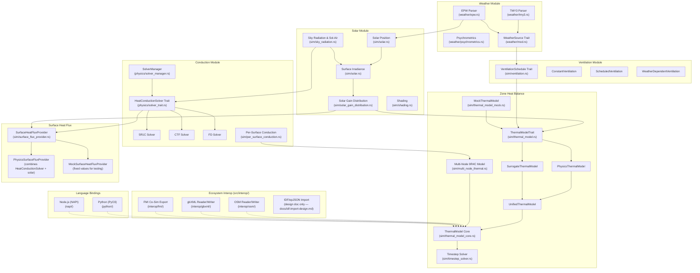
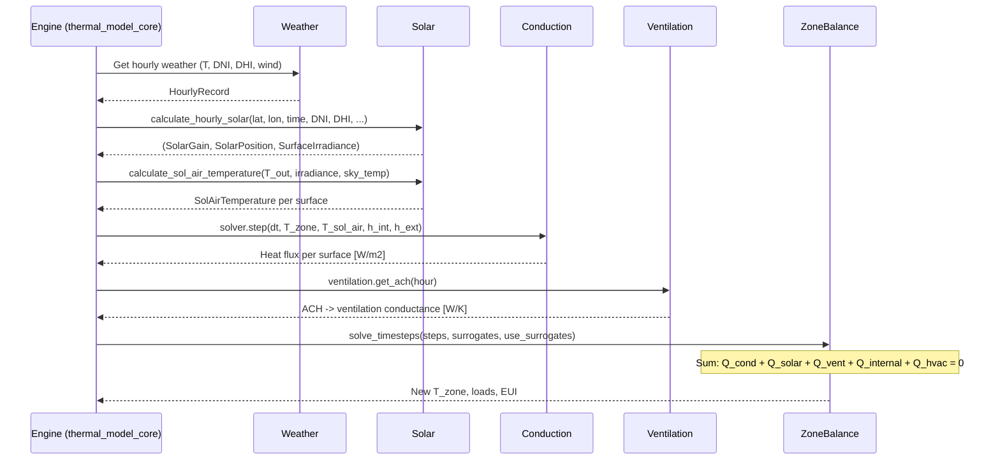

# Fluxion Engine Architecture

> **Source of Truth** — Feed this file to AI on every new session. All module boundaries, interfaces, and data contracts are defined here.

## Architecture Philosophy

**Bottom-Up Physics Validation**: Every module must be unit-tested in isolation against EnergyPlus reference data (1% tolerance) before being connected to the zone solver. No ASHRAE 140 system-level testing until all individual modules pass.

**ML Surrogate Ready**: All major physics modules interact through Rust traits, so ML surrogates can be swapped in at runtime via `Box<dyn Trait>`.

**Ecosystem Interoperability**: Import/export bridges to industry file formats (OSM, gbXML, FMI) live under `src/interop/`. Language bindings (Python via PyO3, Node.js via NAPI) expose the engine to external runtimes.

---

## Module Dependency Diagram



**Notes on interop edges**: Dashed lines (`-.->`) indicate optional import/export bridges. OSM, gbXML, and FMI are implemented; IDF/epJSON import is currently a design document only (`docs/idf-import-design.md`), with the planned module path `src/io/idf/`.

---

## Module Contracts

### Module 1: Weather

**Source**: `src/weather/` (`epw.rs`, `tmy3.rs`, `psychrometrics.rs`, `interpolation.rs`, `ddy.rs`, `denver.rs`)
**Purpose**: Parse EPW/TMY3 files and provide hourly weather data.

| Input | Type | Source |
|-------|------|--------|
| EPW/TMY3 file path | `String` | User/CLI |

| Output | Type | Consumer |
|--------|------|----------|
| `HourlyRecord` (8760 rows) | `Vec<HourlyRecord>` | Solar, Ventilation, Zone |
| Dry-bulb temperature | `f64` [C] | Conduction, Zone |
| DNI, DHI, GHI | `f64` [W/m2] | Solar |
| Wind speed | `f64` [m/s] | Ventilation |
| Humidity ratio | `f64` [kg/kg] | Psychrometrics |

**Key structs/traits**:
- `HourlyRecord` in `weather/epw.rs`
- `HourlyWeatherData` in `weather/mod.rs`
- `WeatherSource` trait in `weather/mod.rs`

**Reference data**: `tests/reference_data/weather/denver_tmy3_reference.csv` (8760 rows; columns: hour, dry_bulb_temp_c, humidity_rh_pct, dni_wm2, dhi_wm2, ghi_wm2, wind_speed_ms, humidity_ratio_kgkg). Station mismatch corrected in #1142 (now Golden-NREL TMY3).

---

### Module 2: Solar Position & Irradiance

**Source**: `src/sim/solar.rs`, `src/sim/sky_radiation.rs`, `src/sim/solar_gain_distribution.rs`, `src/sim/shading.rs`
**Purpose**: Calculate sun position, surface irradiance, and solar heat gains with per-surface distribution.

| Input | Type | Source |
|-------|------|--------|
| Latitude | `f64` [deg] | Building config |
| Longitude | `f64` [deg] | Building config |
| Year, Month, Day, Hour | `i32, u32, u32, f64` | Timestep |
| DNI, DHI, GHI | `f64` [W/m2] | Weather |
| Ground albedo | `f64` [-] | Building config |
| Surface tilt/azimuth | `f64` [deg] | Building config |

| Output | Type | Consumer |
|--------|------|----------|
| `SolarPosition` | `{altitude, azimuth, zenith}` | All solar submodules |
| `SurfaceIrradiance` | `{beam, diffuse, ground_reflected}` [W/m2] | Solar gain calc |
| `SolarGain` | `{beam_gain, diffuse_gain, ground_reflected_gain}` [W] | Zone balance |
| `SolAirTemperature` | `f64` [C] | Conduction boundary |
| Per-surface incident solar | `IncidentSolarAccumulator` | Diagnostics/validation |

**Key functions**:
- `calculate_solar_position(lat, lon, year, month, day, hour) -> SolarPosition`
- `calculate_surface_irradiance(sun_pos, dni, dhi, ghi, orientation) -> SurfaceIrradiance`
- `calculate_hourly_solar(...) -> (SolarGain, SolarPosition, SurfaceIrradiance)`

**Per-surface distribution** (#1119): Solar gain distribution across multiple surfaces is handled by `sim/solar_gain_distribution.rs`. The `IncidentSolar` metric type (#1132, `validation/report.rs`) and `IncidentSolarAccumulator` (`sim/thermal_model_data.rs`) track per-surface solar radiation for diagnostics and validation.

**Validation target**: Solar azimuth/altitude within 0.5 deg of E+; surface irradiance within 1% of E+.

**Reference data**: `tests/reference_data/solar/`
- `solar_position_denver.csv` — hour, altitude, azimuth, zenith
- `surface_irradiance_south.csv` — hour, beam, diffuse, ground_reflected
- `solar_gain_distribution.csv` — per-surface solar gain distribution (#1119)

**Isolation test**: `tests/solar_isolation.rs` — position within 0.5°, beam annual energy within 1%, ground-reflected mean within 1%, sol-air temperature analytical (#1146).

---

### Module 3: Conduction & Thermal Mass

**Source**: `src/physics/`
**Purpose**: Calculate heat transfer through building envelope via conduction.

| Input | Type | Source |
|-------|------|--------|
| Wall assembly | `BuildingAssembly` | Building config |
| Interior temperature | `f64` [C] | Zone balance (previous step) |
| Exterior temperature | `f64` [C] | Weather (or sol-air) |
| Interior h coefficient | `f64` [W/m2K] | Building config |
| Exterior h coefficient | `f64` [W/m2K] | Sky radiation |
| Timestep | `f64` [s] | Engine |

| Output | Type | Consumer |
|--------|------|----------|
| Heat flux (inward) | `f64` [W/m2] | Zone balance |
| Energy storage rate | `f64` [W/m2] | Diagnostics |

**Key trait**: `HeatConductionSolver` in `physics/solver_trait.rs`

```rust
pub trait HeatConductionSolver: Send + Sync {
    fn name(&self) -> &str;
    fn initialize(&mut self, wall: &BuildingAssembly) -> Result<(), SolverError>;
    fn step(&mut self, dt: f64, T_int: f64, T_ext: f64, h_int: f64, h_ext: f64) -> Result<f64, SolverError>;
    fn energy_storage_rate(&self) -> f64;
    fn is_valid(&self) -> bool;
}
```

**Implementations**: `FiveR1CSolver` (struct, `physics/five_r1c_solver.rs`), `CTFSolverWrapper`, `FDSolverWrapper`
**Selector**: `SolverManager` auto-selects based on thermal mass.
**Per-surface solver**: `sim/per_surface_conduction.rs` provides independent backward-Euler per-surface solving for the multi-node thermal model (#857/#856).

**Validation target**: Inside surface heat flux within 1% of E+ for step-change temperature test on 200mm concrete wall.

---

### Module 4: Infiltration & Ventilation

**Source**: `src/sim/ventilation.rs`
**Purpose**: Calculate air change rates and ventilation heat loss.

| Input | Type | Source |
|-------|------|--------|
| Outdoor temperature | `f64` [C] | Weather |
| Indoor temperature | `f64` [C] | Zone balance |
| Wind speed | `f64` [m/s] | Weather |
| Building height | `f64` [m] | Building config |
| Zone volume | `f64` [m3] | Building config |

| Output | Type | Consumer |
|--------|------|----------|
| Air changes per hour | `f64` [ACH] | Zone balance |
| Ventilation conductance | `f64` [W/K] | Zone balance |

**Key trait**: `VentilationSchedule`

```rust
pub trait VentilationSchedule {
    fn get_ach(&self, hour: usize) -> f64;
    fn ach_to_conductance(ach: f64, volume: f64, rho: f64, cp: f64) -> f64;
}
```

**Key functions**:
- `calculate_wind_infiltration_ach(wind_speed, height, shielding) -> f64`
- `calculate_stack_infiltration_ach(T_in, T_out, height_diff, area) -> f64`
- `calculate_combined_infiltration_ach(...) -> f64`

**Validation target**: Ventilation heat loss within 1% of E+ analytical calculation.

---

### Module 5: Zone Air Heat Balance

**Source**: `src/sim/thermal_model_core.rs`, `src/sim/thermal_model.rs`, `src/sim/thermal_model_physics/`, `src/sim/timestep_solver.rs`
**Purpose**: Solve the zone heat balance equation at each timestep.

| Input | Type | Source |
|-------|------|--------|
| Conduction heat fluxes | `Vec<f64>` [W] | Conduction module |
| Solar heat gains | `SolarGain` [W] | Solar module |
| Ventilation conductance | `f64` [W/K] | Ventilation module |
| Internal gains | `f64` [W] | Schedule |
| Weather data | `HourlyWeatherData` | Weather module |

| Output | Type | Consumer |
|--------|------|----------|
| Zone air temperature | `f64` [C] | Next timestep, HVAC |
| Heating load | `f64` [W] | HVAC controller |
| Cooling load | `f64` [W] | HVAC controller |
| Annual EUI | `f64` [kWh/m2/year] | Optimization |

**Key trait**: `ThermalModelTrait` in `sim/thermal_model.rs`

```rust
pub trait ThermalModelTrait: Send + Sync {
    fn num_zones(&self) -> usize;
    fn get_temperatures(&self) -> Vec<f64>;
    fn set_temperatures(&mut self, temperatures: &[f64]);
    fn mode(&self) -> ThermalModelMode;
    fn set_mode(&mut self, mode: ThermalModelMode);
    fn solve_timesteps(&mut self, steps: usize, surrogates: &SurrogateManager, use_surrogates: bool) -> f64;
    fn apply_parameters(&mut self, params: &[f64]);
    fn zone_area(&self) -> f64;
    fn heating_setpoint(&self) -> f64;
    fn cooling_setpoint(&self) -> f64;
    fn hvac_power_demand(&self, timestep: usize, outdoor_temp: f64) -> f64;
    fn is_valid(&self) -> bool;
}
```

**ML Surrogate Path**: `SurrogateThermalModel` implements `ThermalModelTrait` — the zone solver doesn't know whether physics or ML is computing the result. v3.0 surrogate training and ONNX export landed in #1139 (`src/ai/surrogate.rs`, `src/ai/modular_surrogate.rs`).

**Multi-node HVAC**: The 9R4C multi-node thermal model (`sim/multi_node_thermal.rs`) separates thermal mass into 4 nodes (wall, roof, floor, internal) for heavy-mass buildings (Case 900+ series, #715). Multi-node HVAC validation against ASHRAE 140 Case 900 is in place.

**Validation target**: Zone temperature within 0.5C of E+ when all sub-modules are verified.

---

### Supporting Traits

These traits support the main physics pipeline and should also be documented:

| Trait | File | Purpose |
|-------|------|---------|
| `SurfaceHeatFluxProvider` | `src/sim/surface_flux_provider.rs` | Surface-level heat flux abstraction (conduction + solar combined) |
| `WeatherSource` | `src/weather/mod.rs` | Weather data access abstraction |
| `PsychrometricCalculations` | `src/weather/psychrometrics.rs` | Moist air property calculations |
| `MaterialLayer` | `src/sim/assembly.rs` | Building material layer interface |
| `Equipment` | `src/sim/equipment.rs` | HVAC equipment trait |
| `VariableCapacityEquipment` | `src/sim/hvac/equipment.rs` | Variable-speed equipment |
| `GroundTemperature` | `src/sim/boundary.rs` | Ground temp boundary condition |

### Surface Heat Flux Trait Hierarchy

The `SurfaceHeatFluxProvider` trait decouples the zone solver from specific heat flux
calculation methods. It wraps conduction and solar into a single interface. Verified
accurate as of #1119 (per-surface boundary conditions):

```text
SurfaceHeatFluxProvider (surface level, sim/surface_flux_provider.rs)
├── PhysicsSurfaceFluxProvider   (combines HeatConductionSolver + solar gain per surface)
└── MockSurfaceHeatFluxProvider  (fixed values for testing)
```

```rust
pub trait SurfaceHeatFluxProvider: Send + Sync {
    fn surface_heat_flux(&self, surface_idx: usize, T_zone: f64, T_outdoor: f64, dt_seconds: f64) -> f64;
    fn num_surfaces(&self) -> usize;
    fn name(&self) -> &str;
}
```

`PhysicsSurfaceFluxProvider` accepts per-surface solar gain (`solar_gain_wm2`) and per-surface film coefficients (`h_int`, `h_ext`) via `add_surface` / `add_surface_with_film_coefficients`, matching the per-surface boundary condition work in #1119.

### Thermal Model Trait Hierarchy

```text
ThermalModelTrait (zone level, sim/thermal_model.rs)
├── PhysicsThermalModel        (analytical 5R1C thermal network)
├── SurrogateThermalModel      (neural network inference, ONNX v3.0 — #1139)
├── UnifiedThermalModel        (runtime switching between physics/surrogate)
└── MockThermalModel           (fixed values for testing, sim/thermal_model_mock.rs)
```

---

## Data Flow: Single Timestep

> **Implementation note**: The `Engine` node below represents the orchestration role. In code, `sim/engine.rs` re-exports `ThermalModel` (from `thermal_model_core.rs`) and `StepParameters` (from `timestep_solver.rs`); the actual per-timestep orchestration lives in `thermal_model_core.rs` and `timestep_solver.rs`.



---

## Ecosystem Interop

Import/export bridges live under `src/interop/`. Each is gated behind the module tree rooted at `interop/mod.rs`.

| Module | Path | Status | Notes |
|--------|------|--------|-------|
| OpenStudio OSM | `interop/osm/` | Implemented (#1130) | Reader (884 LoC) + Writer (505 LoC) + types; `import_osm` / `export_osm` |
| gbXML | `interop/gbxml/` | Implemented (#1126) | Reader + Writer + types; `import_gbxml` / `export_gbxml`; BIM integration |
| FMI Co-Simulation | `interop/fmi/` | Implemented — spike (#1125) | FMU export, single-zone, fixed 1h timestep; `FmiExporter`, `FmiConfig` |
| EnergyPlus IDF/epJSON | `docs/idf-import-design.md` | **Design only** (#1126) | Planned path `src/io/idf/`; not yet implemented |
| IFC/BIM geometry | `docs/` (design doc) | **Design only** (#1121) | Geometry import design documented; not yet implemented |

### Language Bindings

| Binding | Path | Feature Flag | Status |
|---------|------|--------------|--------|
| Python (PyO3) | `src/python/` | `python-bindings` | Implemented (#1123); multi-zone + HVAC bindings |
| Node.js (NAPI) | `src/napi/` | `napi-bindings` | Implemented; coexists with Python bindings |

---

## Reference Data Structure

```
tests/reference_data/
  conduction/
    step_response_200mm_concrete.csv     # hour, T_ext, T_surface_inside, heat_flux
    step_response_composite.csv
    step_response_fixed_zone_20c.csv
    step_response_floor.csv
    step_response_lightweight.csv
    step_response_roof.csv
  energyplus_models/                     # Source IDF models for regenerating CSVs
    annual_solar_ventilation.idf
    ashrae_140_solar_gain.idf
    fixed_inputs_zone_temp.idf
    step_change_concrete.idf
    ventilation_denver_01ach.idf
    ventilation_denver_05ach.idf
    ventilation_denver_10ach.idf
    ventilation_dulles_05ach.idf
    ventilation_tampa_05ach.idf
  solar/
    solar_position_denver.csv            # hour, altitude, azimuth, zenith
    surface_irradiance_south.csv         # hour, beam, diffuse, ground_reflected
    solar_gain_distribution.csv          # per-surface solar gain distribution (#1119)
  ventilation/
    infiltration_denver.csv              # hour, ACH, vent_conductance
    infiltration_denver_01ach.csv
    infiltration_denver_05ach.csv
    infiltration_denver_10ach.csv
    infiltration_dulles_05ach.csv
    infiltration_tampa_05ach.csv
  weather/
    denver_tmy3_reference.csv            # hour, T_drybulb, RH, DNI, DHI, GHI, wind, humidity_ratio
  zone_balance/
    fixed_inputs_zone_temp.csv           # hour, T_zone, T_out, Q_cond, Q_solar, Q_vent, Q_int, Q_heat, Q_cool
  generate_reference_data.py             # Regenerates solar/conduction/ventilation CSVs from IDFs
  generate_fixed_zone_reference.py       # Regenerates zone_balance CSV
  generate_ventilation_scenarios.py      # Regenerates ventilation CSVs
  README.md
```

Each CSV column must match a function output exactly so tests can loop row-by-row. Reference CSVs are regenerated from the IDF models in `energyplus_models/` using EnergyPlus 25.2.0 against the Golden-NREL TMY3 EPW (station mismatch fixed in #1142).

---

## Validation Strategy

### Phase 1: Module Isolation (Current)
Each module tested independently against E+ reference data:
- **Weather**: EPW/TMY3 parsing matches E+ reference (station corrected #1142)
- **Solar**: Position + irradiance + per-surface distribution match E+ within 1% (#1119, #1132)
- **Conduction**: Step response heat flux matches E+ within 1%
- **Ventilation**: ACH and heat loss match E+ within 1%

### Phase 2: Integration
Reconnect modules, run ASHRAE 140 system tests. Multi-node HVAC validation (Case 900) is in place; free-floating calibration landed in #1154 (CTF stability, EPW weather, ISO 13790 thermal mass). Empirical corrections removed in #1138.
If a system test fails, the individual module tests pinpoint which module is wrong.

### Phase 3: ML Surrogate Drop-In
Once physics is validated, train ML surrogates on physics outputs.
Surrogates must match physics within 2% on held-out data. v3.0 surrogate training and ONNX export landed in #1139.

---

## Current Module Status

| Module | Isolated? | Trait Defined? | E+ Reference Data? | Unit Tests Pass? |
|--------|-----------|----------------|--------------------|--------------------|
| Weather | Yes | Yes (`WeatherSource`) | Yes | Yes |
| Solar | Yes | No (functions are standalone) | Yes | Yes |
| Conduction | Yes | Yes (`HeatConductionSolver`) | Yes | Yes |
| Ventilation | Yes | Yes (`VentilationSchedule`) | Yes | Yes |
| Zone Balance | Partial | Yes (`ThermalModelTrait`) | Yes | Partial |

**Zone Balance detail**: Multi-node 9R4C model and Case 900 multi-node HVAC validation are complete. Free-floating calibration and annual re-validation CI gate landed (#1154, #1137, #669). Marked "Partial" because system-level ASHRAE 140 tuning across the full case matrix is ongoing; the bottom-up module isolation required by Phase 1 is complete for Weather, Solar, Conduction, and Ventilation.

**Note on Solar trait**: The solar module exposes standalone functions rather than a trait because there is no ML surrogate swap point at the solar calculation layer — solar position/irradiance is deterministic physics. The per-surface results flow into `SurfaceHeatFluxProvider` and `ThermalModelTrait`, which are the swap points.

**Recent corrections**: #1140 corrected ASHRAE 140 exterior film coefficient (29.3 → 18.3 W/m2K) and solar absorptance (0.6 → 0.7); #1142 corrected the weather reference data station mismatch.

---

## Module Size Budget

Keep modules small enough for AI context windows:
- Each module < 500 lines of physics code
- Test files < 300 lines each
- Reference data CSVs < 10,000 rows (1 year hourly)
