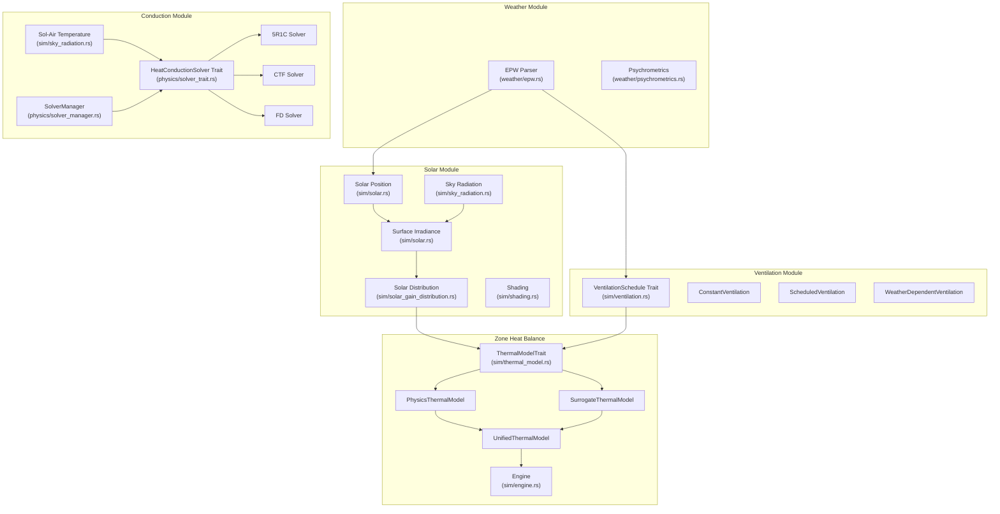
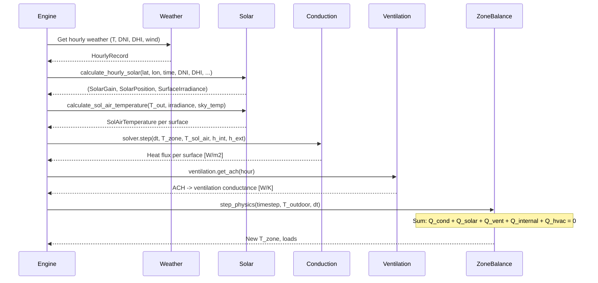

# Fluxion Engine Architecture

> **Source of Truth** — Feed this file to AI on every new session. All module boundaries, interfaces, and data contracts are defined here.

## Architecture Philosophy

**Bottom-Up Physics Validation**: Every module must be unit-tested in isolation against EnergyPlus reference data (1% tolerance) before being connected to the zone solver. No ASHRAE 140 system-level testing until all individual modules pass.

**ML Surrogate Ready**: All major physics modules interact through Rust traits, so ML surrogates can be swapped in at runtime via `Box<dyn Trait>`.

---

## Module Dependency Diagram



---

## Module Contracts

### Module 1: Weather

**Source**: `src/weather/`
**Purpose**: Parse EPW files and provide hourly weather data.

| Input | Type | Source |
|-------|------|--------|
| EPW file path | `String` | User/CLI |

| Output | Type | Consumer |
|--------|------|----------|
| `HourlyRecord` (8760 rows) | `Vec<HourlyRecord>` | Solar, Ventilation, Zone |
| Dry-bulb temperature | `f64` [C] | Conduction, Zone |
| DNI, DHI, GHI | `f64` [W/m2] | Solar |
| Wind speed | `f64` [m/s] | Ventilation |
| Humidity ratio | `f64` [kg/kg] | Psychrometrics |

**Key struct**: `HourlyRecord` in `weather/epw.rs`

---

### Module 2: Solar Position & Irradiance

**Source**: `src/sim/solar.rs`, `src/sim/sky_radiation.rs`, `src/sim/solar_gain_distribution.rs`
**Purpose**: Calculate sun position, surface irradiance, and solar heat gains.

| Input | Type | Source |
|-------|------|--------|
| Latitude | `f64` [deg] | Building config |
| Longitude | `f64` [deg] | Building config |
| Year, Month, Day, Hour | `i32, u32, u32, f64` | Timestep |
| DNI, DHI, GHI | `f64` [W/m2] | Weather |
| Ground albedo | `f64` [-] | Building config |
| Surface tilt/azimuth | `f64` [deg] | Building config |

| Output | Type | Consumer |
|--------|------|----------|
| `SolarPosition` | `{altitude, azimuth, zenith}` | All solar submodules |
| `SurfaceIrradiance` | `{beam, diffuse, ground_reflected}` [W/m2] | Solar gain calc |
| `SolarGain` | `{beam_gain, diffuse_gain, ground_reflected_gain}` [W] | Zone balance |
| `SolAirTemperature` | `f64` [C] | Conduction boundary |

**Key functions**:
- `calculate_solar_position(lat, lon, year, month, day, hour) -> SolarPosition`
- `calculate_surface_irradiance(sun_pos, dni, dhi, ghi, orientation) -> SurfaceIrradiance`
- `calculate_hourly_solar(...) -> (SolarGain, SolarPosition, SurfaceIrradiance)`

**Validation target**: Solar azimuth/altitude within 0.5 deg of E+; surface irradiance within 1% of E+.

---

### Module 3: Conduction & Thermal Mass

**Source**: `src/physics/`
**Purpose**: Calculate heat transfer through building envelope via conduction.

| Input | Type | Source |
|-------|------|--------|
| Wall assembly | `BuildingAssembly` | Building config |
| Interior temperature | `f64` [C] | Zone balance (previous step) |
| Exterior temperature | `f64` [C] | Weather (or sol-air) |
| Interior h coefficient | `f64` [W/m2K] | Building config |
| Exterior h coefficient | `f64` [W/m2K] | Sky radiation |
| Timestep | `f64` [s] | Engine |

| Output | Type | Consumer |
|--------|------|----------|
| Heat flux (inward) | `f64` [W/m2] | Zone balance |
| Energy storage rate | `f64` [W/m2] | Diagnostics |

**Key trait**: `HeatConductionSolver` in `physics/solver_trait.rs`

```rust
pub trait HeatConductionSolver: Send + Sync {
    fn name(&self) -> &str;
    fn initialize(&mut self, wall: &BuildingAssembly) -> Result<(), SolverError>;
    fn step(&mut self, dt: f64, T_int: f64, T_ext: f64, h_int: f64, h_ext: f64) -> Result<f64, SolverError>;
    fn energy_storage_rate(&self) -> f64;
    fn is_valid(&self) -> bool;
}
```

**Implementations**: `FiveR1CSolver` (struct, `physics/five_r1c_solver.rs`), `CTFSolverWrapper`, `FDSolverWrapper`
**Selector**: `SolverManager` auto-selects based on thermal mass.

**Validation target**: Inside surface heat flux within 1% of E+ for step-change temperature test on 200mm concrete wall.

---

### Module 4: Infiltration & Ventilation

**Source**: `src/sim/ventilation.rs`
**Purpose**: Calculate air change rates and ventilation heat loss.

| Input | Type | Source |
|-------|------|--------|
| Outdoor temperature | `f64` [C] | Weather |
| Indoor temperature | `f64` [C] | Zone balance |
| Wind speed | `f64` [m/s] | Weather |
| Building height | `f64` [m] | Building config |
| Zone volume | `f64` [m3] | Building config |

| Output | Type | Consumer |
|--------|------|----------|
| Air changes per hour | `f64` [ACH] | Zone balance |
| Ventilation conductance | `f64` [W/K] | Zone balance |

**Key trait**: `VentilationSchedule`

```rust
pub trait VentilationSchedule {
    fn get_ach(&self, hour: usize) -> f64;
    fn ach_to_conductance(ach: f64, volume: f64, rho: f64, cp: f64) -> f64;
}
```

**Key functions**:
- `calculate_wind_infiltration_ach(wind_speed, height, shielding) -> f64`
- `calculate_stack_infiltration_ach(T_in, T_out, height_diff, area) -> f64`
- `calculate_combined_infiltration_ach(...) -> f64`

**Validation target**: Ventilation heat loss within 1% of E+ analytical calculation.

---

### Module 5: Zone Air Heat Balance

**Source**: `src/sim/thermal_model.rs`, `src/sim/thermal_model_physics.rs`
**Purpose**: Solve the zone heat balance equation at each timestep.

| Input | Type | Source |
|-------|------|--------|
| Conduction heat fluxes | `Vec<f64>` [W] | Conduction module |
| Solar heat gains | `SolarGain` [W] | Solar module |
| Ventilation conductance | `f64` [W/K] | Ventilation module |
| Internal gains | `f64` [W] | Schedule |
| Weather data | `HourlyWeatherData` | Weather module |

| Output | Type | Consumer |
|--------|------|----------|
| Zone air temperature | `f64` [C] | Next timestep, HVAC |
| Heating load | `f64` [W] | HVAC controller |
| Cooling load | `f64` [W] | HVAC controller |

**Key trait**: `ThermalModelTrait` in `sim/thermal_model.rs`

```rust
pub trait ThermalModelTrait: Send + Sync {
    fn solve_timesteps(&mut self, steps: usize, surrogates: &SurrogateManager, use_ai: bool, ...) -> f64;
    fn get_temperatures(&self) -> Vec<f64>;
    fn set_loads(&mut self, loads: &[f64]);
    fn set_weather(&mut self, weather: HourlyWeatherData);
    fn step_physics(&mut self, timestep: usize, outdoor_temp: f64, dt_seconds: f64) -> f64;
}
```

**ML Surrogate Path**: `SurrogateThermalModel` implements `ThermalModelTrait` — the zone solver doesn't know whether physics or ML is computing the result.

**Validation target**: Zone temperature within 0.5C of E+ when all sub-modules are verified.

---

### Supporting Traits

These traits support the main physics pipeline and should also be documented:

| Trait | File | Purpose |
|-------|------|---------|
| `WeatherSource` | `src/weather/mod.rs` | Weather data access abstraction |
| `PsychrometricCalculations` | `src/weather/psychrometrics.rs` | Moist air property calculations |
| `MaterialLayer` | `src/sim/assembly.rs` | Building material layer interface |
| `Equipment` | `src/sim/equipment.rs` | HVAC equipment trait |
| `VariableCapacityEquipment` | `src/sim/hvac/equipment.rs` | Variable-speed equipment |
| `GroundTemperature` | `src/sim/boundary.rs` | Ground temp boundary condition |

---

## Data Flow: Single Timestep



---

## Reference Data Structure

```
tests/reference_data/
  solar/
    solar_position_denver_2023.csv    # hour, altitude, azimuth, zenith
    surface_irradiance_south.csv       # hour, beam, diffuse, ground_reflected
  conduction/
    step_response_200mm_concrete.csv   # hour, T_ext, T_surface_inside, heat_flux
    annual_wall_denver.csv             # hour, heat_flux
  ventilation/
    infiltration_denver.csv            # hour, ACH, vent_conductance
  zone_balance/
    case_600_denver.csv               # hour, T_zone, Q_heat, Q_cool
```

Each CSV column must match a function output exactly so tests can loop row-by-row.

---

## Validation Strategy

### Phase 1: Module Isolation (Current)
Each module tested independently against E+ reference data:
- **Solar**: Position + irradiance match E+ within 1%
- **Conduction**: Step response heat flux matches E+ within 1%
- **Ventilation**: ACH and heat loss match E+ within 1%

### Phase 2: Integration
Reconnect modules, run ASHRAE 140 system tests.
If a system test fails, the individual module tests pinpoint which module is wrong.

### Phase 3: ML Surrogate Drop-In
Once physics is validated, train ML surrogates on physics outputs.
Surrogates must match physics within 2% on held-out data.

---

## Current Module Status

| Module | Isolated? | Trait Defined? | E+ Reference Data? | Unit Tests Pass? |
|--------|-----------|----------------|--------------------|--------------------|
| Weather | Partial | No | No | Partial |
| Solar | No | No | No | No |
| Conduction | No | Yes (`HeatConductionSolver`) | No | No |
| Ventilation | No | Yes (`VentilationSchedule`) | No | No |
| Zone Balance | No | Yes (`ThermalModelTrait`) | No | No |

**Next steps**: Fill every "No" cell left-to-right.

---

## Module Size Budget

Keep modules small enough for AI context windows:
- Each module < 500 lines of physics code
- Test files < 300 lines each
- Reference data CSVs < 10,000 rows (1 year hourly)
