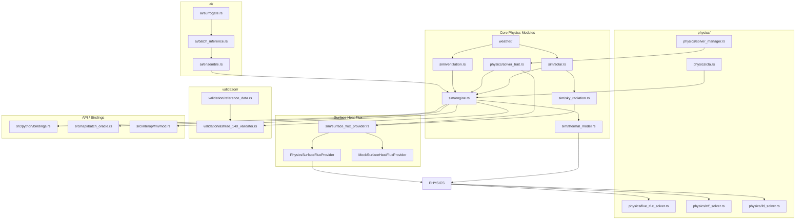

# Fluxion Codebase Map

Code navigation guide for the Fluxion BEM engine — Rust core with Python/JS bindings.
MANDATORY READING at start of every session; establishes cross-language context.
Covers: module dependency graph, physics modules, ONNX surrogates, multi-language bindings.
Companion to ARCHITECTURE.md (physics contracts) and RULES.md (coding constraints).
Status: Current — reflects crate-split layout (#1255, #1349, #1441) and Neuro-Symbolic architecture.
Action: Run `cargo build` and `python -c "import fluxion"` to verify setup before exploring.

> **MANDATORY READING** — Read this file at the start of every session to establish cross-language context.

## Project Overview

**Fluxion** is a Rust-based Building Energy Modeling (BEM) engine with a **Neuro-Symbolic hybrid architecture**. It combines:
- **Physics-based thermal networks** (ISO 13790-compliant 5R1C/6R2C models)
- **AI surrogates** (ONNX Runtime) for 10,000+ configs/sec throughput
- **Multi-language bindings** (Python/PyO3, Node.js/NAPI, FMI 2.0)

## Module Dependency Graph



## Directory Structure

```
src/
├── ai/                        # AI surrogate models
│   ├── surrogate.rs          # SurrogateManager (ONNX Runtime wrapper)
│   ├── batch_inference.rs     # Batch inference service
│   ├── ensemble.rs            # Ensemble prediction
│   ├── distributed.rs        # Distributed inference
│   └── modular_surrogate.rs  # Modular surrogate architecture
│
├── api/                       # Public API types (Python FFI)
│   ├── mod.rs
│   ├── error.rs              # FluxionError, ValidationError, etc.
│   ├── parameters.rs         # BuildingParameters with validation
│   └── schema.rs             # SimulationSchema v1 (JSON serialization)
│
├── cli/                       # Command-line interface
│   └── commands/
│
├── interop/                  # External integrations
│   └── fmi/                  # FMI 2.0 Co-Simulation export
│
├── napi/                      # Node.js/NAPI bindings
│   ├── mod.rs
│   ├── batch_oracle.rs       # BatchOracle wrapper (napi-derive)
│   ├── building_parameters.rs# BuildingParameters wrapper
│   └── error.rs             # NAPI-specific error types
│
├── orchestration/            # Multi-simulation orchestration
│
├── performance/             # Benchmarking and profiling
│
├── physics/                 # Thermal conduction solvers
│   ├── solver_trait.rs       # HeatConductionSolver trait
│   ├── five_r1c_solver.rs   # 5R1C CTA implementation
│   ├── cta.rs               # Continuous Tensor Abstraction
│   ├── ctf_solver.rs        # Conduction Transfer Function
│   ├── fd_solver.rs         # Finite Difference
│   ├── solver_manager.rs    # Auto-solver selection
│   ├── constants/          # Physical constants
│   │   ├── solar/          # Solar constants (ASHRAE 140)
│   │   └── thermal/        # Thermal constants (ISO 13790, ASHRAE 140)
│   └── thermal_mass/        # Thermal mass calculations
│
├── python/                   # PyO3 Python bindings
│   ├── mod.rs
│   ├── bindings.rs          # PyMultiZoneThermalModel, PyConstruction, etc.
│   └── hvac.py             # Python HVAC utilities
│
├── sim/                      # Simulation engine
│   ├── engine.rs            # ThermalModel, solve_timesteps
│   ├── thermal_model.rs     # ThermalModelTrait (trait hierarchy)
│   ├── thermal_model_core/   # Core thermal model implementation (mod.rs + tests)
│   ├── thermal_model_5r1c.rs # 5R1C specific implementation
│   ├── surface_flux_provider.rs # SurfaceHeatFluxProvider trait
│   ├── solar.rs            # Solar position & irradiance
│   ├── sky_radiation.rs     # Sky temperature & sol-air temp
│   ├── ventilation.rs      # VentilationSchedule trait
│   ├── shading.rs          # Shading calculations
│   ├── construction.rs     # ConstructionLayer, WallSurface, etc.
│   ├── schedule.rs         # Occupancy/lighting/HVAC schedules
│   ├── occupancy.rs        # Internal gains from occupancy
│   ├── equipment.rs        # HVAC equipment models
│   ├── boundary.rs         # Boundary conditions
│   └── hvac/              # HVAC system models
│       ├── airside_state.rs    # Validated moist-air and supply-flow boundary values
│       └── airside_coupling.rs # Transactional 6-min operator split with 9R4C
│
├── solar/                  # Solar calculations
│
├── testing/                # Integration tests
│
├── thermal/                # Thermal calculations
│
├── validation/            # Validation framework
│   ├── ashrae_140_validator/  # ASHRAE 140 compliance (mod.rs + tests)
│   ├── reference_data.rs   # E+ reference data loading
│   ├── tolerance.rs        # Validation tolerances
│   └── cross_validation/   # Multi-reference validation
│       └── adapters/       # EnergyPlus, ESP-r, TRNSYS adapters
│
├── weather/               # Weather data
│   ├── epw.rs            # EPW file parser
│   └── psychrometrics.rs # Moist air properties
│
└── lib.rs                 # PyO3 module entry point (BatchOracle, Model)
```

---

## FFI Contracts

### FFI Architecture Overview

Fluxion provides four FFI pathways — PyO3 (Python), NAPI-RS (Node.js),
FMI 2.0 (co-simulation export), and `wasm-bindgen` (browser / CAD /
web-BIM via the `fluxion-wasm` workspace crate, PR #3714):

```
┌──────────────────────────────────────────────────────────────────────────┐
│                         External Consumers                                │
│ Python (scipy, D-Wave) │ Node.js │ FMI (EnergyPlus, TRNSYS) │ WASM (browser, CAD) │
└──────────────────────────────────────────────────────────────────────────┘
              │                │              │                        │
       ┌──────┴───────┐ ┌──────┴───────┐ ┌────┴────┐          ┌─────────┴─────────┐
       │  src/lib.rs  │ │   src/napi/  │ │  src/   │          │   fluxion-wasm    │
       │ (PyO3 module)│ │  (NAPI-RS)   │ │interop/ │          │   (wasm-bindgen)  │
       │              │ │              │ │   fmi   │          │                   │
       └──────┬───────┘ └──────┬───────┘ └────┬────┘          └─────────┬─────────┘
              │                │              │                        │
              │        ┌───────┴────┐         │                        │
              │        │ crates/     │         │                        │
              │        │ fluxion-    │         │                        │
              │        │ toon (TOON) │         │                        │
              │        └───────┬────┘         │                        │
              │                │              │                        │
    ┌─────────▼────────────────▼──────────────▼────────────────────────▼─────┐
    │              Rust Core (rlib) + fluxion-fluid acausal HVAC ports       │
    │   ThermalModel │ SurrogateManager │ Solvers │ FluidNetwork             │
    └────────────────────────────────────────────────────────────────────────┘
```

---

### Python Bindings (PyO3)

**Feature flag**: `python-bindings`

**Entry point**: `src/lib.rs` (PyO3 module `fluxion`)

#### Exposed Types

| Rust Type | Python Class | Purpose |
|-----------|-------------|---------|
| `Model` | `fluxion.Model` | Single-building detailed simulation |
| `BatchOracle` | `fluxion.BatchOracle` | High-throughput population evaluation |
| `BuildingParameters` | `fluxion.BuildingParameters` | Validated parameter wrapper |
| `ThermalModel<VectorField>` | `fluxion.MultiZoneThermalModel` | Multi-zone thermal model |
| `Construction` | `fluxion.Construction` | Wall construction assembly |
| `ConstructionLayer` | `fluxion.ConstructionLayer` | Single material layer |
| `VectorField` | `fluxion.VectorField` | CTA vector field |

#### Python API Signatures

```python
# High-throughput evaluation (hot loop)
BatchOracle.evaluate_population(
    population: List[List[float]],  # [[u_value, heating, cooling], ...]
    use_surrogates: bool
) -> List[float]  # EUI values

# Single building simulation
Model.simulate(years: int, use_surrogates: bool) -> float  # EUI

# Parameter validation
BatchOracle.validate_parameters(params: List[float]) -> None  # raises ValidationError
```

#### Data Serialization

**Population format**: `Vec<Vec<f64>>` passed directly to Rust
- Element 0: Window U-value (W/m²K, range 0.1–5.0)
- Element 1: Heating setpoint (°C, range 15–25)
- Element 2: Cooling setpoint (°C, range 22–32)

**Return format**: `Vec<f64>` of EUI values (kWh/m²/yr)

#### Memory Ownership Rules

1. **Owned data**: Python `list` → Rust `Vec` conversion (copies data)
2. **Borrowed data**: NumPy arrays use `from_vec_bound` for zero-copy when possible
3. **GIL**: PyO3 releases GIL during Rust computations for parallelism
4. **Error handling**: Rust errors converted to Python exceptions (`ValidationError`, `SimulationError`, `SurrogateError`)

---

### Node.js Bindings (NAPI-RS)

**Feature flag**: `napi-bindings`

**Entry point**: `@fluxion/native` npm package

#### Exposed Types

| Rust Type | TypeScript Class |
|-----------|-----------------|
| `BatchOracle` | `BatchOracle` |
| `BuildingParameters` | `BuildingParameters` |
| `FluxionError` | `FluxionError` (union of error types) |

#### TypeScript API Signatures

```typescript
// High-throughput evaluation
evaluatePopulation(
    population: number[][],  // [[u_value, heating, cooling], ...]
    useSurrogates: boolean
): number[]  // EUI values

// Parameter validation
validateParameters(params: number[]): void  // throws ValidationError
```

#### NAPI-Specific Notes

- Uses `napi-derive` for automatic TypeScript type generation
- Supports `async` operations via `napi::bindgen_prelude::Result`
- Error types: `FluxionError`, `SimulationError`, `SurrogateError`, `ValidationError`

---

### FMI 2.0 Co-Simulation (interop/fmi)

**Purpose**: Export Fluxion as FMU for co-simulation with EnergyPlus, TRNSYS, etc.

#### Exposed Variables

| Name | Causality | Type | Unit | Description |
|------|-----------|------|------|-------------|
| `outdoor_temperature` | Input | Real | K | Outdoor dry-bulb temperature |
| `direct_normal_solar` | Input | Real | W/m² | Direct normal solar radiation |
| `diffuse_horizontal_solar` | Input | Real | W/m² | Diffuse horizontal solar radiation |
| `internal_gains` | Input | Real | W | Total internal heat gains |
| `zone_temperature` | Output | Real | K | Zone air temperature |
| `heating_load` | Output | Real | W | Heating load (positive) |
| `cooling_load` | Output | Real | W | Cooling load (positive) |

#### Configuration

```rust
FmiConfig {
    communication_timestep: 3600.0,  // 1 hour
    start_time: 0.0,
    stop_time: 31536000.0,  // 1 year
}
```

---

### WebAssembly Bindings (wasm-bindgen) — `fluxion-wasm/`

**Purpose**: Browser-side and in-CAD simulation. The `fluxion-wasm`
workspace crate ships `wasm-bindgen` exports wrapping `fluxion-fluid`
ports/mediums and a per-zone lumped-capacitance model wired to real
weather + HVAC loads. Issue #1996 scaffolded the crate; Issue #2380
and PR #3714 wired it to real weather (WD600 series for
`"ASHRAE_600"` preset) and full HVAC power demand. Authoritative
references: [`fluxion-wasm/README.md`](fluxion-wasm/README.md) (API
+ integration examples) and
[`fluxion-wasm/WASM_STATUS.md`](fluxion-wasm/WASM_STATUS.md)
(compatibility matrix + limitations).

**Build entry points** (`wasm-pack`):
```bash
wasm-pack build --target web     -p fluxion-wasm   # browser bundle
wasm-pack build --target nodejs -p fluxion-wasm   # Node.js module
cargo check                      -p fluxion-wasm   # native sanity check
```

#### Exposed Types (`#[wasm_bindgen]`)

| Rust Type | JS Class | Purpose |
|-----------|----------|---------|
| `FluidSimulation` | `FluidSimulation` | Per-zone lumped-capacitance model with HVAC power demand; primary public type |
| `FluidSimulationConfig` | (plain JSON) | Serialization-only — constructor input schema |
| `Air`, `Water`, `Medium` | re-exports | `fluxion-fluid::mediums` strong types |
| `AirPort`, `HydronicPort`, `BoundaryConditions` | re-exports | `fluxion-fluid::ports` strong types |

#### JavaScript API (v1.1.0)

```javascript
import init, { FluidSimulation } from '@fluxion/wasm';

await init();

const sim = new FluidSimulation(JSON.stringify({
  building: '5_zone_office',
  num_zones: 5,
  weather: 'ASHRAE_600',
  heating_setpoint: 20.0,
  cooling_setpoint: 24.0,
  zone_thermal_mass: [5e6, 5e6, 5e6, 5e6, 5e6],
  zone_conductance:  [50.0, 50.0, 50.0, 50.0, 50.0],
  infiltration_ach:  [0.5,  0.5,  0.5,  0.5,  0.5 ],
  internal_gains_w:  [200,  200,  200,  200,  200 ],
}));

sim.step(1.0);                                 // advance 1 hour
const temps = sim.get_zone_temps();            // Float64Array of zone °C
sim.set_control('heating_zone_0', 21.0);       // mutate control loop
const q = sim.hvac_power_demand(0, -5.0);      // HVAC W at hour, T_out °C
```

Full method list (constructor + 25 methods including zone-parameter
batch mutations in v1.1.0): see `fluxion-wasm/README.md` §API. The
JSON shape for both the constructor and `apply_zone_parameters` is
documented in `fluxion-wasm/README.md` §Configuration.

#### FFI / Memory Ownership

- `wasm-bindgen` translates `Vec<f64>` to JS `Float64Array` as a
  zero-copy view (no heap allocation, the JS GC reclaims).
- `String` ↔ `JSString` automatic.
- `Result<T, JsValue>` maps to either a thrown `Error` (Rust `Err`
  variant converted via `JsValue::from_str`) or a returned value.
- `Option<T>` ↔ `T | null`.
- All exported types are `'static`; reference counting on the
  JS side, no explicit `free()` required — the JS GC reclaims.
- Validation at the boundary (Issue #2911): finite-range checks in
  `fluxion_wasm::check_finite` (and the wasm-boundary
  `validate_finite` wrapper) reject NaN/±Inf and out-of-range values
  so a malformed JS payload cannot propagate into downstream
  numerical instability.

#### WASM Compatibility Constraints

See [`fluxion-wasm/WASM_STATUS.md`](fluxion-wasm/WASM_STATUS.md) for
the full matrix. Summary:

| Module | Status | Notes |
|--------|--------|-------|
| `fluxion-core` | ✅ Compatible | Weather, assembly, multi_node |
| `fluxion-fluid::mediums` | ✅ Compatible | Pure Rust |
| `fluxion-fluid::ports` | ✅ Compatible | Strongly typed ports |
| `fluxion-fluid::graph` | ✅ Compatible | petgraph with `alloc` |
| `fluxion-fluid::solvers` | ⚠ Sequential | `faer-rs` without `rayon` |
| `fluxion-ai` (ONNX) | ❌ Incompatible | `ort` is not WASM-portable |
| `BatchOracle` (`rayon`) | ❌ Incompatible | No thread pool in WASM |

Consequence: `FluidSimulation::solve_timesteps(steps, useSurrogates)`
is a documented stub that returns `0.0`; surrogate inference is
unavailable in WASM builds. The enhanced lumped-capacitance model
(per-zone thermal mass + conductance + infiltration + gains) is the
physics-only path. The crate is consumed by
`fluxion-tauri/frontend/src/sim/` via the `WASM Sim` button as the
optional in-browser physics fallback (see `fluxion-tauri/README.md`
§Web fallback).

---

## Boundary Crates (Workspace Siblings)

Workspace crates that cross a process, protocol, or model boundary rather than a
language-FFI boundary. Each is a Cargo workspace member documented here so
contributors following AGENTS.md's mandatory-reading directive can find them.

### fluxion-toon (crates/fluxion-toon/)

**Purpose**: Token-Oriented Object Notation (TOON) — compact, tabular
serialization format that reduces LLM context-window usage by 35–50% vs JSON for
uniform flat-struct arrays (zone temperatures, surface fluxes, HVAC energy).
Authoritative spec: `crates/fluxion-toon/SPEC.md` (TOON v1.0). Issues #2066, #2071.

**Feature-gate relationship**: standalone **leaf crate** — has no `fluxion`
dependency. Consumed by `fluxion-mcp` (Issue #2072) to serialize tool responses
for LLM clients.

**Entry point**: `crates/fluxion-toon/src/lib.rs`

#### Public Surface

| Item | Kind | Purpose |
|------|------|---------|
| `to_string<T: Serialize>(&T) -> Result<String>` | fn | Serialize any `serde::Serialize` type to TOON |
| `from_str<T: DeserializeOwned>(&str) -> Result<T>` | fn | Deserialize; verifies `toon:v1` header + array length guardrails |
| `token_savings_pct(json_len, toon_len) -> f64` | fn | Token/byte savings utility |
| `ToonError` | enum | `Eof`, `LengthMismatch`, `InvalidSyntax`, `MalformedRow`, `InvalidHeader`, `MalformedPatch`, `Custom`, `Deserialization`, `Serialization`, `PatchError`, `Io`, `Json`, `TooLarge` (DoS cap, #2527) |
| `patch::ModelPatch { param, value, target? }` | struct | Parsed parameter patch from an LLM response |
| `patch::parse_toon_patch(input) -> Result<ModelPatch>` | fn | Strips markdown codeblock fences (```` ```toon ````, ```` ```json ````) and parses the patch |
| `parse::ToonDocument`, `parse_line`, `parse_uniform_array_header`, `parse_array_row` | fn/struct | Low-level parser primitives |

#### Serialization Contract

**Wire format** — every TOON payload begins with the version header:
```
toon:v1
<body>
```

The body is a JSON document in which uniform flat-struct arrays collapse to
CSV-style rows under an explicit-count header. The `[N]` length is a
**hallucination guardrail** — the parser raises `LengthMismatch` if the declared
count does not equal the row count, preventing LLMs from omitting or inventing
elements:

```
zone_temps[3]{id,temp_c,humidity_rh}:
  z0, 21.4, 45.0
  z1, 22.1, 44.2
  z2, 20.8, 46.1
```

**Collapse preconditions** (all must hold, else falls back to per-element JSON):
1. Every element is a flat object (no nested objects or arrays as values).
2. All elements share identical field names in the same order.
3. All field values are primitives (`f64`, `i64`, `bool`, `string`).
4. Array length is explicit (`[N]`).

**Out of scope**: internal numerical solver state (CTF/FD thermal networks),
multi-node thermal-mass configs with deep nesting, hand-edited configuration
files (use JSON/YAML). See `SPEC.md` § Limitations.

#### Memory Ownership

Pure value-passing, no `unsafe`, no shared state. `to_string` borrows `&T` and
returns an owned `String`; `from_str` borrows `&str` and returns an owned `T`.
The parser is non-recursive (object → array → object) and caps declared array
lengths at `parse::MAX_ARRAY_ELEMENTS` (#2527 DoS hardening → `ToonError::TooLarge`).

---

### fluxion-twin (crates/fluxion-twin/)

**Purpose**: Digital twin core — Unscented Kalman Filter (UKF) for non-linear
state estimation in thermal systems, plus an MQTT telemetry ingestion subsystem.
Produces `TwinCorrection` values consumed by
`ThermalModelTrait::set_twin_correction` (see Trait Hierarchy below).

**Feature-gate relationship**: standalone workspace crate (no `fluxion`
dependency). Wired into the main crate through the `TwinCorrection` struct and
the `set_twin_correction` method on `ThermalModelTrait` — the thermal model
accepts corrections produced by `UkfTwinAdapter::correct()`.

**Entry point**: `crates/fluxion-twin/src/lib.rs` + `src/telemetry/mod.rs`

#### Public Surface

| Item | Kind | Purpose |
|------|------|---------|
| `UnscentedKalmanFilter<S, M>` | struct | Sigma-point UKF, generic over state vector `S` and measurement vector `M` |
| `TwinStateEstimator` | trait | Unified estimator interface (`predict`, `correct`, `current_state`, `state_dim`, `measurement_dim`) |
| `UkfTwinAdapter<S, M>` | struct | Adapts a UKF into `TwinStateEstimator`; `correct()` returns `TwinCorrection` |
| `TwinCorrection { zone_temperatures, covariance_diagonal }` | struct | Per-zone temperature corrections (°C) + covariance diagonal; `single_zone(...)`, `multi_zone(...)` constructors |
| `StateVector`, `MeasurementVector` | traits | Vector-space ops (`zeros`, `as_slice`, `from_slice`, `add`, `sub`, `scale`); both implemented for `Vec<f64>` |
| `KalmanError` | enum | `DimensionMismatch`, `NonPositiveDefiniteMatrix`, `SingularMatrix`, `CholeskyFailed`, `SigmaPointGenerationFailed`, `PredictionFailed`, `UpdateFailed` |
| `TelemetryConsumer`, `Sender`, `TelemetryMsg`, `TelemetryError` | telemetry | Bounded-channel consumer with out-of-order deduplication |
| `MqttTelemetryConsumer`, `MqttTelemetryMessage`, `MqttTelemetryError` | telemetry | MQTT subscriber → bounded `tokio::sync::mpsc` channel (capacity 1024) |

**UKF API**:
```rust
let mut ukf = UnscentedKalmanFilter::new(
    initial_state, initial_covariance, process_noise, measurement_noise,
    state_transition_fn,   // Box<dyn Fn(&S, &[f64]) -> S + Send + Sync>
    measurement_fn,        // Box<dyn Fn(&S) -> M + Send + Sync>
);
ukf.predict(&u)?;          // propagate state + covariance one timestep
ukf.update(&measurement)?; // fuse measurement via Kalman gain
```

#### FFI / Boundary Contract

**MQTT telemetry wire format** (`MqttTelemetryMessage`, JSON over MQTT payload):
```json
{
  "sensor_id": "zone-1-temp",
  "timestamp": 1700000000,
  "temperature_c": 22.5,
  "humidity_pct": 45.0,
  "power_w": 150.0
}
```
Measurement fields are `Option<f64>` so heterogeneous sensor types can share a
topic. The consumer subscribes via `rumqttc` (auto-reconnects on transient
disconnects) and forwards owned `MqttTelemetryMessage` values through a bounded
`mpsc` channel — backpressure is applied at capacity 1024.

**TwinCorrection** crosses the crate boundary into the thermal model as a plain
owned struct (no trait object, no `unsafe`); `ThermalModelTrait::set_twin_correction`
takes it by reference.

#### MQTT Transport Security (#3162)

The transport is **always MQTT-over-TLS** (`mqtts://`, port 8883) using rustls
with the platform trust store; server certificates are **always validated** —
there is no runtime bypass for certificate verification and no insecure
transport escape hatch. Plaintext `mqtt://` / `tcp://` broker URLs are rejected
unconditionally; the former plaintext opt-in flag and release boot guard from
#2703 were removed in #3162.

#### Memory Ownership

The UKF owns `nalgebra::DMatrix<f64>` covariance/noise matrices and boxed
`state_transition` / `measurement_fn` closures (`Box<dyn Fn + Send + Sync + 'static>`).
State vector `S` and measurement `M` are owned values (cloned per sigma point).
The telemetry consumer owns the rumqttc `AsyncClient` + `EventLoop`.
Observability (#2519): `predict` / `update` emit
`fluxion_twin_ukf_{predict,update}_duration_seconds` histograms on **every**
return path (success and error).

---

### fluxion-evaluator (crates/fluxion-evaluator/)

**Purpose**: Deterministic headless evaluator harness for evolutionary kernel
search. Provides the in-tree contract that any evolver (OpenEvolve,
AlphaEvolve, FunSearch, …) programs against; the evolver itself stays
out-of-tree and pluggable. Issue #3336.

**Feature-gate relationship**: standalone workspace member with **zero new
third-party dependencies** (the cargo-deny duplicate-version budget is at
zero headroom, issue #3310). Uses only existing workspace deps (`serde`,
`serde_json`, `thiserror`, `sha2`). The opt-in `dynamic` feature is
intentionally a stub — see "Dynamic loading" below.

**Entry point**: `crates/fluxion-evaluator/src/lib.rs`

#### Public Surface

| Item | Kind | Purpose |
|------|------|---------|
| `Kernel` | trait | The fixed trait every candidate implements; takes `&KernelInput` and returns `Result<KernelOutput, KernelError>` |
| `EdgeCase`, `KernelInput`, `KernelOutput`, `ReferenceOutput` | struct | One-edge-case data: input handed to the candidate, candidate's output, known-good reference |
| `CandidateId` | newtype | Stable identifier carried through the Summary |
| `DefaultInvariantCheck` | struct | Kernel-agnostic invariant battery (energy closure ≤ 1e-6, NaN/Inf rejection) |
| `InvariantCheck`, `InvariantResult`, `InvariantViolation` | trait / struct | Pluggable invariant system; kernels can layer domain-specific checks via `DefaultInvariantCheck::and_then` |
| `run_battery` | fn | Aggregate one candidate across an edge-case battery, collecting violations |
| `TimingConfig`, `LatencyMeasurement`, `LatencyAggregate`, `time_kernel` | struct / fn | Noise-robust latency: median-of-N + IQR spread (NEVER a single wall-clock shot) |
| `RecompileConfig`, `RecompileOutcome`, `Recompiler` | struct | Recompilation harness: copy candidate into a tempdir, run `cargo build --target-dir` in a sandboxed subprocess, return the artifact path |
| `SandboxConfig`, `SandboxEnforcer`, `determinism_digest` | struct / fn | Subprocess isolation (wall-clock cap, network isolation via `CARGO_NET_OFFLINE=true`); SHA-256 digest over canonical input bytes for byte-identical replay |
| `Summary`, `SchemaVersion`, `SummaryBuilder`, `EvaluationOutcome`, `CURRENT_SCHEMA_VERSION` | struct / enum / const | **Versioned schema v1 JSON** — the contract between the harness and any out-of-tree evolver |
| `EvaluatorError` | enum | Top-level error type with `#[from]` impls for compile failure / resource cap / dynamic load / subprocess / I/O / invalid config |
| `fluxion-evaluator` | bin | Thin CLI wrapper that reads candidate source from stdin (or `--candidate-file`) and prints a schema-v1 Summary on stdout; OpenEvolve adapter subprocess entry point |
| `sample_kernel` | example | The seed file format the harness-generated wrapper expects |

#### Sandbox / Threat Model

Candidate code is **untrusted**. The harness's only line of defense is
`SandboxEnforcer`:

| Capability | Threat | Mitigation |
|------------|--------|------------|
| Arbitrary Rust source | Compile-time resource exhaustion | Fresh `target/`, no debug-info, wall-clock cap (default 60 s) |
| Panic in candidate | Crash the harness | Subprocess isolation; exit code surfaced |
| Infinite loop | Hang the harness | Wall-clock cap (configurable via `FLUXION_EVAL_WALL_CLOCK_SECS`) |
| Memory exhaustion | OOM the runner | Best-effort platform-dependent cap (advisory; not a guarantee) |
| Network access | Exfiltrate source | `CARGO_NET_OFFLINE=true` (opt-out: `FLUXION_EVAL_ALLOW_NET=1`) |

The full threat model is documented in
[`crates/fluxion-evaluator/src/sandbox.rs`](crates/fluxion-evaluator/src/sandbox.rs).

#### Dynamic Loading (`dynamic` feature, opt-in, never used in CI)

The feature is **intentionally a stub** in this PR: enabling it does NOT
add `libloading` because that would require a new third-party crate and
the project is at zero headroom on the duplicate-version budget
(issue #3310). Every public function in `dynamic.rs` returns
`DynamicLoadError::NotImplementedInThisBuild`. The expected cdylib ABI is
documented in
[`crates/fluxion-evaluator/src/dynamic.rs`](crates/fluxion-evaluator/src/dynamic.rs)
so a follow-up PR can swap in `libloading` once the budget allows.

#### Memory Ownership

Pure value-passing — no `unsafe` (denied at the crate root via
`#![deny(unsafe_code)]`), no shared mutable state across evaluations. The
recompile path owns the candidate tempdir for the duration of one
evaluation; `Recompiler::recompile` produces an owned `RecompileOutcome`
that the caller drops. Sandbox subprocesses are killed on harness
shutdown (best-effort via wall-clock timeout). No raw pointers, no FFI
in the default build.

---

### fluxion-core (fluxion-core/)

**Purpose**: Dependency-light *leaf* crate that holds the cycle-breaking
modules shared across the Fluxion workspace: weather/EPW/TMY parsing,
ASHRAE 140 leaf types, construction / assembly domain types, multi-node
and per-surface conduction primitives, physics constants, and a few
auxiliary utility modules. Lives at `fluxion-core/` (separate workspace
member, NOT a directory under `src/`). The crate is built once and
cached by `cargo-mutants` in CI so each mutation only recompiles the
main `fluxion` crate, not the leaf. Issues #1255, #1349, #1441, #2462,
#3467.

**Feature-gate relationship** (`fluxion-core/Cargo.toml`, Issue #3467):

- **Default features: empty.** `cargo build -p fluxion-core` pulls only
  `num-traits`, `serde` + `serde_json` + `serde_yaml`, `thiserror`,
  `log` — the production binary stays free of reqwest / hyper / tokio
  / rustls / directories.
- **`tmy3-download` (opt-in, default OFF):** pulls `reqwest` (blocking,
  rustls-tls), `directories`, `sha2` and compiles
  `fluxion-core/src/weather/tmy3.rs` (NREL TMY3 download + on-disk
  SHA-256 cache). The root `fluxion` crate forwards the feature as
  `tmy3-download = ["fluxion-core/tmy3-download"]` so consumers like
  `tests/test_tmy3_download.rs` opt in explicitly.

**Regression gate** (`scripts/check_fluxion_core_dep_budget.py`):

1. **Static manifest scan** — fails if any non-optional
   `[dependencies]` entry is on the heavyweight allow-list (reqwest,
   hyper, hyper-util, tokio, tokio-rustls, rustls, rustls-pki-types,
   rustls-webpki, webpki-roots, directories, mockito, httpmock,
   wiremock).
2. **Dynamic default-feature tree** — `cargo tree -p fluxion-core
   --no-default-features --edges no-dev` must contain zero heavyweight
   crates.
3. **Dynamic opt-in tree** — `cargo tree -p fluxion-core --features
   tmy3-download` MUST contain `reqwest`, `directories`, `sha2`
   (positive check that the feature gating is wired correctly).

Dev-deps have no per-feature gating in cargo, so `mockito` shows up in
every `cargo test -p fluxion-core` build — the static check reports
this as an advisory warning, never as a failure, since the production
binary is unaffected.

**Entry point**: `fluxion-core/src/lib.rs`

#### Public Surface

| Item | Kind | Purpose |
|------|------|---------|
| `weather` | module | EPW parsing (`epw`), embedded TMY (Denver/Miami/Minneapolis), psychrometrics, design-day generation, interpolation, carbon intensity, and the `tmy3` download/cache module (feature-gated, see above) |
| `assembly` | module | `BuildingAssembly`, `AssemblyBuilder`, `MaterialLayer` trait, ASHRAE 140 material constants (#1349) |
| `construction` | module | `ConstructionLayer`, `Construction`, `MassClass`, `Materials`, `Assemblies`, `SurfaceType`, ASHRAE 140 film/air constants (#2462) |
| `multi_node` | module | `ThermalMassNode`, `MultiNodeThermalMass`, `MultiNodeModelType`, `MassAirCouplingMode` (#1349) |
| `per_surface_conduction` | module | `SurfaceKind`, `MassNode`, `SurfaceNode`, `PerSurfaceConductionSolver` (#2462) |
| `physics_constants` | module | `STEFAN_BOLTZMANN` (#2462) |
| `ashrae_cases` | module | 13 ASHRAE-140 leaf data types (`Orientation`, `WindowArea`, `ConstructionType`, …) (#1441) |
| `parser_limits` | module | Parser size/depth/repetition limits — DoS hardening (#2527) |
| `earth_tube`, `tensor`, `urban_radiation` | module | Auxiliary domain primitives |

#### Cycle-Rule Boundary

`fluxion-core/src/**/*.rs` MUST NOT import `crate::sim::*` /
`crate::physics::*` / `crate::ai::*` / `crate::validation::*` /
`crate::interop::*` / etc. Enforced by:

- `scripts/check_ashrae_cases_cycle.py` (Python, the canonical
  workspace-level scan, #1441 + #2495).
- `fluxion-core/tests/boundary_enforcement.rs` (Rust runtime check
  using `cargo metadata` + source grep, #3168 — runs as part of
  `cargo test -p fluxion-core`).

#### Memory Ownership

Pure value-passing. No FFI, no shared mutable state across modules,
no async runtime. Every Tmy3 cache client owns its own on-disk
directory; SHA-256 verification is in-process. The crate's only
side-effecting operations are file reads/writes inside the
`directories`-resolved cache path; everything else is pure data
transformations.

---

### fluxion-mcp (fluxion-mcp/)

**Purpose**: Model Context Protocol (MCP) server exposing the Fluxion BEM engine
to AI assistants (Claude, Copilot, etc.) over JSON-RPC 2.0. **Binary-only
crate** — `[[bin]] fluxion-mcp` in `Cargo.toml`, no library target.

**Feature-gate relationship** (`fluxion-mcp/Cargo.toml`):
- Depends on `fluxion` with **`default-features = false`**; `multi-zone` is
  activated via the MCP crate's own `multi-zone` feature (default-on), not
  unconditionally on the dependency (Issue #2540). This keeps a workspace
  `--no-default-features` build from forcing `multi-zone` onto every member.
- **Unconditionally** pulls `fluxion-fluid` (HVAC fluid-network topology) and
  `fluxion-toon` (TOON response serialization, Issue #2072).
- Build: `cargo build -p fluxion-mcp` · Test: `cargo test -p fluxion-mcp`.

**Entry point**: `fluxion-mcp/src/main.rs` (binary), `tools.rs` (tool registry),
`state.rs` (session state), `metrics.rs` (per-tool observability).

#### Public Surface (JSON-RPC over stdio)

One JSON object per `\n`-terminated line on stdin, one per line on stdout.
Methods: `initialize` (returns `protocolVersion: "2024-11-05"`), `tools/list`,
`tools/call`. Every response (including errors) carries a UUIDv4 `request_id`
correlation token (#2515).

#### Tools (12 registered via `tools::list_tools()`)

| Tool | Purpose |
|------|---------|
| `load_building_model` | Load + validate a fluxion thermal network model |
| `run_simulation` | Execute an annual/period simulation with weather |
| `get_zone_temperatures` | Hourly zone temperatures from the last simulation |
| `get_hvac_energy` | Heating/cooling energy by period |
| `get_solar_gains` | Per-surface incident + transmitted solar gains |
| `list_construction_assemblies` | Enumerate `fluxion-core` construction assemblies |
| `set_parameter` | Mutate a model parameter |
| `describe_model` | Dump current model state |
| `compare_to_reference` | Compare results against reference data |
| `inspect_fluid_loop` | Inspect an HVAC fluid-network topology |
| `get_hvac_control_sequence` | Read HVAC control loop setpoints |
| `set_hvac_control_sequence` | Mutate HVAC control (rate-limited: 5 changes/min) |

#### Response Formats (`ResponseFormat` enum)

Content-negotiated via the `response_format` argument (`from_str` accepts
`application/json`/`json` and `application/x-toon`/`x-toon`/`toon`):
- **`Json`** (default) — tool result re-parsed to a JSON `Value` for the envelope.
- **`Toon`** — result serialized with `fluxion_toon::to_string`; the server wraps
  it for transport as `{"_toon": "<toon:v1\n...>"}`. Clients detect the `_toon`
  key and decode.

#### State + Threading Model (#2562)

`McpState` is held behind `Arc<tokio::sync::Mutex<McpState>>` on a
`current_thread` Tokio runtime. `McpState` is `Send` (every field is `Send`) so
no additional `Sync` bound is required; mutable access is serialized through the
async mutex. Fields:

| Field | Type | Purpose |
|-------|------|---------|
| `model` | `Option<ThermalModel<VectorField>>` | Multi-zone thermal model |
| `simulation_results` | `Option<SimulationResults>` | Outputs from last `run_simulation` |
| `parameters` | `HashMap<String, f64>` | Mutable parameter overrides |
| `response_format` | `ResponseFormat` | Json / Toon |
| `fluid_networks` | `HashMap<String, FluidNetworkState>` | HVAC fluid topology + control sequence per loop |
| `control_changes_timestamps` | `Vec<Instant>` | Rate-limit bucket for `set_hvac_control_sequence` |

#### FFI / Memory Ownership Contract

The wire boundary is JSON-RPC **text over stdio** — there is no shared memory
with the client process. `process_request` parses each stdin line into an owned
`JsonRpcRequest`, dispatches to `tools::handle_tool_call(&mut McpState, params)`,
and serializes the `JsonRpcResponse` back to an owned `String` + `\n`. Tool
results are produced as owned `String`s (JSON or `toon:v1\n...`) and then
re-parsed into `serde_json::Value` for the response envelope (TOON strings are
wrapped as `{"_toon": <string>}`). Per-tool latency and error metrics are
recorded via the `metrics` crate (#2515).

---

### fluxion-wasm (fluxion-wasm/)

**Purpose**: WebAssembly surface for browser-side and in-CAD simulation.
Ships `wasm-bindgen` exports that wrap `fluxion-fluid` strong types
(`Air`, `Water`, `Medium`, `AirPort`, `HydronicPort`,
`BoundaryConditions`) and a per-zone lumped-capacitance model with HVAC
power demand. Issue #1996 (scaffolding) → #2380 (WASM build pipeline)
→ PR #3714 wired the simulator to real outdoor-temperature schedules
(`"ASHRAE_600"` preset via embedded WD600 dry-bulb series, plus the
explicit `outdoorTemps` array channel — Issue #3624) and full HVAC
power demand. See §WebAssembly Bindings above for the FFI surface and
[`fluxion-wasm/README.md`](fluxion-wasm/README.md) /
[`fluxion-wasm/WASM_STATUS.md`](fluxion-wasm/WASM_STATUS.md) for the
authoritative API + compatibility matrix.

**Feature-gate relationship** (`fluxion-wasm/Cargo.toml`):
- **`crate-type = ["cdylib", "rlib"]`** — the `cdylib` target is what
  `wasm-pack` ships; the `rlib` target lets `cargo test --lib`
  exercise the simulation natively without a browser harness.
- **`fluxion-fluid`** is an unconditional dependency (the `ports`/
  `mediums`/graph layers are WASM-portable per
  `fluxion-fluid/WASM_STATUS.md`).
- **`fluxion-core`** is pulled in only on non-`wasm32` targets
  (`[target.'cfg(not(target_arch = "wasm32"))'.dependencies]`) so the
  WASM artefact stays free of platform-specific edge cases.

**Entry point**: `fluxion-wasm/src/lib.rs` (`FluidSimulation`,
`FluidSimulationConfig`, plus re-exports of `fluxion_fluid::mediums`
and `fluxion_fluid::ports`).

#### Public Surface (FFI)

See §WebAssembly Bindings (wasm-bindgen) above for the full table —
it documents every `#[wasm_bindgen]`-exposed type and method, the
`Float64Array` / `JSString` / `Option<T>` memory-translation rules,
and the NaN/±Inf + range-validation contract at the
JS→Rust boundary (Issue #2911).

#### Build & Test

| Command | Purpose |
|---------|---------|
| `cargo check -p fluxion-wasm` | Native typecheck; runs in CI |
| `cargo test -p fluxion-wasm` | Native tests via the `rlib` target |
| `wasm-pack build --target web -p fluxion-wasm` | Browser bundle (consumed by `fluxion-tauri/frontend/src/sim/`) |
| `wasm-pack build --target nodejs -p fluxion-wasm` | Node.js module |
| `cargo build -p fluxion-wasm --release` | Optimised artefact (`opt-level = "s"`, `lto = true`; `wasm-opt = false` per `[package.metadata.wasm-pack.profile.release]`) |

#### Memory Ownership

`wasm-bindgen` handles transfer automatically: `Vec<f64>` → JS
`Float64Array` (zero-copy view, no JS-side heap allocation), `String`
→ `JSString`, `Result<T, JsValue>` → thrown `Error` or returned value.
All exported types are `'static`; the JS GC reclaims. No explicit
`free()` calls, no `unsafe`, no shared mutable state across exports.

---

### fluxion-fluid (fluxion-fluid/)

**Purpose**: Acausal HVAC / fluid-network port-trait library (ADR-0005,
Issue #1980). Provides strongly-typed ports (`ports/`), a graph layer
for connecting them (`graph/`), and solvers (`solvers/`) for assembling
air loops, plant loops, and other DAE systems. Documented at the file
level rather than via PyO3/NAPI because the surface is consumed by
other Rust crates (notably `fluxion-mcp` and `fluxion-wasm`).

> **Not to be confused** with `fluxion-core/src/fluid/` — that is a
> separate, lighter in-core module. `fluxion-fluid` is the
> feature-gated, acausal-HVAC port-trait layer; see
> [`fluxion-fluid/README.md`](fluxion-fluid/README.md).

**Feature-gate relationship** (`fluxion-fluid/Cargo.toml`):
- The crate itself is always built (workspace member);
- **`fluxion`** (the root crate) pulls it in only with
  `--features fluid`. **`fluxion-mcp`** and **`fluxion-wasm`** depend
  on it unconditionally — both need the port-traits surface at
  runtime regardless of the engine build profile.

**Entry point**: `fluxion-fluid/src/ports/` (`AirPort`, `HydronicPort`,
`BoundaryConditions`), `fluxion-fluid/src/graph/` (`Component`,
`FluidNode`, `FluidEdge`), `fluxion-fluid/src/solvers/`.

#### WASM Compatibility

[`fluxion-fluid/WASM_STATUS.md`](fluxion-fluid/WASM_STATUS.md) tracks
the dependency compatibility matrix. `ports/`, `graph/`, and `mediums`
are fully WASM-portable. `solvers/` fall back to a sequential path
(no `rayon`) — `fluxion-wasm` pins to that fallback by construction.

#### Consumers

| Consumer | Use |
|----------|-----|
| `fluxion-mcp` | `inspect_fluid_loop`, `get_hvac_control_sequence`, `set_hvac_control_sequence` (Issue #2562) |
| `fluxion-wasm` | Re-exports `Air`, `Water`, `Medium`, `AirPort`, `HydronicPort`, `BoundaryConditions`; wraps them in `FluidSimulation` |
| Root `fluxion` | `cargo build --features fluid` wires it into the engine proper |

#### Memory Ownership

Pure value-passing and trait-object composition (`Box<dyn AirPort>`
etc.). State per loop lives on `FluidNetworkState` inside
`fluxion-mcp`'s `McpState` (one entry per loop). No `unsafe`; no FFI
boundary of its own.

---

### fluxion-behavior (fluxion-behavior/)

**Purpose**: Occupant-side thermal comfort + behaviour. Implements
Fanger PMV/PPD, adaptive-comfort models (ASHRAE 55-style), and
stochastic occupant triggers (window opening, shading,
setpoint adjustments). Outputs feed back into the zone energy
balance so the simulation reflects how a real occupant would react
to the conditions the model produces. Always-built sibling of the
root crate. See [`fluxion-behavior/README.md`](fluxion-behavior/README.md).

**Feature-gate relationship**: the crate is always built; the root
crate's `behavior` feature (default-on in the relevant scope)
activates the wiring into `ThermalModelTrait::get_comfort_metrics`.

**Entry point**: `fluxion-behavior/src/` (PMV/PPD, adaptive models,
occupant-trigger state machine).

#### Public Surface

| Item | Kind | Purpose |
|------|------|---------|
| `PmvComfort` | struct | Fanger PMV/PPD reference implementation |
| `AdaptiveComfort` | struct | ASHRAE 55 adaptive-comfort reference implementation |
| `OccupantComfortTriggers` | struct | Stochastic state machine — emits `TriggerType` on `ComfortViolation` (window open, shade down, setpoint adjust) |
| `OccupantState` | enum | Occupant state machine backing the triggers (see `lighting.rs`) |
| `ComfortMetrics` | struct | Aggregated outputs surfaced via `ThermalModelTrait::get_comfort_metrics()` |
| `ComfortError`, `PmvComfortStatus`, `AdaptiveComfortStatus` | enum | Status / error return types |

#### Memory Ownership

Pure value-passing. No FFI, no async, no shared mutable state
across zones. Comfort outputs are computed on demand from the
caller's zone temperatures and humidity ratios.

---

### fluxion-grid (fluxion-grid/)

**Purpose**: Grid-edge electrical network — battery storage, bus
nodes, power-flow solvers, and the joint thermal–electrical
convergence that couples the grid back to the thermal model.
Always-built sibling of the root crate. See
[`fluxion-grid/README.md`](fluxion-grid/README.md).

**Feature-gate relationship**: the crate is always built; the
optional **`fluxion-integration`** feature on the root crate wires
`ThermalElectricalCoupler` into `ThermalModelTrait` so the grid
and the thermal solver converge on one solution instead of
running decoupled.

**Entry point**: `fluxion-grid/src/` (battery, bus, solver,
coupler).

#### Public Surface

| Item | Kind | Purpose |
|------|------|---------|
| `BatteryStorage` | struct | Time-varying SOC, charge/discharge limits |
| `BatteryStorageNode`, `NetZeroSystem` | struct | Battery network assembly |
| `ElectricalBus` | struct | Power-balance aggregation point (`BusNodeType`) |
| `PowerFlowSolver` | struct | Per-bus power-flow solver (`TransmissionLine`, `PowerFlowState`, `GridConvergenceReport`) |
| `VoltageCoupler`, `ThermalElectricalCoupler`, `ThermalModelTraitBridge` | struct | Joint convergence back into `ThermalModelTrait` (gated by `fluxion-integration`) |
| `HeatPumpVoltageModel`, `fluxion_bridge` | module / struct | Heat-pump voltage coupling helpers |
| `GridModelError`, `GridSolveError` | enum | Top-level error types |

#### Memory Ownership

Pure value-passing plus per-bus owned state. The coupler holds a
callback back into `ThermalModelTrait` for one convergence pass;
no `unsafe`, no async, no FFI.

---

### fluxion-city (fluxion-city/)

**Purpose**: Urban-scale radiation modelling. Inter-building
radiative exchange via a Nusselt-analog view-factor formulation
so a building's thermal model accounts for longwave + shortwave
radiation from neighbouring buildings rather than treating the
building as isolated. Feature-gated sibling. See
[`fluxion-city/README.md`](fluxion-city/README.md).

**Feature-gate relationship** (`fluxion-city/Cargo.toml`, Issue
#2344): always built as a workspace member; pulled into the root
crate only with `--features fluxion-city`. ARCHITECTURE.md gives
this crate a full Module section, so its absence from
`CODEBASE_MAP.md` would drift the two reference docs.

**Entry point**: `fluxion-city/src/` (view-factor matrix,
urban-radiation timestep).

#### Public Surface

| Item | Kind | Purpose |
|------|------|---------|
| `UrbanGraph` | struct | Bounding-box graph of buildings (`BuildingNode`, `SpatialEdge`, `AdjacencyType`, `BoundingBox3D`) |
| `nusselt` module | module | Pairwise Nusselt-analog form factors between buildings |
| `sparse` module | module | Sparse assembly helpers for the view-factor matrix |
| `geometry` module | module | `GroundPlane`, `RectSurface`, `UrbanCanopySurface`, `VerticalSurface`, `SurfaceType` |
| `ray_tracing` module | module | `MonteCarloViewFactor`, `Surface3D` for 3D form-factor verification |
| `ashrae140` module | module | `ashrae140(...)` + `verify_ashrae_case(...)` plumbing for ASHRAE-140 view-factor checks |
| `ViewFactorError` | enum | Top-level error type |

#### Memory Ownership

Pure value-passing. The graph and view-factor matrices are owned
per `UrbanGraph` instance; surface properties are read-only views
into the caller's `Construction` data.

---

### fluxion-cfd (fluxion-cfd/)

**Purpose**: Indoor airflow / CFD co-simulation path. Fast Fluid
Dynamics (FFD) approximation of the Navier–Stokes equations
produces room-scale air-temperature and velocity fields that feed
back into the zone thermal model. Backend selection via per-crate
`cpu` / `cuda` / `opencl` features (default `cpu`). Feature-gated
sibling. See [`fluxion-cfd/README.md`](fluxion-cfd/README.md).

**Feature-gate relationship** (`fluxion-cfd/Cargo.toml`): always
built as a workspace member; pulled into the root crate only with
`--features fluxion-cfd`. The crate's own `cpu` / `cuda` /
`opencl` features are independent of the root crate's feature
gate. ARCHITECTURE.md gives this crate a full Module section, so
its absence from `CODEBASE_MAP.md` would drift the two reference
docs.

**Entry point**: `fluxion-cfd/src/` (FFD solver, room-mesh
loader, GPU/CPU backends).

#### Public Surface

| Item | Kind | Purpose |
|------|------|---------|
| `FfdCfdSolver` | struct | Per-room Navier–Stokes approximation; backend chosen via the crate's `cpu` / `cuda` / `opencl` features |
| `FfdConfig`, `Grid3d`, `Field3d`, `VelocityField` | struct | Per-room config, 3D grid, scalar/vector field buffers |
| `advection` module | module | `AdvectionSolver` |
| `diffusion` module | module | `DiffusionSolver` |
| `pressure` module | module | `PressureSolver` (pressure-Poisson stage) |
| `gpu`, `cpu` modules | module | Backend selection (gated by crate features) |

#### Memory Ownership

Per-room owned mesh + field buffers. State lives on
`FfdCfdSolver` for the duration of one simulation; no `unsafe`
on the boundary itself (GPU kernels live behind the `cuda`/`opencl`
features).

---

### fluxion-tauri (fluxion-tauri/src-tauri/) — explicit rationale

**Why listed here despite being a GUI shell**: the root
`Cargo.toml` workspace member path is `fluxion-tauri/src-tauri/`
package `fluxion-tauri`. It is omitted from the body of the
Boundary Crates section above (which is reserved for crates
that cross a process, protocol, or model boundary rather than
a language-FFI boundary — TAURI's IPC is a Tauri-defined
contract, not a Fluxion FFI surface).

**Crate role**: Tauri v2 desktop shell scaffolded in Issue #3178.
`fluxion-tauri/README.md` is the authoritative layout reference:

- `fluxion-tauri/src-tauri/` — Rust crate (`main.rs`, `commands.rs`,
  `geometry.rs`; Tauri IPC commands for geometry, summary, zone
  info, sim params; 11 unit tests).
- `fluxion-tauri/frontend/` — Vite + React 18 + TypeScript +
  React Three Fiber app (`scene/`, `lib/`, `livetwin/`,
  `sim/`, `tauri/`, `ui/`).
- Optional **in-browser physics** via `fluxion-wasm` built into
  `frontend/public/wasm/`; the **WASM Sim** button steps a
  `FluidSimulation` in 3 zones without a backend. Building
  geometry is **not** exposed through `fluxion-wasm` (that crate
  exports simulation, not geometry) — geometry commands stay
  behind Tauri IPC.

**Workspace-scope exclusion** (Issue #3587 / Issue #3126):
`cargo test --workspace --exclude fluxion-tauri` is the
developer-facing default because the proc-macro build needs
`npm run build` in `fluxion-tauri/frontend/` to materialise
`frontend/dist` first. Building the workspace crate from the
repo root without that pre-step fails on the proc-macro
expansion. `--include fluxion-tauri` works once the frontend
is built.

**Build / test entry points**:

```bash
cargo test -p fluxion-tauri                # 11 Rust unit tests
cargo check -p fluxion-tauri
(cd fluxion-tauri/frontend && npm run build)   # produces frontend/dist
(cd fluxion-tauri/frontend && npm run tauri:dev)
(cd fluxion-tauri/frontend && npm run tauri:build)
```

`fluxion-tauri/src-tauri/examples/dump_sample.rs` regenerates
the cross-language contract fixture
(`fluxion-tauri/frontend/tests/fixtures/rust-sample-geometry.json`)
after `commands.rs`/`geometry.rs` changes.

---

## Core Data Structures

### ThermalModel

```rust
pub struct ThermalModel<V: VectorField> {
    pub num_zones: usize,
    pub temperatures: V,           // Zone temperatures
    pub loads: V,                   // Applied loads
    pub window_u_value: f64,        // Design variable
    pub hvac_setpoint: f64,         // Design variable
    pub heating_setpoints: V,
    pub cooling_setpoints: V,
    pub building_type: BuildingType,
}
```

### VectorField (CTA)

```rust
pub struct VectorField {
    data: Vec<f64>,
}

pub trait VectorField:
    crate::physics::cta::ContinuousTensor
    + Send
    + Sync
{
    fn new(data: Vec<f64>) -> Self;
    fn as_slice(&self) -> &[f64];
    fn as_mut_slice(&mut &mut [f64]);
}
```

### SurrogateManager

```rust
pub struct SurrogateManager {
    ort_session: Option<ort::Session>,  // ONNX Runtime session
    gpu_enabled: bool,
}
```

---

## Trait Hierarchy

### HeatConductionSolver (physics/solver_trait.rs)

```rust
pub trait HeatConductionSolver: Send + Sync {
    fn name(&self) -> &str;
    fn initialize(&mut self, wall: &WallSpec) -> Result<(), SolverError>;
    fn step(
        &mut self,
        timestep: Time,
        T_interior: Temperature,
        T_exterior: Temperature,
        h_interior: HeatTransferCoefficient,
        h_exterior: HeatTransferCoefficient,
    ) -> Result<HeatFlux, SolverError>;
    fn energy_storage_rate(&self) -> f64;
    fn steady_state_flux(
        &self,
        T_interior: Temperature,
        T_exterior: Temperature,
    ) -> Result<HeatFlux, SolverError> {
        ...
    }
    fn is_valid(&self) -> bool;
}
```

**Implementations**: `FiveR1CSolver`, `CTFSolverWrapper`, `FDSolverWrapper`

### ThermalModelTrait (sim/thermal_model.rs)

```rust
pub trait ThermalModelTrait: Send + Sync {
    fn num_zones(&self) -> usize;
    fn get_temperatures(&self) -> Vec<f64>;
    fn set_temperatures(&mut self, temperatures: &[f64]);
    fn mode(&self) -> ThermalModelMode;
    fn set_mode(&mut self, mode: ThermalModelMode);
    fn solve_timesteps(
        &mut self,
        steps: usize,
        surrogates: &SurrogateManager,
        use_surrogates: bool,
    ) -> f64;
    fn apply_parameters(&mut self, params: &[f64]);
    fn zone_area(&self) -> f64;
    fn heating_setpoint(&self) -> f64;
    fn cooling_setpoint(&self) -> f64;
    fn hvac_power_demand(&self, timestep: usize, outdoor_temp: f64) -> f64;
    fn is_valid(&self) -> bool;
    fn get_comfort_metrics(&self) -> Vec<ZoneComfortMetrics>;
    fn set_twin_correction(&mut self, correction: &TwinCorrection);
}
```

**Implementations**: `PhysicsThermalModel`, `SurrogateThermalModel`, `UnifiedThermalModel`, `MockThermalModel`

### VentilationSchedule (sim/ventilation.rs)

```rust
pub trait VentilationSchedule: Debug + Send + Sync {
    fn get_ach(
        &self,
        hour: usize,
        T_outdoor: f64,
        T_indoor: f64,
        wind_speed: f64,
        volume: f64,
    ) -> f64;
    fn clone_box(&self) -> Box<dyn VentilationSchedule>;
}
```

**Implementations**: `ConstantVentilation`, `ScheduledVentilation`, `WeatherDependentVentilation`

### SurfaceHeatFluxProvider (sim/surface_flux_provider.rs)

```rust
pub trait SurfaceHeatFluxProvider: Send + Sync {
    fn surface_heat_flux(&self, surface_idx: usize, T_zone: f64, T_outdoor: f64, dt_seconds: f64) -> f64;
    fn num_surfaces(&self) -> usize;
    fn name(&self) -> &str;
}
```

**Implementations**: `PhysicsSurfaceFluxProvider`, `MockSurfaceHeatFluxProvider`

---

## Physics Modules

### Weather (src/weather/)

| File | Purpose |
|------|---------|
| `epw.rs` | EPW file parser → `HourlyRecord` (8760 rows) |
| `psychrometrics.rs` | Moist air property calculations |

**Outputs**: Dry-bulb temperature, DNI, DHI, GHI, wind speed, humidity ratio

### Solar (src/sim/solar.rs)

| Function | Purpose |
|----------|---------|
| `calculate_solar_position(lat, lon, year, month, day, hour)` | Solar position (altitude, azimuth, zenith) |
| `calculate_surface_irradiance(...)` | Surface irradiance (beam, diffuse, ground_reflected) |
| `calculate_hourly_solar(...)` | Combined solar calculation |

**Validation target**: Solar azimuth/altitude within 0.5°, irradiance within 1% of E+

### Conduction (src/physics/)

| Solver | File | Method |
|--------|------|--------|
| 5R1C | `five_r1c_solver.rs` | CTA (Continuous Tensor Abstraction) |
| CTF | `ctf_solver.rs` | Conduction Transfer Functions |
| FD | `fd_solver.rs` | Finite Difference |

**Validation target**: Inside surface heat flux within 1% of E+ for step-change test

### Ventilation (src/sim/ventilation.rs)

| Function | Purpose |
|----------|---------|
| `calculate_wind_infiltration_ach(wind_speed, height, shielding)` | Wind-driven ACH |
| `calculate_stack_infiltration_ach(...)` | Stack-driven ACH |
| `calculate_combined_infiltration_ach(...)` | Combined ACH |

**Validation target**: Ventilation heat loss within 1% of E+ analytical calculation

---

## Validation Reference Data

```
tests/reference_data/
├── solar/
│   ├── solar_position_denver_2023.csv    # hour, altitude, azimuth, zenith
│   └── surface_irradiance_south.csv      # hour, beam, diffuse, ground_reflected
├── conduction/
│   ├── step_response_200mm_concrete.csv  # hour, T_ext, T_surface_inside, heat_flux
│   └── annual_wall_denver.csv           # hour, heat_flux
├── ventilation/
│   └── infiltration_denver.csv          # hour, ACH, vent_conductance
└── zone_balance/
    └── case_600_denver.csv             # hour, T_zone, Q_heat, Q_cool
```

---

## Key Files by Task

| Task | Files |
|------|-------|
| Add new design variable | `src/lib.rs` (BatchOracle), `ThermalModel.apply_parameters()` |
| Add new conduction solver | `src/physics/solver_trait.rs`, `src/physics/` |
| Add Python binding | `src/python/bindings.rs`, `src/lib.rs` |
| Add NAPI binding | `src/napi/`, `src/lib.rs` |
| Add FMI variable | `src/interop/fmi/mod.rs` |
| ASHRAE 140 validation | `src/validation/ashrae_140_validator/` |
| Add AI surrogate | `src/ai/surrogate.rs` |

---

## Build & Test Commands

> **Workspace-scope rule (Issue #3587)** — The root crate is also workspace package `fluxion` with `default-members = ["."]`. A bare `cargo test` therefore runs the root crate ONLY and silently SKIPS sibling-crate tests. **Always use the workspace form below.** Full rationale + the opt-in pre-push hook: see `docs/agents/workspace-scope.md` (and `AGENTS.md` §"Commands That Are Easy to Guess Wrong").

```bash
# Build Python bindings
maturin develop

# Build NAPI bindings
cargo build --features napi-bindings

# Run tests (★ developer-facing default — see workspace-scope rule above)
cargo test --workspace --exclude fluxion-tauri --no-fail-fast
# ⚠ bare `cargo test` runs the root crate ONLY; do NOT rely on it as a green-light signal

# Run with coverage
cargo test --coverage

# Format
cargo fmt

# Lint
cargo clippy
```

---

## Performance Targets

| Metric | Target |
|--------|--------|
| Single config latency | <100ms for 8760 timesteps |
| BatchOracle throughput | >10,000 configs/sec (8-core CPU) |
| Memory per config | <1MB (CTA buffer reuse) |

---

## Agent Instructions

**MANDATORY**: At the start of every session, read this file to understand:
1. Module boundaries and dependencies
2. FFI contract data formats (population vector, return types)
3. Memory ownership rules for Python/Node.js bindings
4. Key trait hierarchies for ML surrogate swap points

For detailed architecture, see `ARCHITECTURE.md`.
