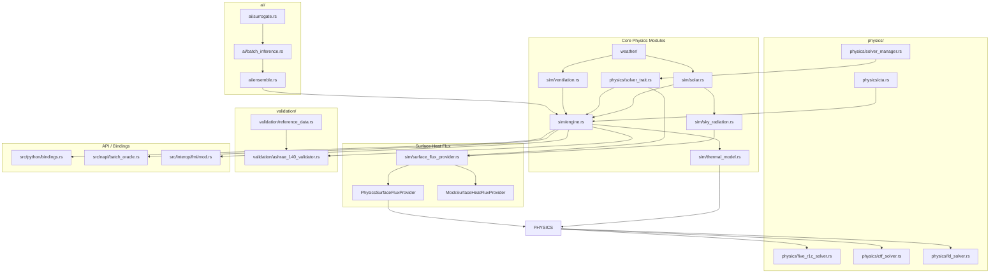

# Fluxion Codebase Map

Code navigation guide for the Fluxion BEM engine — Rust core with Python/JS bindings.
MANDATORY READING at start of every session; establishes cross-language context.
Covers: module dependency graph, physics modules, ONNX surrogates, multi-language bindings.
Companion to ARCHITECTURE.md (physics contracts) and RULES.md (coding constraints).
Status: Current — reflects crate-split layout (#1255, #1349, #1441) and Neuro-Symbolic architecture.
Action: Run `cargo build` and `python -c "import fluxion"` to verify setup before exploring.

> **MANDATORY READING** — Read this file at the start of every session to establish cross-language context.

## Project Overview

**Fluxion** is a Rust-based Building Energy Modeling (BEM) engine with a **Neuro-Symbolic hybrid architecture**. It combines:
- **Physics-based thermal networks** (ISO 13790-compliant 5R1C/6R2C models)
- **AI surrogates** (ONNX Runtime) for 10,000+ configs/sec throughput
- **Multi-language bindings** (Python/PyO3, Node.js/NAPI, FMI 2.0)

## Module Dependency Graph



## Directory Structure

```
src/
├── ai/                        # AI surrogate models
│   ├── surrogate.rs          # SurrogateManager (ONNX Runtime wrapper)
│   ├── batch_inference.rs     # Batch inference service
│   ├── ensemble.rs            # Ensemble prediction
│   ├── distributed.rs        # Distributed inference
│   └── modular_surrogate.rs  # Modular surrogate architecture
│
├── api/                       # Public API types (Python FFI)
│   ├── mod.rs
│   ├── error.rs              # FluxionError, ValidationError, etc.
│   ├── parameters.rs         # BuildingParameters with validation
│   └── schema.rs             # SimulationSchema v1 (JSON serialization)
│
├── cli/                       # Command-line interface
│   └── commands/
│
├── interop/                  # External integrations
│   └── fmi/                  # FMI 2.0 Co-Simulation export
│
├── napi/                      # Node.js/NAPI bindings
│   ├── mod.rs
│   ├── batch_oracle.rs       # BatchOracle wrapper (napi-derive)
│   ├── building_parameters.rs# BuildingParameters wrapper
│   └── error.rs             # NAPI-specific error types
│
├── orchestration/            # Multi-simulation orchestration
│
├── performance/             # Benchmarking and profiling
│
├── physics/                 # Thermal conduction solvers
│   ├── solver_trait.rs       # HeatConductionSolver trait
│   ├── five_r1c_solver.rs   # 5R1C CTA implementation
│   ├── cta.rs               # Continuous Tensor Abstraction
│   ├── ctf_solver.rs        # Conduction Transfer Function
│   ├── fd_solver.rs         # Finite Difference
│   ├── solver_manager.rs    # Auto-solver selection
│   ├── constants/          # Physical constants
│   │   ├── solar/          # Solar constants (ASHRAE 140)
│   │   └── thermal/        # Thermal constants (ISO 13790, ASHRAE 140)
│   └── thermal_mass/        # Thermal mass calculations
│
├── python/                   # PyO3 Python bindings
│   ├── mod.rs
│   ├── bindings.rs          # PyMultiZoneThermalModel, PyConstruction, etc.
│   └── hvac.py             # Python HVAC utilities
│
├── sim/                      # Simulation engine
│   ├── engine.rs            # ThermalModel, solve_timesteps
│   ├── thermal_model.rs     # ThermalModelTrait (trait hierarchy)
│   ├── thermal_model_core.rs # Core thermal model implementation
│   ├── thermal_model_5r1c.rs # 5R1C specific implementation
│   ├── surface_flux_provider.rs # SurfaceHeatFluxProvider trait
│   ├── solar.rs            # Solar position & irradiance
│   ├── sky_radiation.rs     # Sky temperature & sol-air temp
│   ├── ventilation.rs      # VentilationSchedule trait
│   ├── shading.rs          # Shading calculations
│   ├── construction.rs     # ConstructionLayer, WallSurface, etc.
│   ├── schedule.rs         # Occupancy/lighting/HVAC schedules
│   ├── occupancy.rs        # Internal gains from occupancy
│   ├── equipment.rs        # HVAC equipment models
│   ├── boundary.rs         # Boundary conditions
│   └── hvac/              # HVAC system models
│       ├── airside_state.rs    # Validated moist-air and supply-flow boundary values
│       └── airside_coupling.rs # Transactional 6-min operator split with 9R4C
│
├── solar/                  # Solar calculations
│
├── testing/                # Integration tests
│
├── thermal/                # Thermal calculations
│
├── validation/            # Validation framework
│   ├── ashrae_140_validator.rs # ASHRAE 140 compliance
│   ├── reference_data.rs   # E+ reference data loading
│   ├── tolerance.rs        # Validation tolerances
│   └── cross_validation/   # Multi-reference validation
│       └── adapters/       # EnergyPlus, ESP-r, TRNSYS adapters
│
├── weather/               # Weather data
│   ├── epw.rs            # EPW file parser
│   └── psychrometrics.rs # Moist air properties
│
└── lib.rs                 # PyO3 module entry point (BatchOracle, Model)
```

---

## FFI Contracts

### FFI Architecture Overview

Fluxion provides three FFI pathways:

```
┌─────────────────────────────────────────────────────────────┐
│                    External Consumers                        │
│   Python (scipy, D-Wave, GA libs)  │  Node.js  │  FMI     │
└─────────────────────────────────────────────────────────────┘
                              │
                    ┌─────────┴─────────┐
                    │   src/lib.rs      │
                    │   (PyO3 module)   │
                    └─────────┬─────────┘
                              │
         ┌────────────────────┼────────────────────┐
         │                    │                    │
   ┌─────▼─────┐       ┌─────▼─────┐       ┌─────▼─────┐
   │  python/  │       │   napi/  │       │  interop/ │
   │ bindings  │       │  napi    │       │    fmi    │
   └─────┬─────┘       └─────┬─────┘       └─────┬─────┘
         │                    │                    │
   ┌─────▼────────────────────▼────────────────────▼─────┐
   │              Rust Core (rlib)                        │
   │   ThermalModel │ SurrogateManager │ Solvers        │
   └─────────────────────────────────────────────────────┘
```

---

### Python Bindings (PyO3)

**Feature flag**: `python-bindings`

**Entry point**: `src/lib.rs` (PyO3 module `fluxion`)

#### Exposed Types

| Rust Type | Python Class | Purpose |
|-----------|-------------|---------|
| `Model` | `fluxion.Model` | Single-building detailed simulation |
| `BatchOracle` | `fluxion.BatchOracle` | High-throughput population evaluation |
| `BuildingParameters` | `fluxion.BuildingParameters` | Validated parameter wrapper |
| `ThermalModel<VectorField>` | `fluxion.MultiZoneThermalModel` | Multi-zone thermal model |
| `Construction` | `fluxion.Construction` | Wall construction assembly |
| `ConstructionLayer` | `fluxion.ConstructionLayer` | Single material layer |
| `VectorField` | `fluxion.VectorField` | CTA vector field |

#### Python API Signatures

```python
# High-throughput evaluation (hot loop)
BatchOracle.evaluate_population(
    population: List[List[float]],  # [[u_value, heating, cooling], ...]
    use_surrogates: bool
) -> List[float]  # EUI values

# Single building simulation
Model.simulate(years: int, use_surrogates: bool) -> float  # EUI

# Parameter validation
BatchOracle.validate_parameters(params: List[float]) -> None  # raises ValidationError
```

#### Data Serialization

**Population format**: `Vec<Vec<f64>>` passed directly to Rust
- Element 0: Window U-value (W/m²K, range 0.1–5.0)
- Element 1: Heating setpoint (°C, range 15–25)
- Element 2: Cooling setpoint (°C, range 22–32)

**Return format**: `Vec<f64>` of EUI values (kWh/m²/yr)

#### Memory Ownership Rules

1. **Owned data**: Python `list` → Rust `Vec` conversion (copies data)
2. **Borrowed data**: NumPy arrays use `from_vec_bound` for zero-copy when possible
3. **GIL**: PyO3 releases GIL during Rust computations for parallelism
4. **Error handling**: Rust errors converted to Python exceptions (`ValidationError`, `SimulationError`, `SurrogateError`)

---

### Node.js Bindings (NAPI-RS)

**Feature flag**: `napi-bindings`

**Entry point**: `@fluxion/native` npm package

#### Exposed Types

| Rust Type | TypeScript Class |
|-----------|-----------------|
| `BatchOracle` | `BatchOracle` |
| `BuildingParameters` | `BuildingParameters` |
| `FluxionError` | `FluxionError` (union of error types) |

#### TypeScript API Signatures

```typescript
// High-throughput evaluation
evaluatePopulation(
    population: number[][],  // [[u_value, heating, cooling], ...]
    useSurrogates: boolean
): number[]  // EUI values

// Parameter validation
validateParameters(params: number[]): void  // throws ValidationError
```

#### NAPI-Specific Notes

- Uses `napi-derive` for automatic TypeScript type generation
- Supports `async` operations via `napi::bindgen_prelude::Result`
- Error types: `FluxionError`, `SimulationError`, `SurrogateError`, `ValidationError`

---

### FMI 2.0 Co-Simulation (interop/fmi)

**Purpose**: Export Fluxion as FMU for co-simulation with EnergyPlus, TRNSYS, etc.

#### Exposed Variables

| Name | Causality | Type | Unit | Description |
|------|-----------|------|------|-------------|
| `outdoor_temperature` | Input | Real | K | Outdoor dry-bulb temperature |
| `direct_normal_solar` | Input | Real | W/m² | Direct normal solar radiation |
| `diffuse_horizontal_solar` | Input | Real | W/m² | Diffuse horizontal solar radiation |
| `internal_gains` | Input | Real | W | Total internal heat gains |
| `zone_temperature` | Output | Real | K | Zone air temperature |
| `heating_load` | Output | Real | W | Heating load (positive) |
| `cooling_load` | Output | Real | W | Cooling load (positive) |

#### Configuration

```rust
FmiConfig {
    communication_timestep: 3600.0,  // 1 hour
    start_time: 0.0,
    stop_time: 31536000.0,  // 1 year
}
```

---

## Core Data Structures

### ThermalModel

```rust
pub struct ThermalModel<V: VectorField> {
    pub num_zones: usize,
    pub temperatures: V,           // Zone temperatures
    pub loads: V,                   // Applied loads
    pub window_u_value: f64,        // Design variable
    pub hvac_setpoint: f64,         // Design variable
    pub heating_setpoints: V,
    pub cooling_setpoints: V,
    pub building_type: BuildingType,
}
```

### VectorField (CTA)

```rust
pub struct VectorField {
    data: Vec<f64>,
}

pub trait VectorField:
    crate::physics::cta::ContinuousTensor
    + Send
    + Sync
{
    fn new(data: Vec<f64>) -> Self;
    fn as_slice(&self) -> &[f64];
    fn as_mut_slice(&mut &mut [f64]);
}
```

### SurrogateManager

```rust
pub struct SurrogateManager {
    ort_session: Option<ort::Session>,  // ONNX Runtime session
    gpu_enabled: bool,
}
```

---

## Trait Hierarchy

### HeatConductionSolver (physics/solver_trait.rs)

```rust
pub trait HeatConductionSolver: Send + Sync {
    fn name(&self) -> &str;
    fn initialize(&mut self, wall: &BuildingAssembly) -> Result<(), SolverError>;
    fn step(&mut self, dt: f64, T_int: f64, T_ext: f64, h_int: f64, h_ext: f64) -> Result<f64, SolverError>;
    fn energy_storage_rate(&self) -> f64;
    fn is_valid(&self) -> bool;
}
```

**Implementations**: `FiveR1CSolver`, `CTFSolverWrapper`, `FDSolverWrapper`

### ThermalModelTrait (sim/thermal_model.rs)

```rust
pub trait ThermalModelTrait: Send + Sync {
    fn solve_timesteps(
        &mut self,
        steps: usize,
        surrogates: &SurrogateManager,
        use_ai: bool,
        loads: Option<&[f64]>,
        weather: Option<&HourlyWeatherData>,
        schedule: Option<&ScheduleSet>,
    ) -> f64;
    fn get_temperatures(&self) -> Vec<f64>;
    fn set_loads(&mut self, loads: &[f64]);
}
```

**Implementations**: `PhysicsThermalModel`, `SurrogateThermalModel`, `UnifiedThermalModel`, `MockThermalModel`

### VentilationSchedule (sim/ventilation.rs)

```rust
pub trait VentilationSchedule {
    fn get_ach(&self, hour: usize) -> f64;
    fn ach_to_conductance(ach: f64, volume: f64, rho: f64, cp: f64) -> f64;
}
```

**Implementations**: `ConstantVentilation`, `ScheduledVentilation`, `WeatherDependentVentilation`

### SurfaceHeatFluxProvider (sim/surface_flux_provider.rs)

```rust
pub trait SurfaceHeatFluxProvider: Send + Sync {
    fn surface_heat_flux(&self, surface_idx: usize, T_zone: f64, T_outdoor: f64, dt_seconds: f64) -> f64;
    fn num_surfaces(&self) -> usize;
    fn name(&self) -> &str;
}
```

**Implementations**: `PhysicsSurfaceFluxProvider`, `MockSurfaceHeatFluxProvider`

---

## Physics Modules

### Weather (src/weather/)

| File | Purpose |
|------|---------|
| `epw.rs` | EPW file parser → `HourlyRecord` (8760 rows) |
| `psychrometrics.rs` | Moist air property calculations |

**Outputs**: Dry-bulb temperature, DNI, DHI, GHI, wind speed, humidity ratio

### Solar (src/sim/solar.rs)

| Function | Purpose |
|----------|---------|
| `calculate_solar_position(lat, lon, year, month, day, hour)` | Solar position (altitude, azimuth, zenith) |
| `calculate_surface_irradiance(...)` | Surface irradiance (beam, diffuse, ground_reflected) |
| `calculate_hourly_solar(...)` | Combined solar calculation |

**Validation target**: Solar azimuth/altitude within 0.5°, irradiance within 1% of E+

### Conduction (src/physics/)

| Solver | File | Method |
|--------|------|--------|
| 5R1C | `five_r1c_solver.rs` | CTA (Continuous Tensor Abstraction) |
| CTF | `ctf_solver.rs` | Conduction Transfer Functions |
| FD | `fd_solver.rs` | Finite Difference |

**Validation target**: Inside surface heat flux within 1% of E+ for step-change test

### Ventilation (src/sim/ventilation.rs)

| Function | Purpose |
|----------|---------|
| `calculate_wind_infiltration_ach(wind_speed, height, shielding)` | Wind-driven ACH |
| `calculate_stack_infiltration_ach(...)` | Stack-driven ACH |
| `calculate_combined_infiltration_ach(...)` | Combined ACH |

**Validation target**: Ventilation heat loss within 1% of E+ analytical calculation

---

## Validation Reference Data

```
tests/reference_data/
├── solar/
│   ├── solar_position_denver_2023.csv    # hour, altitude, azimuth, zenith
│   └── surface_irradiance_south.csv      # hour, beam, diffuse, ground_reflected
├── conduction/
│   ├── step_response_200mm_concrete.csv  # hour, T_ext, T_surface_inside, heat_flux
│   └── annual_wall_denver.csv           # hour, heat_flux
├── ventilation/
│   └── infiltration_denver.csv          # hour, ACH, vent_conductance
└── zone_balance/
    └── case_600_denver.csv             # hour, T_zone, Q_heat, Q_cool
```

---

## Key Files by Task

| Task | Files |
|------|-------|
| Add new design variable | `src/lib.rs` (BatchOracle), `ThermalModel.apply_parameters()` |
| Add new conduction solver | `src/physics/solver_trait.rs`, `src/physics/` |
| Add Python binding | `src/python/bindings.rs`, `src/lib.rs` |
| Add NAPI binding | `src/napi/`, `src/lib.rs` |
| Add FMI variable | `src/interop/fmi/mod.rs` |
| ASHRAE 140 validation | `src/validation/ashrae_140_validator.rs` |
| Add AI surrogate | `src/ai/surrogate.rs` |

---

## Build & Test Commands

```bash
# Build Python bindings
maturin develop

# Build NAPI bindings
cargo build --features napi-bindings

# Run tests
cargo test

# Run with coverage
cargo test --coverage

# Format
cargo fmt

# Lint
cargo clippy
```

---

## Performance Targets

| Metric | Target |
|--------|--------|
| Single config latency | <100ms for 8760 timesteps |
| BatchOracle throughput | >10,000 configs/sec (8-core CPU) |
| Memory per config | <1MB (CTA buffer reuse) |

---

## Agent Instructions

**MANDATORY**: At the start of every session, read this file to understand:
1. Module boundaries and dependencies
2. FFI contract data formats (population vector, return types)
3. Memory ownership rules for Python/Node.js bindings
4. Key trait hierarchies for ML surrogate swap points

For detailed architecture, see `ARCHITECTURE.md`.
