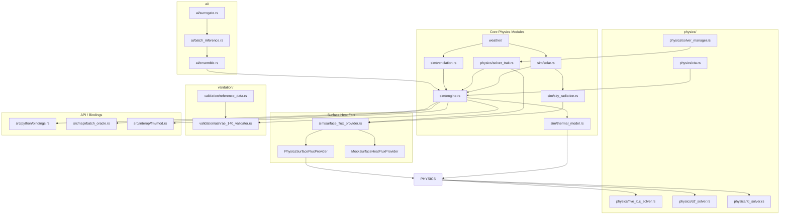

# Fluxion Codebase Map

Code navigation guide for the Fluxion BEM engine — Rust core with Python/JS bindings.
MANDATORY READING at start of every session; establishes cross-language context.
Covers: module dependency graph, physics modules, ONNX surrogates, multi-language bindings.
Companion to ARCHITECTURE.md (physics contracts) and RULES.md (coding constraints).
Status: Current — reflects crate-split layout (#1255, #1349, #1441) and Neuro-Symbolic architecture.
Action: Run `cargo build` and `python -c "import fluxion"` to verify setup before exploring.

> **MANDATORY READING** — Read this file at the start of every session to establish cross-language context.

## Project Overview

**Fluxion** is a Rust-based Building Energy Modeling (BEM) engine with a **Neuro-Symbolic hybrid architecture**. It combines:
- **Physics-based thermal networks** (ISO 13790-compliant 5R1C/6R2C models)
- **AI surrogates** (ONNX Runtime) for 10,000+ configs/sec throughput
- **Multi-language bindings** (Python/PyO3, Node.js/NAPI, FMI 2.0)

## Module Dependency Graph



## Directory Structure

```
src/
├── ai/                        # AI surrogate models
│   ├── surrogate.rs          # SurrogateManager (ONNX Runtime wrapper)
│   ├── batch_inference.rs     # Batch inference service
│   ├── ensemble.rs            # Ensemble prediction
│   ├── distributed.rs        # Distributed inference
│   └── modular_surrogate.rs  # Modular surrogate architecture
│
├── api/                       # Public API types (Python FFI)
│   ├── mod.rs
│   ├── error.rs              # FluxionError, ValidationError, etc.
│   ├── parameters.rs         # BuildingParameters with validation
│   └── schema.rs             # SimulationSchema v1 (JSON serialization)
│
├── cli/                       # Command-line interface
│   └── commands/
│
├── interop/                  # External integrations
│   └── fmi/                  # FMI 2.0 Co-Simulation export
│
├── napi/                      # Node.js/NAPI bindings
│   ├── mod.rs
│   ├── batch_oracle.rs       # BatchOracle wrapper (napi-derive)
│   ├── building_parameters.rs# BuildingParameters wrapper
│   └── error.rs             # NAPI-specific error types
│
├── orchestration/            # Multi-simulation orchestration
│
├── performance/             # Benchmarking and profiling
│
├── physics/                 # Thermal conduction solvers
│   ├── solver_trait.rs       # HeatConductionSolver trait
│   ├── five_r1c_solver.rs   # 5R1C CTA implementation
│   ├── cta.rs               # Continuous Tensor Abstraction
│   ├── ctf_solver.rs        # Conduction Transfer Function
│   ├── fd_solver.rs         # Finite Difference
│   ├── solver_manager.rs    # Auto-solver selection
│   ├── constants/          # Physical constants
│   │   ├── solar/          # Solar constants (ASHRAE 140)
│   │   └── thermal/        # Thermal constants (ISO 13790, ASHRAE 140)
│   └── thermal_mass/        # Thermal mass calculations
│
├── python/                   # PyO3 Python bindings
│   ├── mod.rs
│   ├── bindings.rs          # PyMultiZoneThermalModel, PyConstruction, etc.
│   └── hvac.py             # Python HVAC utilities
│
├── sim/                      # Simulation engine
│   ├── engine.rs            # ThermalModel, solve_timesteps
│   ├── thermal_model.rs     # ThermalModelTrait (trait hierarchy)
│   ├── thermal_model_core.rs # Core thermal model implementation
│   ├── thermal_model_5r1c.rs # 5R1C specific implementation
│   ├── surface_flux_provider.rs # SurfaceHeatFluxProvider trait
│   ├── solar.rs            # Solar position & irradiance
│   ├── sky_radiation.rs     # Sky temperature & sol-air temp
│   ├── ventilation.rs      # VentilationSchedule trait
│   ├── shading.rs          # Shading calculations
│   ├── construction.rs     # ConstructionLayer, WallSurface, etc.
│   ├── schedule.rs         # Occupancy/lighting/HVAC schedules
│   ├── occupancy.rs        # Internal gains from occupancy
│   ├── equipment.rs        # HVAC equipment models
│   ├── boundary.rs         # Boundary conditions
│   └── hvac/              # HVAC system models
│       ├── airside_state.rs    # Validated moist-air and supply-flow boundary values
│       └── airside_coupling.rs # Transactional 6-min operator split with 9R4C
│
├── solar/                  # Solar calculations
│
├── testing/                # Integration tests
│
├── thermal/                # Thermal calculations
│
├── validation/            # Validation framework
│   ├── ashrae_140_validator.rs # ASHRAE 140 compliance
│   ├── reference_data.rs   # E+ reference data loading
│   ├── tolerance.rs        # Validation tolerances
│   └── cross_validation/   # Multi-reference validation
│       └── adapters/       # EnergyPlus, ESP-r, TRNSYS adapters
│
├── weather/               # Weather data
│   ├── epw.rs            # EPW file parser
│   └── psychrometrics.rs # Moist air properties
│
└── lib.rs                 # PyO3 module entry point (BatchOracle, Model)
```

---

## FFI Contracts

### FFI Architecture Overview

Fluxion provides three FFI pathways:

```
┌─────────────────────────────────────────────────────────────┐
│                    External Consumers                        │
│   Python (scipy, D-Wave, GA libs)  │  Node.js  │  FMI     │
└─────────────────────────────────────────────────────────────┘
                              │
                    ┌─────────┴─────────┐
                    │   src/lib.rs      │
                    │   (PyO3 module)   │
                    └─────────┬─────────┘
                              │
         ┌────────────────────┼────────────────────┐
         │                    │                    │
   ┌─────▼─────┐       ┌─────▼─────┐       ┌─────▼─────┐
   │  python/  │       │   napi/  │       │  interop/ │
   │ bindings  │       │  napi    │       │    fmi    │
   └─────┬─────┘       └─────┬─────┘       └─────┬─────┘
         │                    │                    │
   ┌─────▼────────────────────▼────────────────────▼─────┐
   │              Rust Core (rlib)                        │
   │   ThermalModel │ SurrogateManager │ Solvers        │
   └─────────────────────────────────────────────────────┘
```

---

### Python Bindings (PyO3)

**Feature flag**: `python-bindings`

**Entry point**: `src/lib.rs` (PyO3 module `fluxion`)

#### Exposed Types

| Rust Type | Python Class | Purpose |
|-----------|-------------|---------|
| `Model` | `fluxion.Model` | Single-building detailed simulation |
| `BatchOracle` | `fluxion.BatchOracle` | High-throughput population evaluation |
| `BuildingParameters` | `fluxion.BuildingParameters` | Validated parameter wrapper |
| `ThermalModel<VectorField>` | `fluxion.MultiZoneThermalModel` | Multi-zone thermal model |
| `Construction` | `fluxion.Construction` | Wall construction assembly |
| `ConstructionLayer` | `fluxion.ConstructionLayer` | Single material layer |
| `VectorField` | `fluxion.VectorField` | CTA vector field |

#### Python API Signatures

```python
# High-throughput evaluation (hot loop)
BatchOracle.evaluate_population(
    population: List[List[float]],  # [[u_value, heating, cooling], ...]
    use_surrogates: bool
) -> List[float]  # EUI values

# Single building simulation
Model.simulate(years: int, use_surrogates: bool) -> float  # EUI

# Parameter validation
BatchOracle.validate_parameters(params: List[float]) -> None  # raises ValidationError
```

#### Data Serialization

**Population format**: `Vec<Vec<f64>>` passed directly to Rust
- Element 0: Window U-value (W/m²K, range 0.1–5.0)
- Element 1: Heating setpoint (°C, range 15–25)
- Element 2: Cooling setpoint (°C, range 22–32)

**Return format**: `Vec<f64>` of EUI values (kWh/m²/yr)

#### Memory Ownership Rules

1. **Owned data**: Python `list` → Rust `Vec` conversion (copies data)
2. **Borrowed data**: NumPy arrays use `from_vec_bound` for zero-copy when possible
3. **GIL**: PyO3 releases GIL during Rust computations for parallelism
4. **Error handling**: Rust errors converted to Python exceptions (`ValidationError`, `SimulationError`, `SurrogateError`)

---

### Node.js Bindings (NAPI-RS)

**Feature flag**: `napi-bindings`

**Entry point**: `@fluxion/native` npm package

#### Exposed Types

| Rust Type | TypeScript Class |
|-----------|-----------------|
| `BatchOracle` | `BatchOracle` |
| `BuildingParameters` | `BuildingParameters` |
| `FluxionError` | `FluxionError` (union of error types) |

#### TypeScript API Signatures

```typescript
// High-throughput evaluation
evaluatePopulation(
    population: number[][],  // [[u_value, heating, cooling], ...]
    useSurrogates: boolean
): number[]  // EUI values

// Parameter validation
validateParameters(params: number[]): void  // throws ValidationError
```

#### NAPI-Specific Notes

- Uses `napi-derive` for automatic TypeScript type generation
- Supports `async` operations via `napi::bindgen_prelude::Result`
- Error types: `FluxionError`, `SimulationError`, `SurrogateError`, `ValidationError`

---

### FMI 2.0 Co-Simulation (interop/fmi)

**Purpose**: Export Fluxion as FMU for co-simulation with EnergyPlus, TRNSYS, etc.

#### Exposed Variables

| Name | Causality | Type | Unit | Description |
|------|-----------|------|------|-------------|
| `outdoor_temperature` | Input | Real | K | Outdoor dry-bulb temperature |
| `direct_normal_solar` | Input | Real | W/m² | Direct normal solar radiation |
| `diffuse_horizontal_solar` | Input | Real | W/m² | Diffuse horizontal solar radiation |
| `internal_gains` | Input | Real | W | Total internal heat gains |
| `zone_temperature` | Output | Real | K | Zone air temperature |
| `heating_load` | Output | Real | W | Heating load (positive) |
| `cooling_load` | Output | Real | W | Cooling load (positive) |

#### Configuration

```rust
FmiConfig {
    communication_timestep: 3600.0,  // 1 hour
    start_time: 0.0,
    stop_time: 31536000.0,  // 1 year
}
```

---

## Boundary Crates (Workspace Siblings)

Workspace crates that cross a process, protocol, or model boundary rather than a
language-FFI boundary. Each is a Cargo workspace member documented here so
contributors following AGENTS.md's mandatory-reading directive can find them.

### fluxion-toon (crates/fluxion-toon/)

**Purpose**: Token-Oriented Object Notation (TOON) — compact, tabular
serialization format that reduces LLM context-window usage by 35–50% vs JSON for
uniform flat-struct arrays (zone temperatures, surface fluxes, HVAC energy).
Authoritative spec: `crates/fluxion-toon/SPEC.md` (TOON v1.0). Issues #2066, #2071.

**Feature-gate relationship**: standalone **leaf crate** — has no `fluxion`
dependency. Consumed by `fluxion-mcp` (Issue #2072) to serialize tool responses
for LLM clients.

**Entry point**: `crates/fluxion-toon/src/lib.rs`

#### Public Surface

| Item | Kind | Purpose |
|------|------|---------|
| `to_string<T: Serialize>(&T) -> Result<String>` | fn | Serialize any `serde::Serialize` type to TOON |
| `from_str<T: DeserializeOwned>(&str) -> Result<T>` | fn | Deserialize; verifies `toon:v1` header + array length guardrails |
| `token_savings_pct(json_len, toon_len) -> f64` | fn | Token/byte savings utility |
| `ToonError` | enum | `Eof`, `LengthMismatch`, `InvalidSyntax`, `MalformedRow`, `InvalidHeader`, `MalformedPatch`, `Custom`, `Deserialization`, `Serialization`, `PatchError`, `Io`, `Json`, `TooLarge` (DoS cap, #2527) |
| `patch::ModelPatch { param, value, target? }` | struct | Parsed parameter patch from an LLM response |
| `patch::parse_toon_patch(input) -> Result<ModelPatch>` | fn | Strips markdown codeblock fences (```` ```toon ````, ```` ```json ````) and parses the patch |
| `parse::ToonDocument`, `parse_line`, `parse_uniform_array_header`, `parse_array_row` | fn/struct | Low-level parser primitives |

#### Serialization Contract

**Wire format** — every TOON payload begins with the version header:
```
toon:v1
<body>
```

The body is a JSON document in which uniform flat-struct arrays collapse to
CSV-style rows under an explicit-count header. The `[N]` length is a
**hallucination guardrail** — the parser raises `LengthMismatch` if the declared
count does not equal the row count, preventing LLMs from omitting or inventing
elements:

```
zone_temps[3]{id,temp_c,humidity_rh}:
  z0, 21.4, 45.0
  z1, 22.1, 44.2
  z2, 20.8, 46.1
```

**Collapse preconditions** (all must hold, else falls back to per-element JSON):
1. Every element is a flat object (no nested objects or arrays as values).
2. All elements share identical field names in the same order.
3. All field values are primitives (`f64`, `i64`, `bool`, `string`).
4. Array length is explicit (`[N]`).

**Out of scope**: internal numerical solver state (CTF/FD thermal networks),
multi-node thermal-mass configs with deep nesting, hand-edited configuration
files (use JSON/YAML). See `SPEC.md` § Limitations.

#### Memory Ownership

Pure value-passing, no `unsafe`, no shared state. `to_string` borrows `&T` and
returns an owned `String`; `from_str` borrows `&str` and returns an owned `T`.
The parser is non-recursive (object → array → object) and caps declared array
lengths at `parse::MAX_ARRAY_ELEMENTS` (#2527 DoS hardening → `ToonError::TooLarge`).

---

### fluxion-twin (crates/fluxion-twin/)

**Purpose**: Digital twin core — Unscented Kalman Filter (UKF) for non-linear
state estimation in thermal systems, plus an MQTT telemetry ingestion subsystem.
Produces `TwinCorrection` values consumed by
`ThermalModelTrait::set_twin_correction` (see Trait Hierarchy below).

**Feature-gate relationship**: standalone workspace crate (no `fluxion`
dependency). Wired into the main crate through the `TwinCorrection` struct and
the `set_twin_correction` method on `ThermalModelTrait` — the thermal model
accepts corrections produced by `UkfTwinAdapter::correct()`.

**Entry point**: `crates/fluxion-twin/src/lib.rs` + `src/telemetry/mod.rs`

#### Public Surface

| Item | Kind | Purpose |
|------|------|---------|
| `UnscentedKalmanFilter<S, M>` | struct | Sigma-point UKF, generic over state vector `S` and measurement vector `M` |
| `TwinStateEstimator` | trait | Unified estimator interface (`predict`, `correct`, `current_state`, `state_dim`, `measurement_dim`) |
| `UkfTwinAdapter<S, M>` | struct | Adapts a UKF into `TwinStateEstimator`; `correct()` returns `TwinCorrection` |
| `TwinCorrection { zone_temperatures, covariance_diagonal }` | struct | Per-zone temperature corrections (°C) + covariance diagonal; `single_zone(...)`, `multi_zone(...)` constructors |
| `StateVector`, `MeasurementVector` | traits | Vector-space ops (`zeros`, `as_slice`, `from_slice`, `add`, `sub`, `scale`); both implemented for `Vec<f64>` |
| `KalmanError` | enum | `DimensionMismatch`, `NonPositiveDefiniteMatrix`, `SingularMatrix`, `CholeskyFailed`, `SigmaPointGenerationFailed`, `PredictionFailed`, `UpdateFailed` |
| `TelemetryConsumer`, `Sender`, `TelemetryMsg`, `TelemetryError` | telemetry | Bounded-channel consumer with out-of-order deduplication |
| `MqttTelemetryConsumer`, `MqttTelemetryMessage`, `MqttTelemetryError` | telemetry | MQTT subscriber → bounded `tokio::sync::mpsc` channel (capacity 1024) |

**UKF API**:
```rust
let mut ukf = UnscentedKalmanFilter::new(
    initial_state, initial_covariance, process_noise, measurement_noise,
    state_transition_fn,   // Box<dyn Fn(&S, &[f64]) -> S + Send + Sync>
    measurement_fn,        // Box<dyn Fn(&S) -> M + Send + Sync>
);
ukf.predict(&u)?;          // propagate state + covariance one timestep
ukf.update(&measurement)?; // fuse measurement via Kalman gain
```

#### FFI / Boundary Contract

**MQTT telemetry wire format** (`MqttTelemetryMessage`, JSON over MQTT payload):
```json
{
  "sensor_id": "zone-1-temp",
  "timestamp": 1700000000,
  "temperature_c": 22.5,
  "humidity_pct": 45.0,
  "power_w": 150.0
}
```
Measurement fields are `Option<f64>` so heterogeneous sensor types can share a
topic. The consumer subscribes via `rumqttc` (auto-reconnects on transient
disconnects) and forwards owned `MqttTelemetryMessage` values through a bounded
`mpsc` channel — backpressure is applied at capacity 1024.

**TwinCorrection** crosses the crate boundary into the thermal model as a plain
owned struct (no trait object, no `unsafe`); `ThermalModelTrait::set_twin_correction`
takes it by reference.

#### MQTT TLS Boot Guard (#2703)

Default transport is **MQTT-over-TLS** (`mqtts://`, port 8883) using rustls with
the platform trust store; server certificates are validated by default.

| Env var | Effect |
|---------|--------|
| `FLUXION_MQTT_ALLOW_INSECURE` | Truthy → permits plaintext `mqtt://`/`tcp://` URLs (port 1883). Also skips TLS server-cert validation (e.g. self-signed brokers). In release builds any insecure transport (plaintext or disabled cert validation) is refused at boot unless this is set. Debug builds skip the guard for local dev. |

Parity with the `fluxion-rest` boot guard (`FLUXION_REST_ALLOW_INSECURE`).

#### Memory Ownership

The UKF owns `nalgebra::DMatrix<f64>` covariance/noise matrices and boxed
`state_transition` / `measurement_fn` closures (`Box<dyn Fn + Send + Sync + 'static>`).
State vector `S` and measurement `M` are owned values (cloned per sigma point).
The telemetry consumer owns the rumqttc `AsyncClient` + `EventLoop`.
Observability (#2519): `predict` / `update` emit
`fluxion_twin_ukf_{predict,update}_duration_seconds` histograms on **every**
return path (success and error).

---

### fluxion-evaluator (crates/fluxion-evaluator/)

**Purpose**: Deterministic headless evaluator harness for evolutionary kernel
search. Provides the in-tree contract that any evolver (OpenEvolve,
AlphaEvolve, FunSearch, …) programs against; the evolver itself stays
out-of-tree and pluggable. Issue #3336.

**Feature-gate relationship**: standalone workspace member with **zero new
third-party dependencies** (the cargo-deny duplicate-version budget is at
zero headroom, issue #3310). Uses only existing workspace deps (`serde`,
`serde_json`, `thiserror`, `sha2`). The opt-in `dynamic` feature is
intentionally a stub — see "Dynamic loading" below.

**Entry point**: `crates/fluxion-evaluator/src/lib.rs`

#### Public Surface

| Item | Kind | Purpose |
|------|------|---------|
| `Kernel` | trait | The fixed trait every candidate implements; takes `&KernelInput` and returns `Result<KernelOutput, KernelError>` |
| `EdgeCase`, `KernelInput`, `KernelOutput`, `ReferenceOutput` | struct | One-edge-case data: input handed to the candidate, candidate's output, known-good reference |
| `CandidateId` | newtype | Stable identifier carried through the Summary |
| `DefaultInvariantCheck` | struct | Kernel-agnostic invariant battery (energy closure ≤ 1e-6, NaN/Inf rejection) |
| `InvariantCheck`, `InvariantResult`, `InvariantViolation` | trait / struct | Pluggable invariant system; kernels can layer domain-specific checks via `DefaultInvariantCheck::and_then` |
| `run_battery` | fn | Aggregate one candidate across an edge-case battery, collecting violations |
| `TimingConfig`, `LatencyMeasurement`, `LatencyAggregate`, `time_kernel` | struct / fn | Noise-robust latency: median-of-N + IQR spread (NEVER a single wall-clock shot) |
| `RecompileConfig`, `RecompileOutcome`, `Recompiler` | struct | Recompilation harness: copy candidate into a tempdir, run `cargo build --target-dir` in a sandboxed subprocess, return the artifact path |
| `SandboxConfig`, `SandboxEnforcer`, `determinism_digest` | struct / fn | Subprocess isolation (wall-clock cap, network isolation via `CARGO_NET_OFFLINE=true`); SHA-256 digest over canonical input bytes for byte-identical replay |
| `Summary`, `SchemaVersion`, `SummaryBuilder`, `EvaluationOutcome`, `CURRENT_SCHEMA_VERSION` | struct / enum / const | **Versioned schema v1 JSON** — the contract between the harness and any out-of-tree evolver |
| `EvaluatorError` | enum | Top-level error type with `#[from]` impls for compile failure / resource cap / dynamic load / subprocess / I/O / invalid config |
| `fluxion-evaluator` | bin | Thin CLI wrapper that reads candidate source from stdin (or `--candidate-file`) and prints a schema-v1 Summary on stdout; OpenEvolve adapter subprocess entry point |
| `sample_kernel` | example | The seed file format the harness-generated wrapper expects |

#### Sandbox / Threat Model

Candidate code is **untrusted**. The harness's only line of defense is
`SandboxEnforcer`:

| Capability | Threat | Mitigation |
|------------|--------|------------|
| Arbitrary Rust source | Compile-time resource exhaustion | Fresh `target/`, no debug-info, wall-clock cap (default 60 s) |
| Panic in candidate | Crash the harness | Subprocess isolation; exit code surfaced |
| Infinite loop | Hang the harness | Wall-clock cap (configurable via `FLUXION_EVAL_WALL_CLOCK_SECS`) |
| Memory exhaustion | OOM the runner | Best-effort platform-dependent cap (advisory; not a guarantee) |
| Network access | Exfiltrate source | `CARGO_NET_OFFLINE=true` (opt-out: `FLUXION_EVAL_ALLOW_NET=1`) |

The full threat model is documented in
[`crates/fluxion-evaluator/src/sandbox.rs`](crates/fluxion-evaluator/src/sandbox.rs).

#### Dynamic Loading (`dynamic` feature, opt-in, never used in CI)

The feature is **intentionally a stub** in this PR: enabling it does NOT
add `libloading` because that would require a new third-party crate and
the project is at zero headroom on the duplicate-version budget
(issue #3310). Every public function in `dynamic.rs` returns
`DynamicLoadError::NotImplementedInThisBuild`. The expected cdylib ABI is
documented in
[`crates/fluxion-evaluator/src/dynamic.rs`](crates/fluxion-evaluator/src/dynamic.rs)
so a follow-up PR can swap in `libloading` once the budget allows.

#### Memory Ownership

Pure value-passing — no `unsafe` (denied at the crate root via
`#![deny(unsafe_code)]`), no shared mutable state across evaluations. The
recompile path owns the candidate tempdir for the duration of one
evaluation; `Recompiler::recompile` produces an owned `RecompileOutcome`
that the caller drops. Sandbox subprocesses are killed on harness
shutdown (best-effort via wall-clock timeout). No raw pointers, no FFI
in the default build.

---

### fluxion-mcp (fluxion-mcp/)

**Purpose**: Model Context Protocol (MCP) server exposing the Fluxion BEM engine
to AI assistants (Claude, Copilot, etc.) over JSON-RPC 2.0. **Binary-only
crate** — `[[bin]] fluxion-mcp` in `Cargo.toml`, no library target.

**Feature-gate relationship** (`fluxion-mcp/Cargo.toml`):
- Depends on `fluxion` with **`default-features = false`**; `multi-zone` is
  activated via the MCP crate's own `multi-zone` feature (default-on), not
  unconditionally on the dependency (Issue #2540). This keeps a workspace
  `--no-default-features` build from forcing `multi-zone` onto every member.
- **Unconditionally** pulls `fluxion-fluid` (HVAC fluid-network topology) and
  `fluxion-toon` (TOON response serialization, Issue #2072).
- Build: `cargo build -p fluxion-mcp` · Test: `cargo test -p fluxion-mcp`.

**Entry point**: `fluxion-mcp/src/main.rs` (binary), `tools.rs` (tool registry),
`state.rs` (session state), `metrics.rs` (per-tool observability).

#### Public Surface (JSON-RPC over stdio)

One JSON object per `\n`-terminated line on stdin, one per line on stdout.
Methods: `initialize` (returns `protocolVersion: "2024-11-05"`), `tools/list`,
`tools/call`. Every response (including errors) carries a UUIDv4 `request_id`
correlation token (#2515).

#### Tools (12 registered via `tools::list_tools()`)

| Tool | Purpose |
|------|---------|
| `load_building_model` | Load + validate a fluxion thermal network model |
| `run_simulation` | Execute an annual/period simulation with weather |
| `get_zone_temperatures` | Hourly zone temperatures from the last simulation |
| `get_hvac_energy` | Heating/cooling energy by period |
| `get_solar_gains` | Per-surface incident + transmitted solar gains |
| `list_construction_assemblies` | Enumerate `fluxion-core` construction assemblies |
| `set_parameter` | Mutate a model parameter |
| `describe_model` | Dump current model state |
| `compare_to_reference` | Compare results against reference data |
| `inspect_fluid_loop` | Inspect an HVAC fluid-network topology |
| `get_hvac_control_sequence` | Read HVAC control loop setpoints |
| `set_hvac_control_sequence` | Mutate HVAC control (rate-limited: 5 changes/min) |

#### Response Formats (`ResponseFormat` enum)

Content-negotiated via the `response_format` argument (`from_str` accepts
`application/json`/`json` and `application/x-toon`/`x-toon`/`toon`):
- **`Json`** (default) — tool result re-parsed to a JSON `Value` for the envelope.
- **`Toon`** — result serialized with `fluxion_toon::to_string`; the server wraps
  it for transport as `{"_toon": "<toon:v1\n...>"}`. Clients detect the `_toon`
  key and decode.

#### State + Threading Model (#2562)

`McpState` is held behind `Arc<tokio::sync::Mutex<McpState>>` on a
`current_thread` Tokio runtime. `McpState` is `Send` (every field is `Send`) so
no additional `Sync` bound is required; mutable access is serialized through the
async mutex. Fields:

| Field | Type | Purpose |
|-------|------|---------|
| `model` | `Option<ThermalModel<VectorField>>` | Multi-zone thermal model |
| `simulation_results` | `Option<SimulationResults>` | Outputs from last `run_simulation` |
| `parameters` | `HashMap<String, f64>` | Mutable parameter overrides |
| `response_format` | `ResponseFormat` | Json / Toon |
| `fluid_networks` | `HashMap<String, FluidNetworkState>` | HVAC fluid topology + control sequence per loop |
| `control_changes_timestamps` | `Vec<Instant>` | Rate-limit bucket for `set_hvac_control_sequence` |

#### FFI / Memory Ownership Contract

The wire boundary is JSON-RPC **text over stdio** — there is no shared memory
with the client process. `process_request` parses each stdin line into an owned
`JsonRpcRequest`, dispatches to `tools::handle_tool_call(&mut McpState, params)`,
and serializes the `JsonRpcResponse` back to an owned `String` + `\n`. Tool
results are produced as owned `String`s (JSON or `toon:v1\n...`) and then
re-parsed into `serde_json::Value` for the response envelope (TOON strings are
wrapped as `{"_toon": <string>}`). Per-tool latency and error metrics are
recorded via the `metrics` crate (#2515).

---

## Core Data Structures

### ThermalModel

```rust
pub struct ThermalModel<V: VectorField> {
    pub num_zones: usize,
    pub temperatures: V,           // Zone temperatures
    pub loads: V,                   // Applied loads
    pub window_u_value: f64,        // Design variable
    pub hvac_setpoint: f64,         // Design variable
    pub heating_setpoints: V,
    pub cooling_setpoints: V,
    pub building_type: BuildingType,
}
```

### VectorField (CTA)

```rust
pub struct VectorField {
    data: Vec<f64>,
}

pub trait VectorField:
    crate::physics::cta::ContinuousTensor
    + Send
    + Sync
{
    fn new(data: Vec<f64>) -> Self;
    fn as_slice(&self) -> &[f64];
    fn as_mut_slice(&mut &mut [f64]);
}
```

### SurrogateManager

```rust
pub struct SurrogateManager {
    ort_session: Option<ort::Session>,  // ONNX Runtime session
    gpu_enabled: bool,
}
```

---

## Trait Hierarchy

### HeatConductionSolver (physics/solver_trait.rs)

```rust
pub trait HeatConductionSolver: Send + Sync {
    fn name(&self) -> &str;
    fn initialize(&mut self, wall: &BuildingAssembly) -> Result<(), SolverError>;
    fn step(&mut self, dt: f64, T_int: f64, T_ext: f64, h_int: f64, h_ext: f64) -> Result<f64, SolverError>;
    fn energy_storage_rate(&self) -> f64;
    fn is_valid(&self) -> bool;
}
```

**Implementations**: `FiveR1CSolver`, `CTFSolverWrapper`, `FDSolverWrapper`

### ThermalModelTrait (sim/thermal_model.rs)

```rust
pub trait ThermalModelTrait: Send + Sync {
    fn num_zones(&self) -> usize;
    fn get_temperatures(&self) -> Vec<f64>;
    fn set_temperatures(&mut self, temperatures: &[f64]);
    fn mode(&self) -> ThermalModelMode;
    fn set_mode(&mut self, mode: ThermalModelMode);
    fn solve_timesteps(
        &mut self,
        steps: usize,
        surrogates: &SurrogateManager,
        use_surrogates: bool,
    ) -> f64;
    fn set_twin_correction(&mut self, correction: &TwinCorrection);
    // ... (per-timestep load/temperature setters live on the concrete
    //      ThermalModel / ThermalModelData type, not on this trait.)
}
```

**Implementations**: `PhysicsThermalModel`, `SurrogateThermalModel`, `UnifiedThermalModel`, `MockThermalModel`

### VentilationSchedule (sim/ventilation.rs)

```rust
pub trait VentilationSchedule {
    fn get_ach(&self, hour: usize) -> f64;
    fn ach_to_conductance(ach: f64, volume: f64, rho: f64, cp: f64) -> f64;
}
```

**Implementations**: `ConstantVentilation`, `ScheduledVentilation`, `WeatherDependentVentilation`

### SurfaceHeatFluxProvider (sim/surface_flux_provider.rs)

```rust
pub trait SurfaceHeatFluxProvider: Send + Sync {
    fn surface_heat_flux(&self, surface_idx: usize, T_zone: f64, T_outdoor: f64, dt_seconds: f64) -> f64;
    fn num_surfaces(&self) -> usize;
    fn name(&self) -> &str;
}
```

**Implementations**: `PhysicsSurfaceFluxProvider`, `MockSurfaceHeatFluxProvider`

---

## Physics Modules

### Weather (src/weather/)

| File | Purpose |
|------|---------|
| `epw.rs` | EPW file parser → `HourlyRecord` (8760 rows) |
| `psychrometrics.rs` | Moist air property calculations |

**Outputs**: Dry-bulb temperature, DNI, DHI, GHI, wind speed, humidity ratio

### Solar (src/sim/solar.rs)

| Function | Purpose |
|----------|---------|
| `calculate_solar_position(lat, lon, year, month, day, hour)` | Solar position (altitude, azimuth, zenith) |
| `calculate_surface_irradiance(...)` | Surface irradiance (beam, diffuse, ground_reflected) |
| `calculate_hourly_solar(...)` | Combined solar calculation |

**Validation target**: Solar azimuth/altitude within 0.5°, irradiance within 1% of E+

### Conduction (src/physics/)

| Solver | File | Method |
|--------|------|--------|
| 5R1C | `five_r1c_solver.rs` | CTA (Continuous Tensor Abstraction) |
| CTF | `ctf_solver.rs` | Conduction Transfer Functions |
| FD | `fd_solver.rs` | Finite Difference |

**Validation target**: Inside surface heat flux within 1% of E+ for step-change test

### Ventilation (src/sim/ventilation.rs)

| Function | Purpose |
|----------|---------|
| `calculate_wind_infiltration_ach(wind_speed, height, shielding)` | Wind-driven ACH |
| `calculate_stack_infiltration_ach(...)` | Stack-driven ACH |
| `calculate_combined_infiltration_ach(...)` | Combined ACH |

**Validation target**: Ventilation heat loss within 1% of E+ analytical calculation

---

## Validation Reference Data

```
tests/reference_data/
├── solar/
│   ├── solar_position_denver_2023.csv    # hour, altitude, azimuth, zenith
│   └── surface_irradiance_south.csv      # hour, beam, diffuse, ground_reflected
├── conduction/
│   ├── step_response_200mm_concrete.csv  # hour, T_ext, T_surface_inside, heat_flux
│   └── annual_wall_denver.csv           # hour, heat_flux
├── ventilation/
│   └── infiltration_denver.csv          # hour, ACH, vent_conductance
└── zone_balance/
    └── case_600_denver.csv             # hour, T_zone, Q_heat, Q_cool
```

---

## Key Files by Task

| Task | Files |
|------|-------|
| Add new design variable | `src/lib.rs` (BatchOracle), `ThermalModel.apply_parameters()` |
| Add new conduction solver | `src/physics/solver_trait.rs`, `src/physics/` |
| Add Python binding | `src/python/bindings.rs`, `src/lib.rs` |
| Add NAPI binding | `src/napi/`, `src/lib.rs` |
| Add FMI variable | `src/interop/fmi/mod.rs` |
| ASHRAE 140 validation | `src/validation/ashrae_140_validator.rs` |
| Add AI surrogate | `src/ai/surrogate.rs` |

---

## Build & Test Commands

```bash
# Build Python bindings
maturin develop

# Build NAPI bindings
cargo build --features napi-bindings

# Run tests
cargo test

# Run with coverage
cargo test --coverage

# Format
cargo fmt

# Lint
cargo clippy
```

---

## Performance Targets

| Metric | Target |
|--------|--------|
| Single config latency | <100ms for 8760 timesteps |
| BatchOracle throughput | >10,000 configs/sec (8-core CPU) |
| Memory per config | <1MB (CTA buffer reuse) |

---

## Agent Instructions

**MANDATORY**: At the start of every session, read this file to understand:
1. Module boundaries and dependencies
2. FFI contract data formats (population vector, return types)
3. Memory ownership rules for Python/Node.js bindings
4. Key trait hierarchies for ML surrogate swap points

For detailed architecture, see `ARCHITECTURE.md`.
