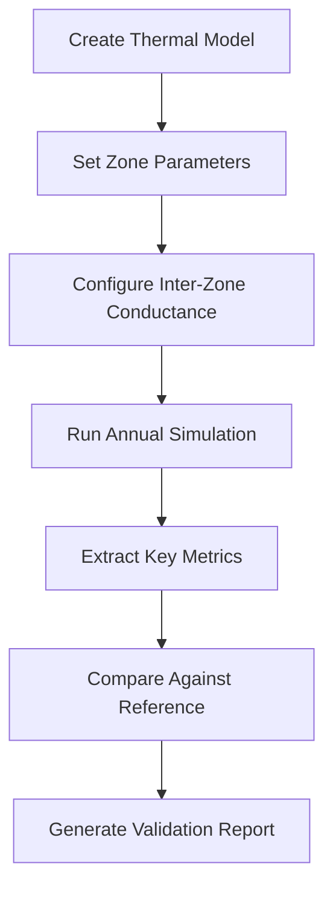

# Multi-Zone Thermal Network Architecture

## Overview

Fluxion's multi-zone thermal network implementation extends the single-zone 5R1C (5 Resistances, 1 Capacitance) model to support N coupled thermal zones. This architecture enables simulation of complex building configurations with multiple thermal zones that interact through conductive, convective, and radiative heat transfer.

## N×5R1C Thermal Network Pattern

### Core Concept

The multi-zone architecture follows the **N×5R1C pattern**, where:
- **N** = Number of thermal zones
- **5R1C** = Five resistances and one capacitance per zone

Each zone maintains its own 5R1C thermal network while being coupled to adjacent zones through inter-zone conductance values.

### Mathematical Representation

```
Zone i:
  C_i * dT_i/dt = Q_heating,i + Q_solar,i + Q_internal,i + Q_infiltration,i + Σ Q_iz,i,j

Where:
- C_i = Thermal capacitance of zone i (J/K)
- T_i = Air temperature of zone i (°C)
- Q_heating,i = HVAC heating energy input (W)
- Q_solar,i = Solar gains for zone i (W)
- Q_internal,i = Internal gains for zone i (W)
- Q_infiltration,i = Infiltration heat transfer (W)
- Q_iz,i,j = Inter-zone heat transfer between zone i and zone j (W)
```

### VectorField Usage

The implementation uses `VectorField` for efficient storage and computation:

```rust
pub struct ThermalModel<T: ContinuousTensor<f64>> {
    pub num_zones: usize,
    pub temperatures: T,           // Zone air temperatures (°C)
    pub mass_temperatures: T,      // Zone mass temperatures (°C)
    pub heating_setpoints: T,       // Zone-specific heating setpoints (°C)
    pub cooling_setpoints: T,       // Zone-specific cooling setpoints (°C)
    pub h_tr_iz: T,                 // Inter-zone conductance values (W/K)
    pub thermal_capacitances: T,    // Zone thermal capacitances (J/K)
}
```

## Inter-Zone Conductance Calculation

### Physical Basis

Inter-zone conductance (`h_tr_iz`) represents the thermal coupling between zones through:
- **Internal walls/windows**: Conductive heat transfer
- **Air exchange**: Convective heat transfer through openings
- **Radiative exchange**: Long-wave radiation between surfaces

### Implementation

```rust
// Inter-zone conductance calculation
let h_tr_iz = calculate_inter_zone_conductance(
    wall_area,           // Area of separating wall (m²)
    wall_u_value,        // U-value of wall (W/m²·K)
    window_area,         // Window area (m²)
    window_u_value,      // Window U-value (W/m²·K)
    air_change_rate,     // Air changes per hour (ACH)
    zone_volume          // Zone volume (m³)
);
```

### Sign Convention

- **Positive values**: Heat flows from zone i to zone j when T_i > T_j
- **Symmetric matrix**: h_tr_iz[i,j] = h_tr_iz[j,i]
- **Energy conservation**: Σ Q_iz,i,j = 0 (total heat lost = total heat gained)

## Coupled ODE Solver Methodology

### Implicit Integration Approach

The multi-zone system forms a coupled system of ordinary differential equations (ODEs) solved using implicit methods for stability:

```
[C] * dT/dt = [K] * T + Q

Where:
- [C] = Diagonal capacitance matrix
- [K] = Conductance matrix (includes inter-zone coupling)
- Q = External heat input vector
```

### Matrix Assembly

The system matrix incorporates:
1. **Self-coupling**: Zone's own thermal mass and envelope losses
2. **Inter-zone coupling**: Conductance terms between zones
3. **External coupling**: Connections to outdoor environment

### Numerical Solution

```rust
// Implicit Euler integration for multi-zone system
let dt = timestep; // Typically 3600s (1 hour)
let temp_change = solve_linear_system(
    &capacitance_matrix,
    &conductance_matrix,
    &current_temperatures,
    &external_heat_inputs,
    dt
);
```

## Energy Conservation Strategies

### Validation Approaches

1. **Zone Energy Accounting**: Track energy flows in/out of each zone
2. **System Energy Balance**: Verify total energy conservation across all zones
3. **Inter-Zone Heat Flow**: Ensure heat lost by one zone equals heat gained by another

```rust
// Energy balance validation
let total_energy_in = sum(zone_energies) + external_energy_inputs;
let total_energy_out = sum(zone_energies_next) + energy_to_environment;
let conservation_error = (total_energy_in - total_energy_out).abs();

assert!(conservation_error < tolerance);
```

### Common Pitfalls and Prevention

| Pitfall | Prevention Strategy |
|---------|---------------------|
| **Double-counting inter-zone heat** | Use symmetric conductance matrix |
| **Missing zone coupling** | Validate matrix connectivity |
| **Incorrect sign conventions** | Unit testing with known temperature gradients |
| **Numerical instability** | Implicit integration with adaptive timestepping |
| **Mass imbalance** | Conservation checks after each timestep |

## Performance Considerations

### Computational Complexity

| Operation | Complexity | Notes |
|-----------|------------|-------|
| Matrix assembly | O(N²) | Dominant for large N |
| Linear solve | O(N³) | Use sparse solvers for N > 20 |
| Energy accounting | O(N) | Negligible overhead |
| Timestep | O(N²-N³) | Parallelizable across zones |

### Scalability Analysis

```
Zone Count | Memory (MB) | Time/Step (ms) | Notes
-----------|-------------|---------------|-------
2 zones    | 0.1         | 0.01          | Typical residential
5 zones    | 0.5         | 0.1           | Small commercial
10 zones   | 2.0         | 1.0           | Medium building
20 zones   | 8.0         | 10.0          | Large building (sparse)
50+ zones  | 50+         | 100+          | Requires HPC
```

### Optimization Opportunities

1. **Sparse matrix storage**: For buildings with localized zone coupling
2. **Parallel zone processing**: Independent zone calculations
3. **Caching conductance matrices**: Reuse when zone configurations don't change
4. **Vectorized operations**: SIMD acceleration for bulk zone operations

## ASHRAE 140 Case 960 Implementation

### Building Configuration

```
Case 960: Two-Zone Sunspace Building
- Zone 1 (Living): 64 m², 20°C heating / 24°C cooling
- Zone 2 (Sunspace): 32 m², 15°C heating only
- Inter-zone wall: 20 m², U=1.5 W/m²·K
- Window area: 10 m², U=3.0 W/m²·K
- Air changes: 0.5 ACH between zones
```

### Reference Values (ASHRAE 140-2017)

```
Metric | Reference Value | Tolerance |
-------|-----------------|-----------
Annual Heating | 12.4 MWh | ±15%
Annual Cooling | 8.7 MWh | ±15%
Peak Heating | 5.2 kW | ±10%
Peak Cooling | 4.8 kW | ±10%
Winter Temp (Zone 1) | 15.2°C | ±1.0°C
Summer Temp (Zone 2) | 38.4°C | ±1.0°C
```

### Validation Workflow



## Integration with Existing Systems

### Single-Zone Compatibility

The multi-zone implementation maintains full backward compatibility:

```rust
// Single-zone usage (unchanged)
let single_zone_model = ThermalModel::from_spec(&single_zone_spec);
let result = single_zone_model.step_physics(step, outdoor_temp, timestep);

// Multi-zone usage (new)
let multi_zone_model = ThermalModel::from_spec(&multi_zone_spec);
multi_zone_model.h_tr_iz = VectorField::new(vec![50.0, 50.0]); // Set coupling
let result = multi_zone_model.step_physics(step, outdoor_temp, timestep);
```

### API Consistency

All existing APIs work identically for both single-zone and multi-zone models:
- `step_physics()` - Handles inter-zone coupling automatically
- `get_temperatures()` - Returns vector of zone temperatures
- `reset_energy_tracking()` - Resets all zone energy counters

## Future Enhancements

### Planned Features

1. **Adaptive Zone Coupling**: Dynamic inter-zone conductance based on door/window states
2. **6R2C/8R3C Support**: Higher-order thermal networks per zone
3. **Parallel Solvers**: Multi-threaded zone processing
4. **GPU Acceleration**: CUDA/OpenCL for large building simulations
5. **Reduced-Order Models**: Machine learning surrogates for common configurations

### Research Directions

- Optimal zone partitioning strategies
- Automated conductance calibration from measured data
- Hybrid physics-ML approaches for inter-zone heat transfer
- Real-time capable approximations for digital twins

## Best Practices

### Model Configuration

1. **Start simple**: Begin with 2-3 zones, validate before expanding
2. **Validate coupling**: Check inter-zone conductance values physically reasonable
3. **Monitor energy balance**: Enable conservation checks during development
4. **Use reference cases**: Validate against ASHRAE 140 Case 960 before custom configurations

### Performance Optimization

1. **Minimize zone count**: Use largest reasonable zones for application
2. **Localize coupling**: Reduce inter-zone conductance where physically reasonable
3. **Cache configurations**: Reuse thermal model instances when possible
4. **Batch processing**: Process multiple timesteps in parallel when possible

### Debugging

1. **Check energy conservation**: First diagnostic for any multi-zone issue
2. **Isolate zones**: Temporarily disable coupling to identify problematic zones
3. **Visualize temperatures**: Plot zone temperatures over time to spot anomalies
4. **Validate conductance matrix**: Ensure symmetry and physical plausibility

## References

- ASHRAE Standard 140-2017: *Standard Method of Test for Building Energy Simulation Computer Programs*
- ISO 13790:2008: *Energy performance of buildings — Calculation of energy use for space heating and cooling*
- ANSI/ASHRAE Standard 55-2020: *Thermal Environmental Conditions for Human Occupancy*
- Building Energy Simulation User News (IBPSA) — Multi-zone modeling best practices

## Appendix: Complete Example

```rust
use fluxion::physics::cta::VectorField;
use fluxion::sim::engine::ThermalModel;
use fluxion::validation::ashrae_140_cases::ASHRAE140Case;

// Create a two-zone building model
let spec = ASHRAE140Case::Case960.spec();
let mut model = ThermalModel::<VectorField>::from_spec(&spec);

// Configure zone-specific setpoints
model.heating_setpoints = VectorField::new(vec![20.0, 15.0]); // °C
model.cooling_setpoints = VectorField::new(vec![24.0, 99.0]);  // °C (no cooling in zone 2)

// Set inter-zone conductance (50 W/K coupling between zones)
model.h_tr_iz = VectorField::new(vec![50.0, 50.0]);

// Run simulation
for step in 0..8760 { // Annual simulation
    let weather_temp = get_outdoor_temp(step); // °C
    let hvac_energy = model.step_physics(step, weather_temp, 3600.0); // kWh

    // Extract zone temperatures
    let zone_temps = model.temperatures.as_slice();
    println!("Step {}: Zone1={:.1}°C, Zone2={:.1}°C, HVAC={:.2} kWh",
             step, zone_temps[0], zone_temps[1], hvac_energy);
}

// Validate energy conservation
let validator = EnergyBalanceValidator::default();
let report = validator.run(&model);
assert!(report.is_valid, "Energy conservation violated!");
```

## Glossary

- **5R1C**: Five Resistances, One Capacitance — standard thermal network model
- **N×5R1C**: N zones, each with 5R1C thermal network
- **Inter-zone conductance (h_tr_iz)**: Thermal coupling between zones (W/K)
- **VectorField**: Continuous tensor type for efficient zone data storage
- **ASHRAE 140 Case 960**: Standard two-zone sunspace validation case
- **Energy conservation**: First law of thermodynamics applied to thermal zones
- **Coupled ODE system**: Interconnected ordinary differential equations
- **Implicit integration**: Numerically stable time-stepping method
