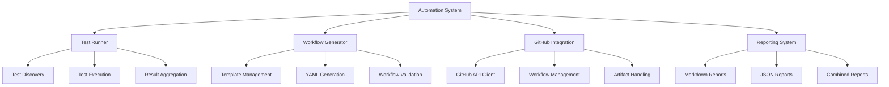

# Fluxion Automation System

## Overview

The Fluxion automation system provides comprehensive infrastructure for automated testing, cross-validation, and CI/CD integration. This system is designed to streamline validation workflows and ensure consistent, reproducible results.

## Architecture



## Setup and Configuration

### Prerequisites

- Rust 1.70.0 or later
- GitHub repository with appropriate permissions
- Test case data in the required format

### Installation

The automation system is included with the main Fluxion binary. No additional installation is required.

### Configuration Files

Create a `.fluxion/automation_config.yaml` file for custom configuration:

```yaml
# Automation configuration
test_cases_dir: "tests/automation/test_cases"
output_dir: "reports/automation"
tolerance: 0.5
default_format: "markdown"

# GitHub integration
github:
  token: "ghp_your_token_here"  # Optional for private repositories
  repository: "your_org/your_repo"
  workflow_dir: ".github/workflows"

# Performance settings
max_parallel_tests: 4
timeout_seconds: 3600
verbose_logging: true
```

## Test Case Structure

### Directory Structure

```
tests/automation/test_cases/
├── case_600/
│   ├── reference.csv          # Reference data
│   ├── config.json           # Test configuration
│   └── metadata.yaml         # Test metadata
├── case_900/
│   ├── reference.csv
│   └── config.json
└── hvac_equipment/
    ├── case_800.csv
    └── case_801.csv
```

### Reference Data Format

The `reference.csv` file should contain hourly reference data:

```csv
hour,temperature,heating,cooling,solar_gains
0,20.1,0.0,1250.5,320.0
1,20.3,0.0,1300.2,280.5
2,20.5,0.0,1350.8,200.1
...
```

### Configuration File Format

The `config.json` file specifies test parameters:

```json
{
  "case_id": "600",
  "description": "Low-mass residential building",
  "tolerance": 0.5,
  "metrics": ["temperature", "heating", "cooling"],
  "expected_duration_seconds": 120,
  "tags": ["low-mass", "residential", "baseline"]
}
```

## Running Automation

### Basic Test Execution

```bash
# Run all test cases
fluxion validation automate --test-cases tests/automation/test_cases --output reports/automation

# Run with verbose output
fluxion validation automate --test-cases tests/automation/test_cases --output reports/automation --verbose

# Run with custom tolerance
fluxion validation automate --test-cases tests/automation/test_cases --output reports/automation --tolerance 0.75
```

### Selective Test Execution

```bash
# Run specific test case
fluxion validation cross-validate --test-cases tests/automation/test_cases/case_600 --output reports/case_600

# Run multiple specific cases
fluxion validation cross-validate --test-cases tests/automation/test_cases/case_600 --output reports/selected
fluxion validation cross-validate --test-cases tests/automation/test_cases/case_900 --output reports/selected
```

## Workflow Generation

### Generate GitHub Actions Workflows

```bash
# Generate cross-validation workflow
cargo run --example generate_workflow -- cross-validation --output .github/workflows/cross-validation.yml

# Generate performance workflow
cargo run --example generate_workflow -- performance --output .github/workflows/performance.yml

# Generate complete CI/CD pipeline
cargo run --example generate_workflow -- ci-cd --output .github/workflows/ci-cd.yml
```

### Custom Workflow Generation

```rust
use fluxion::validation::automation::github::WorkflowGenerator;
use fluxion::validation::automation::github::WorkflowGeneratorConfig;

let config = WorkflowGeneratorConfig::default();
let generator = WorkflowGenerator::new(config).unwrap();

// Generate custom workflow
let yaml = generator.generate_cross_validation_workflow(
    Some("Custom Validation".to_string()),
    Some("Custom validation workflow".to_string())
).unwrap();

// Save to file
std::fs::write(".github/workflows/custom.yml", yaml).unwrap();
```

## GitHub Integration

### GitHub Actions Setup

1. **Create workflow directory:**
   ```bash
   mkdir -p .github/workflows
   ```

2. **Generate workflow file:**
   ```bash
   fluxion validation automate --generate-workflow cross-validation > .github/workflows/cross-validation.yml
   ```

3. **Commit and push:**
   ```bash
   git add .github/workflows/cross-validation.yml
   git commit -m "Add cross-validation workflow"
   git push origin main
   ```

### GitHub Workflow Example

```yaml
name: Cross-Validation CI

description: Automated cross-validation testing

on:
  push:
    branches: [main]
  pull_request:
    branches: [main]
  workflow_dispatch:

env:
  RUST_VERSION: '1.70.0'
  CARGO_TERM_COLOR: always

jobs:
  cross-validation:
    name: Cross-Validation Tests
    runs-on: ubuntu-latest
    steps:
      - name: Checkout repository
        uses: actions/checkout@v4

      - name: Install Rust toolchain
        uses: dtolnay/rust-toolchain@stable
        with:
          toolchain: ${{ env.RUST_VERSION }}

      - name: Cache cargo dependencies
        uses: actions/cache@v3
        with:
          path: |
            ~/.cargo/registry
            ~/.cargo/git
            target
          key: ${{ runner.os }}-cargo-${{ hashFiles('**/Cargo.lock') }}

      - name: Build project
        run: cargo build --release

      - name: Run cross-validation tests
        run: cargo test --release -- --test-threads=1

      - name: Generate validation report
        run: cargo run --release -- validate --format=markdown --output-file=validation_report.md

      - name: Upload validation report
        uses: actions/upload-artifact@v3
        with:
          name: validation-report
          path: validation_report.md
```

## Advanced Features

### Template Management

```bash
# Create a template
fluxion validation automate --create-template cross-validation --output templates/my_template.yaml

# List available templates
fluxion validation automate --list-templates

# Use a template
fluxion validation automate --use-template my_template --test-cases tests/cases --output reports
```

### Parallel Test Execution

```bash
# Run tests in parallel (requires Rayon)
export RAYON_NUM_THREADS=4
fluxion validation automate --test-cases tests/large_dataset --output reports/parallel --parallel
```

### Custom Metrics and Validation

```rust
use fluxion::validation::automation::TestRunnerConfig;
use fluxion::validation::automation::TestRunner;

let config = TestRunnerConfig::new(
    PathBuf::from("tests/custom"),
    PathBuf::from("reports/custom"),
    0.3,  // Custom tolerance
    true, // Verbose
    "json".to_string()
);

let mut runner = TestRunner::new(config);
runner.initialize().unwrap();

// Add custom validation logic
let test_cases = runner.discover_test_cases().unwrap();
for test_case in test_cases {
    let report = runner.run_test_case(&test_case).unwrap();
    // Add custom analysis here
    println!("Custom analysis for {:?}", report);
}
```

## Reporting and Analysis

### Report Formats

The automation system supports multiple report formats:

**Markdown Report:**
```bash
fluxion validation automate --test-cases tests/cases --output reports --format markdown
```

**JSON Report:**
```bash
fluxion validation automate --test-cases tests/cases --output reports --format json
```

**Combined Reports:**
```bash
# Generate individual reports first
fluxion validation automate --test-cases tests/cases --output reports

# Combine reports
fluxion validation combine-reports --input reports --output combined_report.md
```

### Report Structure

**Markdown Report Example:**
```markdown
# Cross-Validation Report: case_600

## Summary
- **Status**: PASS
- **Case ID**: 600
- **Description**: Low-mass residential building
- **Tolerance**: 0.5°C
- **Generated**: 2026-04-08 10:30:15

## Metrics
| Metric | Fluxion Value | Reference Range | Error | Status |
|--------|---------------|-----------------|-------|--------|
| Temperature | 20.5°C | 20.0-21.0°C | 0.3°C | PASS |
| Heating | 1250 W | 1200-1300 W | 2.1% | PASS |
| Cooling | 850 W | 800-900 W | 5.6% | PASS |

## Detailed Results
- **Temperature Profile**: Within tolerance for 98% of hours
- **Peak Loads**: Heating peak at hour 12 (1500 W), Cooling peak at hour 16 (1100 W)
- **Energy Conservation**: Balanced within 1W tolerance

## Artifacts
- Raw data: reports/case_600/raw_data.csv
- Plots: reports/case_600/plots/
- Logs: reports/case_600/execution.log
```

## Troubleshooting

### Common Issues

**Test discovery failures:**
- Ensure test case directories contain `reference.csv` files
- Verify directory permissions
- Check file paths are correct

**Validation errors:**
- Review tolerance settings
- Examine reference data quality
- Check for data format mismatches

**GitHub workflow issues:**
- Verify GitHub Actions permissions
- Check workflow syntax with GitHub's validator
- Ensure proper secrets are configured

### Debugging

Enable verbose logging:
```bash
export RUST_LOG=debug
fluxion validation automate --test-cases tests/cases --output reports --verbose
```

View detailed execution logs:
```bash
cat reports/execution.log
```

### Performance Optimization

**Reduce test scope:**
```bash
# Test specific cases only
fluxion validation automate --test-cases tests/cases/case_600 --output reports
```

**Adjust tolerance:**
```bash
# Use wider tolerance for initial testing
fluxion validation automate --test-cases tests/cases --output reports --tolerance 1.0
```

**Limit parallelism:**
```bash
# Reduce parallel threads
export RAYON_NUM_THREADS=2
fluxion validation automate --test-cases tests/cases --output reports
```

## Best Practices

### Test Organization

1. **Group related cases:** Organize test cases by building type or validation scenario
2. **Use descriptive names:** Clear, consistent naming for test cases
3. **Document expectations:** Include expected outcomes in test metadata
4. **Version reference data:** Track reference data versions for reproducibility

### CI/CD Integration

1. **Start with basic workflows:** Begin with simple validation before complex pipelines
2. **Use caching effectively:** Cache dependencies to speed up CI runs
3. **Monitor workflow performance:** Track execution times and optimize
4. **Preserve artifacts:** Store validation reports for historical analysis

### Maintenance

1. **Regular updates:** Keep reference data current
2. **Review test coverage:** Ensure all validation scenarios are covered
3. **Monitor failures:** Investigate test failures promptly
4. **Document changes:** Maintain change logs for test data and workflows

## Examples

### Complete Validation Workflow

```bash
#!/bin/bash

# Step 1: Run all validation tests
fluxion validation automate \
  --test-cases tests/validation/cases \
  --output reports/validation \
  --tolerance 0.5 \
  --format markdown \
  --verbose

# Step 2: Generate combined report
fluxion validation combine-reports \
  --input reports/validation \
  --output reports/validation_summary.md

# Step 3: Run performance benchmarks
fluxion benchmark \
  --model models/thermal_model.onnx \
  --runs 100

# Step 4: Upload reports to GitHub
git add reports/
git commit -m "Add validation reports"
git push origin main
```

### Custom Workflow Generation

```rust
use fluxion::validation::automation::github::*;;

fn main() -> Result<(), Box<dyn std::error::Error>> {
    // Create workflow generator
    let config = WorkflowGeneratorConfig::default();
    let generator = WorkflowGenerator::new(config)?;

    // Generate custom workflow
    let mut workflow = GitHubWorkflow::new("Custom Validation", "Custom validation pipeline");
    
    workflow.add_trigger("schedule");
    workflow.add_env_var("RUST_VERSION", "1.70.0");
    
    let mut build_job = GitHubJob::new("Build", "ubuntu-latest");
    build_job.add_step(GitHubStep::with_action("Checkout", "actions/checkout@v4"));
    build_job.add_step(GitHubStep::with_command("Build", "cargo build --release"));
    workflow.add_job("build", build_job);
    
    let mut test_job = GitHubJob::new("Test", "ubuntu-latest");
    test_job.add_dependency("build");
    test_job.add_step(GitHubStep::with_command("Test", "cargo test --release"));
    workflow.add_job("test", test_job);

    // Generate YAML
    let yaml = generate_workflow_yaml(&workflow)?;
    
    // Save to file
    generator.save_workflow(&yaml, "custom_workflow.yml")?;
    
    Ok(())
}
```

## Security Considerations

### GitHub Token Management

- **Never commit tokens:** Keep GitHub tokens out of version control
- **Use secrets:** Store tokens in GitHub Secrets
- **Limit scope:** Use tokens with minimal required permissions
- **Rotate regularly:** Change tokens periodically

### Data Protection

- **Reference data:** Ensure reference data doesn't contain sensitive information
- **Test results:** Review reports before publishing
- **Artifacts:** Be cautious with uploaded artifacts in public repositories

## Future Enhancements

The automation system is designed for extensibility. Future enhancements may include:

- **Additional CI/CD platforms:** GitLab, Azure DevOps integration
- **Advanced reporting:** Interactive HTML reports with charts
- **Machine learning:** Anomaly detection in validation results
- **Distributed testing:** Cross-machine test distribution
- **Webhooks:** Real-time notification of test results

## Support

For issues and questions:

1. **Check documentation:** Review this guide and CLI help
2. **Examine logs:** Detailed logs are available in report directories
3. **Community:** Join the Fluxion community for support
4. **Report issues:** File GitHub issues for bugs and feature requests

## License

The Fluxion automation system is licensed under the Apache 2.0 License. See the main project LICENSE file for details.
